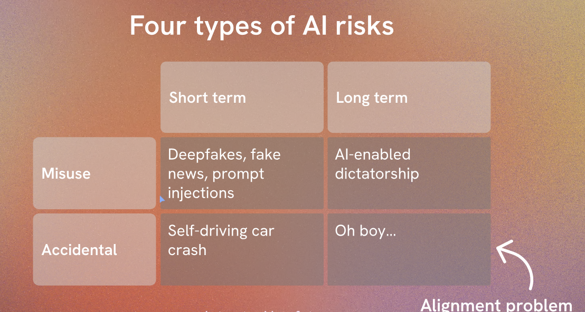

## Introduction to AI Engineering

- ML Engineer vs AI Engineer
    - ML Engineer
        - Focus on building and deploying ML models
        - Data preprocessing, model selection, training, evaluation, deployment
        - Tools: scikit-learn, TensorFlow, PyTorch
    - AI Engineer
        - Focus on building and deploying AI systems
        - ML models, data pipelines, APIs, databases, front-end
        - Tools: scikit-learn, TensorFlow, PyTorch, Flask, Docker, Kubernetes
    - ML models vs AI systems
        - ML models: standalone, single-purpose, batch processing
        - AI systems: integrated, multi-purpose, real-time processing

- AI Engineering Basics
    - AI Engineering Workflow
        - Data Collection
        - Data Preprocessing
        - Model Selection
        - Model Training
        - Model Evaluation
        - Model Deployment
    - AI Engineering Tools
        - scikit-learn: ML models
        - TensorFlow: deep learning models
        - PyTorch: deep learning models
        - Flask: web server
        - Docker: containerization
        - Kubernetes: container orchestration

- AI Engineering Projects
    - Project 1: Build a Machine Learning Model
        - Data Collection: collect data from Kaggle
        - Data Preprocessing: clean and preprocess data
        - Model Selection: select a model for classification
        - Model Training: train the model on the data
        - Model Evaluation: evaluate the model on test data
        - Model Deployment: deploy the model as a web service
    - Project 2: Build a Deep Learning Model
        - Data Collection: collect data from Kaggle
        - Data Preprocessing: clean and preprocess data
        - Model Selection: select a deep learning model
        - Model Training: train the model on the data
        - Model Evaluation: evaluate the model on test data
        - Model Deployment: deploy the model as a web service

- AI Engineering Resources
    - Books
    - Courses
    - Tutorials
    - Projects
    - Communities

- LLM
    - LLM: Large Language Model
    - GPT-3: Generative Pre-trained Transformer 3
    - BERT: Bidirectional Encoder Representations from Transformers
    - T5: Text-to-Text Transfer Transformer
    - XLNet: Transformer-XL Network
    - RoBERTa: Robustly optimized BERT approach
    - ALBERT: A Lite BERT
    - DistilBERT: Distilled BERT
    - ELECTRA: Efficiently Learning an Encoder that Classifies Token Replacements Accurately
    - Reformer: The Efficient Transformer
    - GPT-2: Generative Pre-trained Transformer 2
    - GPT: Generative Pre-trained Transformer
    - Transformer: Attention is All You Need

    - What is LLM?
        - Large Language Model
        - Pre-trained on large text corpus
        - Fine-tuned on specific task
        - State-of-the-art performance

    - Open AI GPT-3
        - Generative Pre-trained Transformer 3
        - 175 billion parameters
        - Released in June 2020
        - State-of-the-art performance

    - Google BERT
        - Bidirectional Encoder Representations from Transformers
        - 340 million parameters
        - Released in October 2018
        - State-of-the-art performance

    - Google T5
        - Text-to-Text Transfer Transformer
        - 11 billion parameters
        - Released in October 2019
        - State-of-the-art performance

    - Open AI Message Array
        - System and User
            ```python
            from openai import OpenAI
            client = OpenAI()   
            response = client.chat.completions.create(
            model="gpt-3.5-turbo",
            messages=[
                {
                "role": "system",
                "content": "Summarize content you are provided with for a second-grade student."
                },
                {
                "role": "user",
                "content": "Jupiter is the fifth planet from the Sun and the largest in the Solar System. It is a gas giant with a mass one-thousandth that of the Sun, but two-and-a-half times that of all the other planets in the Solar System combined. Jupiter is one of the brightest objects visible to the naked eye in the night sky, and has been known to ancient civilizations since before recorded history. It is named after the Roman god Jupiter.[19] When viewed from Earth, Jupiter can be bright enough for its reflected light to cast visible shadows,[20] and is on average the third-brightest natural object in the night sky after the Moon and Venus."
                }
            ],
            temperature=0.7,
            max_tokens=64,
            top_p=1
            )

            #Sample response
            """
            Jupiter is a really big planet in our Solar System. It is the fifth planet from the Sun and it is the largest planet. It is called a gas giant because it is made mostly of gas. Jupiter is much smaller than the Sun, but it is bigger than all the other planets combined. It is very bright and can be seen in the night sky without a telescope. People have known about Jupiter for a very long time, even before they started writing things down. It is named after a god from ancient Rome. Sometimes, Jupiter is so bright that it can make shadows on Earth. It is usually the third-brightest thing we can see in the night sky, after the Moon and Venus."""
            ```

            ```javascript
            import OpenAI from "openai";

            const openai = new OpenAI();

            async function main() {
            const completion = await openai.chat.completions.create({
                messages: [{"role": "system", "content": "You are a helpful assistant."},
                    {"role": "user", "content": "Who won the world series in 2020?"},
                    {"role": "assistant", "content": "The Los Angeles Dodgers won the World Series in 2020."},
                    {"role": "user", "content": "Where was it played?"}],
                model: "gpt-3.5-turbo",
            });

            console.log(completion.choices[0]);
            }
            main();
            ```
    
        - Context Length
            - Context length: 4096 tokens
            - Maximum message length: 2048 tokens
            - Maximum response length: 2048 tokens
            - Maximum tokens per request: 4096 tokens

        - Knowledge Cutoff
            - Knowledge cutoff: 90 days
            - Knowledge retention: 90 days
            - Knowledge update: 90 days
            - Knowledge refresh: 90 days

        - Model Selection
            - Model selection: gpt-3.5-turbo
            - Model version: 3.5
            - Model size: turbo
            - Model capacity: 175 billion parameters

        - Message Array
            - Message array: system, user, assistant
            - Message role: system, user, assistant
            - Message content: text message
            - Message temperature: 0.7
            - Message max tokens: 64
            - Message top p: 1

        - Response Array
            - Response array: completion
            - Response role: assistant
            - Response content: text message
            - Response temperature: 0.7
            - Response max tokens: 64
            - Response top p: 1
        
- TOKENS

    - What is a Token?
        - Token: smallest unit of text
        - Word token: word
        - Sentence token: sentence
        - Paragraph token: paragraph
        - Document token: document

    - Tokenization
        - Tokenization: process of splitting text into tokens
        - Word tokenization: split text into words
        - Sentence tokenization: split text into sentences
        - Paragraph tokenization: split text into paragraphs
        - Document tokenization: split text into documents

    - Token Types
        - Word token: word
        - Punctuation token: punctuation
        - Number token: number
        - Symbol token: symbol
        - Special token: special

    - Tokenization Libraries
        - NLTK: Natural Language Toolkit
        - spaCy: Industrial-Strength Natural Language Processing
        - Transformers: State-of-the-Art Natural Language Processing

    - Tokenization Techniques
        - Word Tokenization
        - Sentence Tokenization
        - Paragraph Tokenization
        - Document Tokenization

    - Tokenization Examples
        - Word Tokenization
            ```python
            import nltk
            nltk.download('punkt')
            from nltk.tokenize import word_tokenize
            text = "Hello, world!"
            tokens = word_tokenize(text)
            print(tokens)
            # Output: ['Hello', ',', 'world', '!']
            ```
        - Sentence Tokenization
            ```python
            import nltk
            nltk.download('punkt')
            from nltk.tokenize import sent_tokenize
            text = "Hello, world! How are you?"
            sentences = sent_tokenize(text)
            print(sentences)
            # Output: ['Hello, world!', 'How are you?']
            ```
        - Paragraph Tokenization
            ```python
            import nltk
            nltk.download('punkt')
            from nltk.tokenize import blankline_tokenize
            text = "Hello, world!\n\nHow are you?"
            paragraphs = blankline_tokenize(text)
            print(paragraphs)
            # Output: ['Hello, world!', 'How are you?']
            ```
        - Document Tokenization
            ```python
            import nltk
            nltk.download('punkt')
            from nltk.tokenize import RegexpTokenizer
            text = "Hello, world!\n\nHow are you?"
            tokenizer = RegexpTokenizer(r'\w+')
            tokens = tokenizer.tokenize(text)
            print(tokens)
            # Output: ['Hello', 'world', 'How', 'are', 'you']
            ```

    - Tokenization Challenges

        - Tokenization Errors
            - Word tokenization: split words incorrectly
            - Sentence tokenization: split sentences incorrectly
            - Paragraph tokenization: split paragraphs incorrectly
            - Document tokenization: split documents incorrectly

        - Tokenization Ambiguity
            - Word tokenization: ambiguous words
            - Sentence tokenization: ambiguous sentences
            - Paragraph tokenization: ambiguous paragraphs
            - Document tokenization: ambiguous documents

        - Tokenization Variability
            - Word tokenization: different languages
            - Sentence tokenization: different punctuation
            - Paragraph tokenization: different formatting
            - Document tokenization: different structure

        - Tokenization Complexity
            - Word tokenization: compound words
            - Sentence tokenization: complex sentences
            - Paragraph tokenization: nested paragraphs
            - Document tokenization: hierarchical documents

    - Tokenization Best Practices

        - Tokenization Libraries
            - NLTK: Natural Language Toolkit
            - spaCy: Industrial-Strength Natural Language Processing
            - Transformers: State-of-the-Art Natural Language Processing

        - Tokenization Techniques
            - Word Tokenization
            - Sentence Tokenization
            - Paragraph Tokenization
            - Document Tokenization

        - Tokenization Examples
            - Word Tokenization
            - Sentence Tokenization
            - Paragraph Tokenization
            - Document Tokenization

        - Tokenization Challenges
            - Tokenization Errors
            - Tokenization Ambiguity
            - Tokenization Variability
            - Tokenization Complexity

        - Tokenization Best Practices
            - Tokenization Libraries
            - Tokenization Techniques
            - Tokenization Examples
            - Tokenization Challenges

    - max_tokens
        - limits the number of tokens the model outputs
        - does not affect the size of the input

    - finish_reason
        - indicates why the model stopped generating tokens
        - can be "length", "stop", or "timeout"
            - "length": reached max_tokens
            - "stop": generated a stop token
            - "timeout": exceeded max_time

    - Temperature
        - temperature: 0.7
        - controls the randomness of the model
        - higher temperature: more randomness
        - lower temperature: less randomness
    - stop
        - stop: ["\n", " ", ".", ",", "!", "?"]
        - specifies the stop tokens
        - model stops generating tokens when it encounters a stop token

    - Zero- shot vs Few-shot vs Prompt-based
        - Zero-shot: no training examples
        - Few-shot: few training examples
        - Prompt-based: prompt with examples
    - Presence and Frequency penalty
        - Frequency penalty: penalizes frequent tokens
            - number from -2 to 2
            - default value: 0
            -  at higher numbers it decreases the models likelihood of repeating the exact same phrase.
        - Presence penalty: penalizes repeated tokens
            - number from -2 to 2
            - default value: 0
            - higher numbers increase a models likelihood of generating diverse tokens 

    - DALL.E 3
        - Image Generation
        - Text-to-Image Translation

- AI Risks
    
    - AI Risks
        - Bias
        - Privacy
        - Security
        - Safety
        - Accountability

        - Bias
            - Bias: unfair prejudice
            - Data bias: biased data
            - Model bias: biased model
            - Decision bias: biased decision

        - Privacy
            - Privacy: personal information
            - Data privacy: data protection
            - Model privacy: model protection
            - Decision privacy: decision protection

        - Security
            - Security: data protection
            - Data security: data protection
            - Model security: model protection
            - Decision security: decision protection

        - Safety
            - Safety: human well-being
            - Data safety: data protection
            - Model safety: model protection
            - Decision safety: decision protection

        - Accountability
            - Accountability: responsibility
            - Data accountability: data responsibility
            - Model accountability: model responsibility
            - Decision accountability: decision responsibility

        - AI Ethics
            - AI Ethics: ethical principles
            - Data ethics: ethical data use
            - Model ethics: ethical model design
            - Decision ethics: ethical decision making

        - AI Governance
            - AI Governance: governance framework
            - Data governance: data management
            - Model governance: model management
            - Decision governance: decision management

        - AI Regulation
            - AI Regulation: regulatory framework
            - Data regulation: data protection
            - Model regulation: model protection
            - Decision regulation: decision protection

        - AI Compliance
            - AI Compliance: compliance requirements
            - Data compliance: data protection
            - Model compliance: model protection
            - Decision compliance: decision protection

        - AI Transparency
            - AI Transparency: transparent AI systems
            - Data transparency: transparent data use
            - Model transparency: transparent model design
            - Decision transparency: transparent decision making

        - AI Accountability
            - AI Accountability: accountable AI systems
            - Data accountability: accountable data use
            - Model accountability: accountable model design
            - Decision accountability: accountable decision making

        - AI Responsibility
            - AI Responsibility: responsible AI systems
            - Data responsibility: responsible data use
            - Model responsibility: responsible model design
            - Decision responsibility: responsible decision making

        - AI Trustworthiness
            - AI Trustworthiness: trustworthy AI systems
            - Data trustworthiness

- AI Safety Best Practices
    [Open AI](https://platform.openai.com/docs/guides/moderation/quickstart)
    - AI Safety
        - AI Safety: safe AI systems
        - Data Safety: safe data use
        - Model Safety: safe model design
        - Decision Safety: safe decision making

    - AI Security
        - AI Security: secure AI systems
        - Data Security: secure data use
        - Model Security: secure model design
        - Decision Security: secure decision making

    - AI Privacy
        - AI Privacy: private AI systems
        - Data Privacy: private data use
        - Model Privacy: private model design
        - Decision Privacy: private decision making

    - AI Bias
        - AI Bias: unbiased AI systems
        - Data Bias: unbiased data use
        - Model Bias: unbiased model design
        - Decision Bias: unbiased decision making

    - AI Accountability
        - AI Accountability: accountable AI systems
        - Data Accountability: accountable data use
        - Model Accountability: accountable model design
        - Decision Accountability: accountable decision making

    - AI Transparency
        - AI Transparency: transparent AI systems
        - Data Transparency: transparent data use
        - Model Transparency: transparent model design
        - Decision Transparency: transparent decision making

    - AI Governance
        - AI Governance: governed AI systems
        - Data Governance: governed data use
        - Model Governance: governed model design
        - Decision Governance: governed decision making

    - AI Regulation
        - AI Regulation: regulated AI systems
        - Data Regulation: regulated data use
        - Model Regulation: regulated model design
        - Decision Regulation: regulated decision making

    - AI Compliance
        - AI Compliance: compliant AI systems
        - Data Compliance: compliant data use
        - Model Compliance: compliant model design
        - Decision Compliance: compliant decision making

    - AI Ethics
        - AI Ethics: ethical AI systems
        - Data Ethics: ethical data use
        - Model Ethics: ethical model design
        - Decision Ethics: ethical decision making

    - AI Responsibility
        - AI Responsibility: responsible AI systems
        - Data Responsibility: responsible data use
        - Model Responsibility: responsible model design
        - Decision Responsibility: responsible decision making

    - AI Trustworthiness
        - AI Trustworthiness: trustworthy AI systems
        - Data Trustworthiness: trustworthy data use
        - Model Trustworthiness: trustworthy model design
        - Decision Trustworthiness: trustworthy