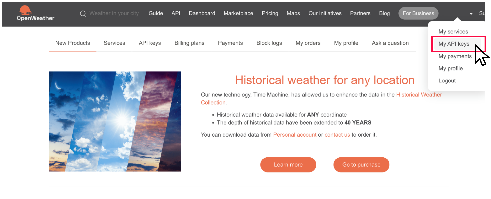

# Install Python on your computer (Optional)

As you have seen in this course, Python is one of the most popular programming languages. To easily write and run Python programs on your computer, you need a code editor like the Jupyter Notebook used in the learning platform.

A convenient way to get everything you need is by downloading [Anaconda](https://www.anaconda.com), which provides Python, Jupyter Notebook, and many other tools in a single installation. In this tutorial, you will see how to download and install Anaconda on your computer, how to create a Jupyter notebook, and how to get your own API keys from OpenWeather and OpenAI.

For more detailed installation instructions specific to your operating system, or if you encounter any problems, please visit [this link](https://docs.anaconda.com/anaconda/install/).

# Downloading Anaconda

Go to [Anaconda](https://www.anaconda.com) and:

1. Click on "Free Download"
   
   

2. Register your information or skip that step

   

3. Click on the download button

   

These steps will usually get you the appropriate distribution for your operating system. If it doesn't provide you with the correct distribution, you can check the list under **Anaconda installers** and find the one that best suits you.

# Installing Anaconda

### MacOS

Anaconda provides a graphical installer that is fairly easy to follow in macOS. After you open the installer, you simply have to follow the prompts. The steps you will need to follow will be similar to the ones outlined here:

1. Read the introduction, click Continue.
2. Read the Read Me document, click Continue.
3. Read and accept the license agreement.
4. Select the installation destination. Anaconda recommends that you select the first option "Install for all users on this computer." Click Continue.

   

5. Click Install.

   

6. After the installation is complete, click Continue.
7. You will be prompted with the option to learn more about Anaconda in the cloud. Feel free to skip and click Continue.

   

8. Finally, you will get a confirmation telling you that the installation was successful. Click Close.

   

After following the instructions from the graphical installer, you will have Anaconda on your computer. If you have any trouble, please consult [this link](https://docs.anaconda.com/anaconda/install/mac-os/).

### Windows

Anaconda provides a graphical installer that is fairly easy to follow in Windows. After you open the installer, you simply have to follow the prompts. The steps you will need to follow will be similar to the ones outlined here:

1. Read the introduction, click Next.
2. Read the terms and conditions and click "I agree".
3. Then, you will need to decide the installation type. Anaconda recommends that you do it "Just for me". Click next.
4. You will be prompted with the installation folder selection. Usually, the predetermined location is a good choice, but feel free to select another if you need to. Click Next.

   

5. Select whether you want to add Anaconda to your PATH and register Anaconda as your default Python. Anaconda doesn't recommend that you add to your PATH, while it is recommended to set it as your default Python. Click Install.

   

6. After the installation is complete, click Next.
7. You will be prompted with the option to learn more about Anaconda in the cloud. Feel free to skip and click Next.

   

8. You will get a confirmation window telling you that the installation was successful. Click Finish.

   

After following the instructions from the graphical installer, you will have Anaconda on your computer. If you have any trouble, please consult [this link](https://docs.anaconda.com/anaconda/install/windows/).

### Linux

Run the `.sh` as a program with the method that you prefer. Then, follow these steps in the terminal that is executing the `.sh`:

1. Read the welcome message, press enter.

   

2. Go through the license agreement. Type "yes", then press enter.

   

3. You will be able to choose the installation destination. The default is usually a good location, but feel free to change it according to your preferences. Press enter to confirm the location.

   

4. Finally, you will need to decide whether to update the shell profile to automatically initialize Conda or not. The default is "no". After you have typed your selection, press enter.

   

5. The program will close after the installation is completed.

After following the instructions from the graphical installer, you will have Anaconda on your computer. If you have any trouble, please consult [this link](https://docs.anaconda.com/anaconda/install/linux/).

## Creating a Jupyter Notebook

Once you have installed Anaconda on your computer, you will be able to access the Anaconda Navigator. It provides you with a graphical interface that makes it easy to access Jupyter Notebook and other tools included in the installation. For a quick overview and tutorials, visit [this link](https://docs.anaconda.com/navigator/).

Follow the next steps to open Jupyter Notebook and create a notebook that uses Python:

1. Launch Anaconda Navigator.
2. In the navigator, look for Jupyter Notebook and click "Launch".

   

3. Click on "New", select and click "Notebook".

   

4. Look for Python in "Select kernel" and click "Select".

   

You are ready to write and run Python code in a Jupyter Notebook on your computer!

   


# Installing Python and Jupyter separately

If you have ever used the terminal on a mac or linux, or Command Prompt on a windows machine, you may want to install Python in a more manual way. This is slightly more difficult than the Anaconda process above, but is a more common way to install and setup Python. 

Here are the steps you would follow:

## 1. Install Python:
- Go to the [Python website](https://www.python.org/).
- Download the latest version of Python for your operating system.
- Run the installer and ensure you check the box "Add Python to PATH."

## 2. Install Jupyter Notebook:
- Open Command Prompt (Windows) or Terminal (Mac/Linux).
- Run the command: 
    ```sh
    pip install jupyter
    ```
## 3. Install aisetup:
- In the Command Prompt (Windows) or Terminal (Mac/Linux)
- Run the command: 
    ```sh
    pip install aisetup
    ```

## Start Jupyter Notebook:
- Run the command:
    ```sh
    jupyter notebook
    ```
    in Command Prompt or Terminal.

## Alternative: Start Jupyter Lab:
- Jupyter lab has some extra features, like a file browser that makes it easier to view and upload files.
- Run the command:
    ```sh
    jupyter lab
    ```
    in Command Prompt or Terminal.

**If you need help with any of these steps, a chatbot can be helpful, or you can search the web.**


# Getting API Keys

Once you have installed Anaconda and started up a Jupyter notebook, you can experiment with the OpenWeather and OpenAI APIs! The steps below will show you how to get your own API key for each service.

For each API, you will need to create an account, then create an API key.

## OpenWeather


1. Create an account using [the OpenWeatherMap.org sign up page](https://home.openweathermap.org/users/sign_up).
    - You must be 16 or over, and agree to the terms of service.

    

2. Click on your account name in the top right corner, then "My API keys"

    

3. Copy the API key that has been generated for you already.

    

You're done! You can now use this API key in your code.

## OpenAI

OpenAI manages API keys through the OpenAI Platform, which is separate from ChatGPT. **You will need to create an OpenAI Platform account even if you already have one for ChatGPT.**

1. Go to [the OpenAI Platform homepage](https://platform.openai.com/).
2. Create an OpenAI Platform account. You can use the same login as your ChatGPT account, if you have one, but the two accounts are managed separately. Make sure you have verified your phone number. You cannot change your phone number after account creation. If a phone number does not appear in your account, you will need to contact support. 

    

3. Navigate to [Dashboard -> API keys](https://platform.openai.com/api-keys).
4. Click "+ Create new secret key".

    

5. Click "Create secret key". You do not need to name your key.

    

6. Copy the key and save it somewhere. **Note:** You will NOT be able to view the key again after closing this window.

    


You're done! You can now use this API key in your code.
