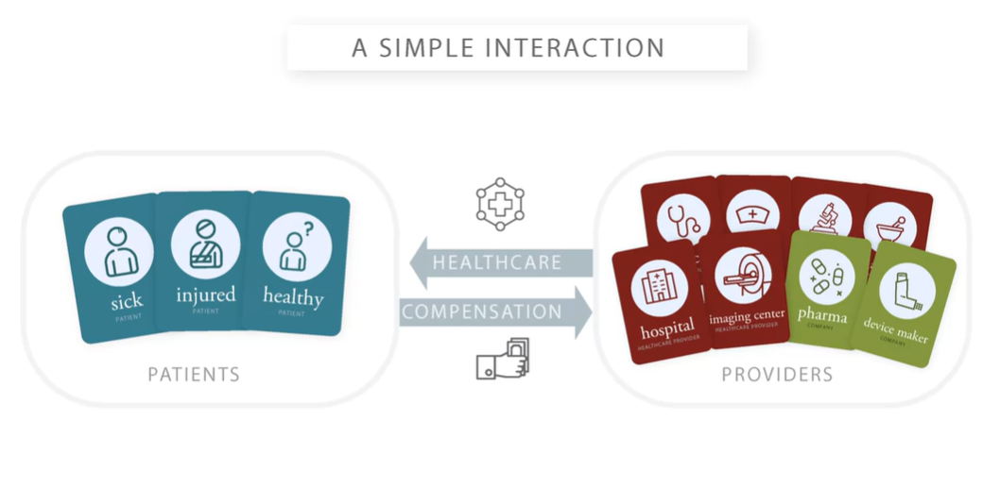
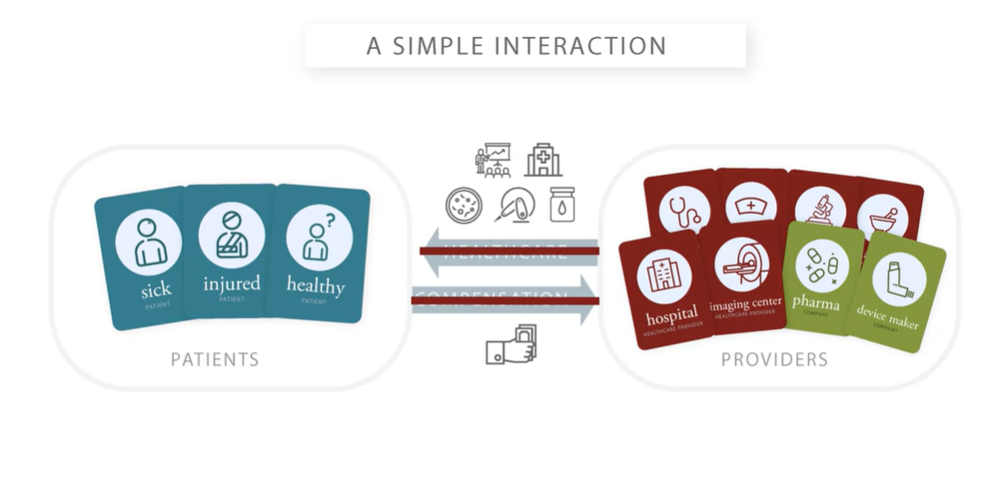
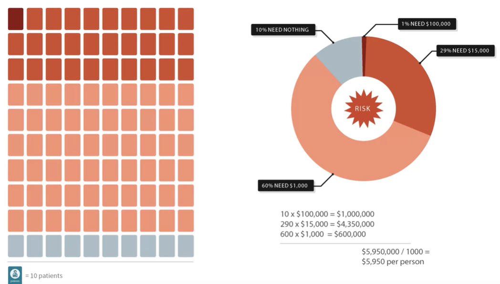
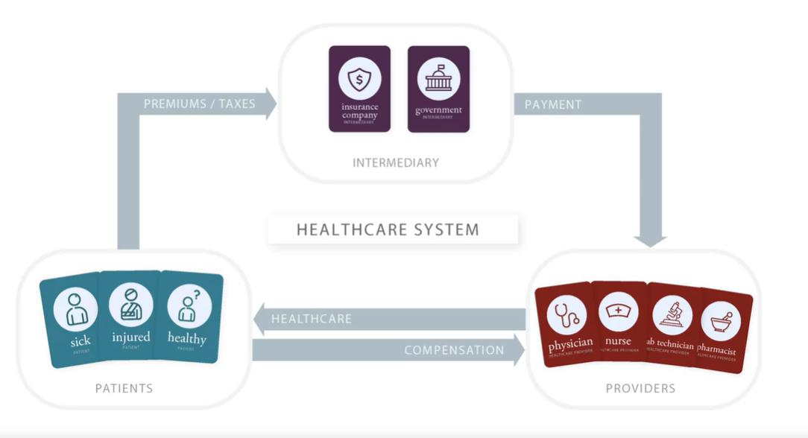
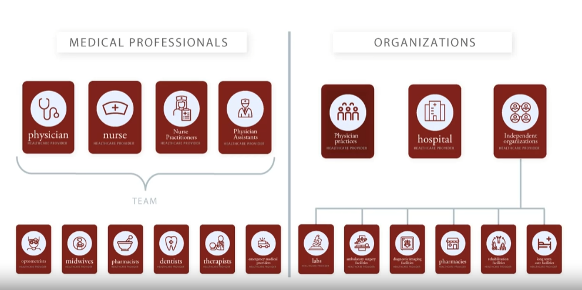
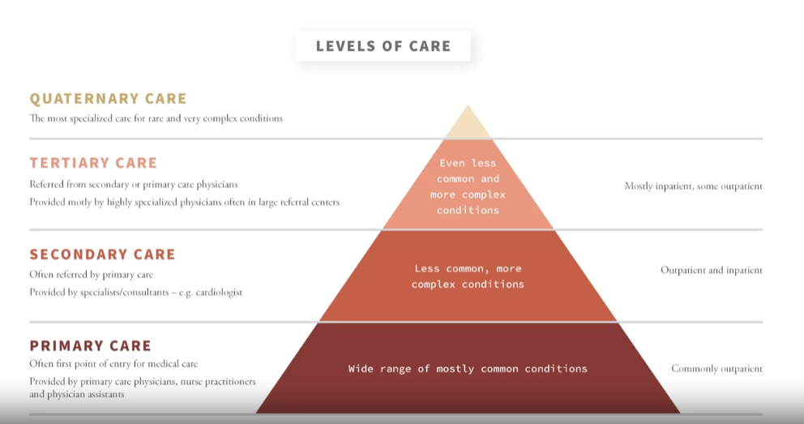
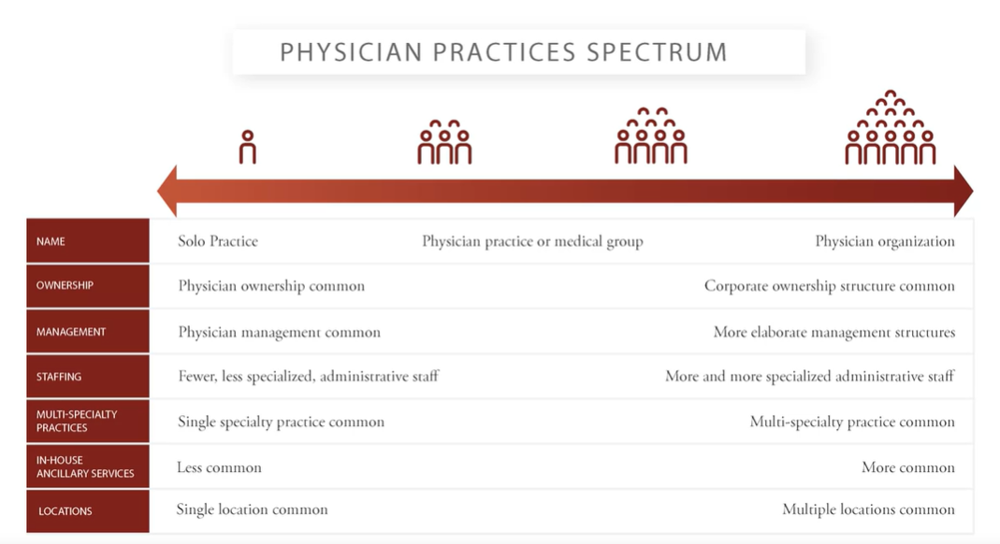
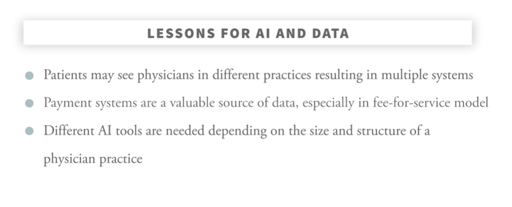

### Introduction to Healthcare

##### Week 1

###### Introduction

- The course covers important topics in health care systems.
- It provides a broad overview of physician practices, hospitals, and other healthcare providers and facilities.
- The course discusses how we pay for health care services, health insurance, and government programs that cover health care.
- It also explores the topic of prescription drugs and healthcare quality and improvement.
- The course takes a survey approach, touching on key issues in each area without going into deep details.
- While the main focus is on the US healthcare system, the topics covered have relevance across multiple countries.
- The course aims to improve understanding of data generated by the healthcare system and its relation to innovations in artificial intelligence.
- Overall, the course provides a comprehensive orientation to the different aspects of health care delivery and financing.

###### Basic Structure of the Healthcare System

- The videos discuss the interaction between patients and healthcare providers in a healthcare system.
- The goal is to facilitate `healthcare flow` from providers to patients, including treatment, prevention, and information.
- Healthcare systems have evolved from simple interactions to modern systems that require compensation for providers.
- The videos explore the transition from simple transactions to complex healthcare systems.
- The videos highlight the importance of compensation for sustainable healthcare provision.

    <!--  -->
    

###### Problem of Risk

- `Risk`: the possibility of facing a financial loss associated with the use of using a particular healthcare service.

- The original transaction between patients and healthcare providers was a simple exchange of healthcare for compensation.
- Healthcare providers became increasingly able to offer valuable services to patients, leading to a greater need for access to professional healthcare.
- Healthcare also became more expensive as providers offered more sophisticated treatments.
- Patients faced the risk of large, unplanned medical bills that they may have trouble paying.
- This created discomfort for patients and affected their future willingness to use the healthcare system.
- Providers also faced challenges when patients couldn't afford the care they received, leading to unpaid bills.
- The problem of risk refers to the possibility of facing a financial loss associated with the use of healthcare.
- Risk is common and widespread today, as healthcare costs can be significant and unpredictable.
- The problem of risk broke the original transaction and our ability to treat healthcare as a simple good or service.
- Addressing the problem of risk is crucial to ensure access to healthcare and the sustainability of healthcare providers.

    <!--  -->
    

###### Risk Pooling

- `Risk pooling`: sharing the risk among a group of people to reduce the financial impact of any one person's loss.

- Risk pooling is a solution to the problem of risk in healthcare systems.
- Risk pooling involves getting a group of people together to contribute an equal share to cover the medical bills of the group.
- By pooling the risk, individuals in the group share the costs of medical care, reducing their individual risk.
- Risk pooling helps replace uncertain and potentially large costs with more predictable and manageable costs.
- It involves shifting the risk from individuals to the group, which is collectively better positioned to handle it.

    <!--  -->
    

###### Insurance and Intermediaries for Risk Pooling

- `Intermediaries`: entities that collect fund from a group of people, pool the funds, and uses them to pay for healthcare for people who are covered by the pool.
- 2 types of intermediaries:
    - `Private insurance companies`: sell health insurance policies that provide coverage for medical bills under certain conditions.
        - `Insurance Policy`: a contract that provides for paying the medical bills of the holder under certain conditions.

        - `Enrollees/ Members/ beneficiaries`: individuals covered by the insurance policy.

        - `Premium`: the price of the policy, paid by the enrollees.
    - `Government programs`: act as intermediaries by collecting funds from the population to finance healthcare costs.
- Risk pooling is a concept used to solve the problem of risk in healthcare delivery.
- Intermediaries are organizations that collect funds from a group of people, pool the funds, and use them to pay for healthcare for the covered individuals.
- Intermediaries can be private insurance companies, payers, or health plans.
- Insurance companies sell health insurance policies that provide coverage for medical bills under certain conditions.
- Enrollees or beneficiaries are the individuals covered by the insurance policy.
- Insurance policies are purchased through premiums, which are the price of the policy.
- Insurance companies pool the premiums collected from a large group of people to create a fund for paying medical bills.
- Government programs also act as intermediaries and pool risk by collecting funds from the population to finance healthcare costs.
- With intermediaries in the picture, funds flow from the population to the intermediaries, who then pay healthcare providers for providing care to the patients.
- Out-of-pocket payments and cost-sharing are still common in healthcare systems, even with insurance coverage.

    <!--  -->
    

- Difference between private insurance companies and government programs:
    - Private insurance companies: sell health insurance policies that provide coverage for medical bills under certain conditions.
    - Government programs: act as intermediaries by collecting funds from the population to finance healthcare costs.

    - Insurance companies sell insurance policies to their enrollees, who pay the insurance company a premium to be covered under that policy. Governments collect funds, either through the tax system or via a premium system, and use those funds to cover the health costs for a group of people.

###### Beyond Patients, Providers, and Intermediaries: Other Players in the Health Care System

- The healthcare system involves relationships between patients, providers, and intermediaries.
- Governments play a role in setting up and operating intermediaries, providing care, and regulating the healthcare system.
- Many companies provide goods and services used by providers and patients, such as drugs, devices, and data systems.
- Professional societies and organizations also work with providers and contribute to the healthcare system.
- Healthcare systems have various components, with a focus on intermediaries and providers, but other entities are also important.

###### Overview of the Types and Roles of Intermediaries

- Intermediaries play a crucial role in the healthcare system by pulling risk and managing the cost of care for their members.
Once intermediaries hold the risk, they have a fixed pool of money collected from premiums and are responsible if their members require a lot of care.
- Intermediaries have an interest in influencing the care their members receive to manage costs in a responsible way and retain customers.
- Different intermediaries may have varying approaches to managing care, such as HMOs, PPOs, and high deductible health plans.
- Intermediaries can be used in various combinations in different countries, and there is no single intermediary that covers everyone.
- Some intermediaries may serve specific populations or geographic areas, while others offer multiple choices for individuals to opt for.
- Examples include the Medicare program in the US for people over 65, the National Health Service in the UK, and private insurance options in both countries.

    <!--  -->
    

- The second video provides an overview of the different types of providers in the healthcare system.
- It categorizes providers into two groups: medical professionals and organizations.
- Medical professionals include physicians, nurses, nurse practitioners, physician assistants, and other specialized professionals.
- Physicians have focused training in a particular area of medicine and work in outpatient or inpatient settings.
- Nurses play an essential role in providing care and often work as part of a team with physicians.
- Other professionals in the healthcare system include optometrists, midwives, pharmacists, dentists, therapists, and emergency medical providers.
- Organizations in the healthcare system include physician practices, hospitals, and independent facilities.
- Physician practices provide administrative and physical infrastructure for outpatient care.
- Hospitals provide more complex care for inpatients and have facilities for surgeries and advanced testing.
- Independent facilities include laboratories, ambulatory surgery facilities, diagnostic imaging facilities, pharmacies, rehabilitation facilities, and long-term care facilities.
- These organizations can be owned and operated by governments or privately owned.
- In some systems, physicians and facilities are organized separately, while in others they may be more closely integrated.
The video emphasizes the importance of collaboration between medical professionals and organizations in delivering care.

- Some key definitions:

    - Specialty: Physicians often have focused training in a particular area of medicine, which is referred to as their specialty. Examples of specialties include internist, pediatrician, cardiologist, and thoracic surgeon. Physicians are often referred to by their specialty, as it indicates their area of expertise.

    - Outpatient: Outpatient settings refer to healthcare settings that are outside of a hospital. Examples include physician offices, clinics, and surgical centers. In outpatient care, patients come in, see a provider, receive any necessary consultation or treatment, and then go back home on the same day.

    - Inpatient: Inpatient care refers to healthcare provided to patients in hospitals. Patients needing inpatient care are admitted to the hospital, stay there for a period of time to receive care, and then go home when they are done.

    - Nurse Practitioner: Nurse practitioners are advanced practice registered nurses who have additional training and education beyond that of a registered nurse. They can provide a wide range of healthcare services, including diagnosing and treating illnesses, prescribing medications, and managing overall patient care.

    - Physician Assistant: Physician assistants are healthcare professionals who work under the supervision of physicians. They can perform various tasks, such as taking medical histories, conducting physical examinations, ordering and interpreting diagnostic tests, and assisting in surgeries.

    - Specialty Providers: In addition to physicians, there are other professionals with specialized expertise who provide care in specific areas. Examples include optometrists (eye care), midwives (maternity care), pharmacists (medication management), dentists (oral health), therapists (mental health), and emergency medical providers (emergency care).

    - Physician Practices: Physician practices are organizations within which physicians work. They provide the administrative and physical infrastructure that physicians need to deliver care. This includes rooms, equipment, and support staff like nurses and scheduling/billing personnel. Physician practices mainly focus on providing infrastructure for outpatient care.

    - Hospitals: Hospitals are organizations that provide more complex care for inpatients. They have facilities such as beds, surgical suites, advanced testing and imaging equipment, and specialized departments. Hospitals also employ a range of medical professionals, including nurses, to provide care to patients.

    - Independent Organizations: These are organizations that provide facilities for specific types of medical care but are not part of a physician practice or a hospital. Examples include laboratories for diagnostic testing, ambulatory surgery facilities, diagnostic imaging facilities, pharmacies, rehabilitation facilities, and long-term care facilities. These organizations can operate independently in the community or be associated with hospitals or physician practices.

    - For-Profit and Nonprofit Organizations: Healthcare organizations can be owned and operated under different arrangements. In some systems, such as the United States, organizations like physician practices, hospitals, and independent facilities are privately owned and operated separately from the government. They function like businesses, providing care in exchange for compensation. Some organizations are explicitly for-profit, aiming to earn profits for their owners, while others may be nonprofit with a broader mission beyond earning profits. Nonprofits still need to be economically successful to stay in operation.

    - Integration of Physicians and Facilities: In some healthcare systems, physicians or physician practices and facilities like hospitals are organized separately but work closely together. For example, in the US, a physician may provide medical care while the hospital provides the facilities. In other systems, there may be closer integration, with the hospital employing physicians and providing both facilities and physician services within the same organization.

###### Providers and Levels of Care

- The first level is primary care, which is the initial and most generalized care a patient receives.
    - Primary care providers treat a wide range of general conditions and can refer patients to specialized physicians if needed.
    - Primary care is often provided by physicians in specialties like general practice, family medicine, internal medicine, pediatrics, geriatrics, or obstetrics and gynecology.
    - Primary care can also be provided by nurse practitioners or physician assistants.
- The next level is secondary care, which is for less common and more complex conditions that require specialized treatment.
    - Physicians providing secondary care are often called specialists or consultants.
    - Secondary care can be provided in outpatient settings or in hospitals.
- The third level is tertiary care, which involves even more specialized care and advanced treatments.
    - Tertiary care is less commonly needed than secondary care and is associated with inpatient care.
    - Tertiary care is provided by highly specialized physicians in referral centers with advanced technologies.
- The fourth level, quaternary care, is an extension of tertiary care and involves very advanced and experimental treatments.
    - Quaternary care is associated with large, advanced hospitals and academic institutions.

    <!--  -->
    

##### The Challenge of Rising Health Care Costs

- The video discusses the challenges in the healthcare system that drive discussions about policies and business opportunities.
- Healthcare costs are high and continue to grow over time in many countries.
- Healthcare spending as a percent of the gross domestic product (GDP) is used as a measure of healthcare expense.
- Most countries spend a significant amount on healthcare, with some countries, like the US, having higher spending than others.
- The increase in healthcare costs can be attributed to factors such as an aging population, increased population incomes, price increases, and advances in technology.
- The high and rising costs raise questions about the value of healthcare and the fairness of prices.
- There is a need to eliminate waste and improve value in healthcare systems.
- Intermediaries, such as private insurers and governments, play a role in managing costs.
- Healthcare providers and individual patients also have a stake in managing healthcare services and costs.
- Questions about healthcare spending and costs will continue to drive discussions and the need for innovation and ideas.

    <!--  -->
    

###### The Challenges of Quality and Access

- The video discusses the challenge of improving quality in healthcare systems.
- Healthcare is complex and rapidly changing, making it difficult to provide high-quality care.
- Underuse, overuse, and misuse of services are common challenges in healthcare.
    - `Underuse`: People don’t use enough of a beneficial service (e.g. vaccines).

    - `Overuse`: Services that only have value for some patients are used by others as well (e.g. MRI scans are given to every person who comes to the emergency department for back pain).

    - `Misuse`: Giving a patient a service when it is not indicated (e.g. giving blood thinners to patient in whom they are contraindicated).
- Providers and the healthcare system are motivated to improve quality and address these challenges.
- Efforts to monitor care, create data, and design better systems are being made to improve quality.
- Access to care and coverage is another challenge in healthcare systems.
- Socioeconomic disparities, cultural issues, and lack of providers can contribute to access challenges.
- Participants in the healthcare system are interested in finding approaches to improve access.
- The video highlights the opportunities for improvement in quality and access in healthcare systems.

###### Lessons for AI and Data

- The video starts by discussing the wide variety of players in the healthcare system and the different roles they play. It emphasizes that when working on AI and healthcare, it is important to consider the different parts of the healthcare system and what they might want from AI.
- Intermediaries, such as insurance companies, have a population to manage and are looking for tools that can help them identify possible health issues in their population and provide access to necessary resources.
- Providers, such as physicians, are focused on providing healthcare to their patients. They need tools that can help them manage incoming information, diagnose and create treatment plans, and identify patients who may need services in the future.
- Patients themselves have interests in keeping themselves healthy and may want to find out if they need medical care. Patient-directed solutions can be beneficial in this regard.
- The video then shifts its focus to the data aspect of healthcare. 
- Different entities in the healthcare system have different kinds of data.
- Providers often have data from their work with patients, which is stored in electronic health records (EHRs). EHR data can be useful but may have idiosyncrasies, such as text fields that are not always easy to handle and less information on payments or business matters.
- Intermediaries, on the other hand, have data associated with paying providers. This data can provide insights into where patients are receiving services and how much they cost.
- Governments, as regulators of the healthcare system, keep track of licensed hospitals and physician licenses. Other entities, such as pharmacies, may also collect data on the drugs they sell.
- The video concludes by emphasizing the importance of paying attention to the fact that data in healthcare comes from different sources, is used for different reasons, and has different issues. It highlights the need for innovation, new ideas, processes, and technologies to address the challenges in the healthcare system.

##### Week 2

###### Characteristics of Physician Practices

- The video discusses how physicians provide services and the organizations in which they work, known as physician practices.
- Physician practices can be organized in different ways, such as independent entities or government-owned.
- Practices can vary in size, from solo practices with one physician to large practices with hundreds or even thousands of physicians.
- As practices get larger, they may be called medical groups or physician organizations.
- Ownership structures also change with practice size, with smaller practices commonly owned by physicians and larger practices having more complex ownership structures.
- Management and staffing also differ based on practice size, with larger practices having more resources and elaborate management structures.
- Larger practices often have multi-specialty physicians and may offer in-house services like imaging and laboratory services.
- Some practices have multiple locations, serving different communities.
- Understanding the variety of physician practices helps in understanding different ways medical care is delivered and how physicians interact with intermediaries and the flow of funds in healthcare systems.

    <!--  -->
    

###### Physicians, Intermediaries, and Networks

- The video discusses the role of intermediaries in the healthcare system and how they facilitate the flow of funds between patients and providers.
- Intermediaries: Organizations that have agreements with physician practices to provide care to their enrollees and handle payment arrangements.
- Physician Practices: Privately run practices that have arrangements or agreements with intermediaries to provide care to patients and receive payment.
- Physician Networks: A particular set of physicians or practices with whom insurers work, and which the members covered by the insurer will be encouraged or required to see for covered care.
- In-Network: Physicians or practices that have negotiated an arrangement with an insurer to be part of their network, allowing the insurer to cover or contribute to the cost of their care for the insurer's members.
- Out-of-Network: Physicians or practices that do not have an arrangement with a particular insurer, making it more difficult for the insurer's members to use their services.
- Independent Practice Associations (IPAs): Organizations that help smaller practices by organizing them into a network and negotiating agreements with insurers on their behalf.
- Payment Arrangements: Terms and agreements between intermediaries and physician practices regarding the payment for services provided to patients.
- Size and Structure of Practices: The size and management structure of physician practices can influence the negotiation and arrangement process with intermediaries.
- Contracting Directly: Some practices may choose to negotiate agreements directly with insurers instead of going through an IPA or other network organizer. 

###### Fee for Service Payment

- The video discusses how physicians are paid in the healthcare system.
- One model of payment is fee-for-service (FFS), where doctors are paid for each service they provide.
- In fee-for-service, doctors create a bill for each service and send it to the insurer for payment.
- Fee schedules are used in fee-for-service, which list all the services a physician can provide and the payment amounts associated with each one.
- Intermediaries using fee-for-service have a fee schedule that provides the allowed amount or negotiated rate for each service.
- Patients see a physician for a service, and the physician sends a bill to the insurer with the charged amount.
- The insurer then compares the charged amount with the allowed amount or negotiated rate and pays the lower amount to the physician.
- Charges on bills may differ from the actual amounts paid.
- Fee-for-service is a retrospective payment system, where the payment amount is set after the services are delivered and responds to the number of services provided.
- Physicians may have their own list of charge amounts, but the payer will usually pay the lesser of the charged amount and the allowed or negotiated rate.

- Definitions mentioned in the video:

    - Fee-for-service (FFS): A payment model where doctors are paid for each service they provide.
    - Fee schedule: A list of services a physician can provide and the payment amounts associated with each one.
    - Allowed amount: The payment amount that an intermediary is willing to pay for a given service.
    - Negotiated rate: The agreed-upon payment amount between an intermediary and a physician practice for a given service.
    - Charge master: A physician practice's list of charge amounts for services.
    - Retrospective payment system: A payment system where the amount of payment is set after the services are delivered and responds to the number of services provided.

###### Procedure Codes and Diagnosis Codes

- The video discusses coding systems used in the healthcare system, particularly in fee-for-service payment systems.
- Coding systems are used to specify the list of services that can be provided and billed in a fee-for-service system.
One commonly used coding system in the US is the Current Procedure Terminology (CPT), which assigns numeric or alphanumeric codes to thousands of services that physicians can provide.
- Another coding system related to CPT is the Healthcare Common Procedure Coding System (HCPCS), which includes additional items and is commonly used in the US.
- The International Classification of Diseases, 10th revision (ICD-10), is a coding system used to code diagnoses or conditions that patients have.
- ICD-10 has thousands of alphanumeric codes for different diagnoses.
Other coding systems, such as the Canadian Classification of - Health Interventions and systems used in the UK, also exist in different countries.
- Procedure codes and diagnosis codes are used by many organizations in various contexts within the healthcare system.
- The video acknowledges that the specifics of how these coding systems work are beyond the scope of the video.

###### The Medicare Fee Schedule

- The Medicare fee schedule is a fee schedule used in the US for Medicare payments to physicians.
- Medicare is a US government payer that provides care mainly to people over age 65.
- The fee schedule is based on the HCPCS system, which uses the CPT listing of physician services.
- The Medicare fee schedule assigns a weight to each service based on the amount of work, expenses, and malpractice risk involved.
- The weights are called relative value units (RVUs) and are used to determine the payment amounts for each service.
- The Medicare fee schedule is publicly available and is commonly used by private insurers as well.
- Private insurers often negotiate with physicians based on the Medicare fee schedule.
- The fee schedule has an enumerated list of services and the number of RVUs associated with each service.
- There is a conversion factor that converts the RVUs into payment amounts.
- The Medicare fee schedule is a significant factor in fee-for-service payment in the US.

- Definitions mentioned in the video:

    - Medicare: The US government payer that provides care mainly to people over age 65.
    - Fee schedule: A list of services and their corresponding payment amounts.
    - HCPCS system: Healthcare Common Procedure Coding System, a standardized coding system for healthcare services.
    - CPT listing: Current Procedural Terminology, a listing of physician services.
    - Relative value units (RVUs): Weights assigned to each service in the fee schedule based on work, expenses, and malpractice risk.
    - Conversion factor: A factor used to convert RVUs into payment amounts.
    - Private insurers: Insurance companies that provide health insurance coverage outside of government programs like Medicare.

###### Capitation Payment Systems: Overview and Structure

- Capitation is a payment model where physicians are paid a fixed amount per person, per unit of time.
- The first step in a capitation payment model is to identify a population of people associated with a practice, called the panel of patients.
- A scope of services is defined for the capitation arrangement, specifying the services included and excluded.
- The practice and the intermediary (insurer) agree on a fixed payment amount per panel patient, per time period (commonly a month), called the capitation rate or per member per month (PMPM) amount.
- Payments to the practice are determined by multiplying the number of patients in the assigned panel by the PMPM amount.
- In a pure capitation system, there is no further payment for any particular service provided by the physicians.
- Capitation arrangements can be applied to different situations, each with their own way of defining the panel, scope, and PMPM.
- Capitation is the opposite of a fee-for-service system, where physicians get paid for each service provided.
- Capitation payments are determined before any services are provided and do not change based on the services provided.
- Capitation arrangements are often used in primary care practices, but can also be used for specialists.

- Definitions mentioned in the video:

    - Capitation: Payment per person, per unit of time.
    - Panel of patients: Population of people associated with a practice.
    - Scope of services: Services included and excluded in the capitation arrangement.
    - Capitation rate: Fixed payment amount per panel patient, per time period.
    - Per member per month (PMPM) amount: Another term for the capitation rate.
    - Fee-for-service: Payment system where physicians get paid for each service provided.
    - Prospective payment: Payment determined before any services are provided.

###### Capitation Payment Systems: Scope of Capitation

- Capitation systems can vary in scope, ranging from partial capitation models to global capitation.
- Partial capitation models include a subset of medical care, such as outpatient primary care.
- Global capitation involves accepting a single capitation payment for all medical care a patient might need in a time period.
- The scope of capitation agreements can be broad, covering primary care, specialty care, hospitalizations, tests, etc.
However, dental care or vision care are often not included in capitation agreements.
- The capitation rate, also known as PMPM (per member per month) amount, depends on the scope of the agreement.
- Global capitation arrangements entail a major change in responsibility and risk for provider organizations.
- Provider organizations accepting global capitation need to be able to handle the financial risks associated with providing a broad range of care.
- Large organizations with many providers and the capability to deliver a broad range of care are more likely to accept global capitation agreements.

    - Physicians are mainly paid in the US either through a fee-for-service (FFS) system, in which they are paid for each specific service given, or through a capitation model, in which they are given a panel of patients and paid a sum of money to handle those patients’ care for a given time period, regardless of services rendered during that time. Physicians might prefer that in FFS, they are incentivized to provide any care that is indicated for a patient, regardless of cost or quantity. They may also like that they do not take on any financial risk for the patients they serve. In capitation, physicians may like that they are incentivized to invest more in preventative services that will decrease a patient’s care needs over a longer time period and that they might feel a financial incentive to use services that might be considered unnecessary. 

###### Episode-Based Payment Systems and Salary Systems

- The video discusses two physician payment models: episode-based payments and salaries.
- Episode-based payments are a middle ground between fee-for-service and capitation. In this model, physicians are paid a predefined amount for a specific episode of care, regardless of the services provided within that episode.
- An episode of care includes a clinical dimension (set of services or medical conditions) and a time dimension (beginning and end of the episode).
- The payment for an episode is fixed and does not vary with the specific services provided to the patient.
- Episode-based payments are similar to capitation in that there is no additional payment for providing more services, but they differ in that the payment is for a defined episode only.
- Salaries are another payment model where physicians are paid a fixed amount for a specific period of time (e.g., month or year) for carrying out agreed-upon duties.
- Salaries are commonly used in larger physician practices.
- These payment models, along with fee-for-service and capitation, are different ways of compensating physicians for their services.

- Definitions mentioned in the video:

    - Fee-for-service: Physicians are paid based on the services they perform. The more services they provide, the more they get paid.
    - Capitation: Physicians receive a single payment per person per unit of time, regardless of the number of services provided.
    - Episode-based payments: Physicians are paid a predefined amount for a specific episode of care, regardless of the services provided within that episode.
    - Salaries: Physicians are paid a fixed amount for a specific period of time for carrying out agreed-upon duties.

###### Risk Shifting in Physician Payment and Multi-Layered Physician Payment Arrangements

- The video discusses two important issues related to physician organizations and payment in healthcare systems: risk and multi-layered payment arrangements.
- Risk in physician payment refers to the transfer of financial responsibility from intermediaries to providers. Capitation is a payment method where the intermediary pays a fixed amount to the physician practice, transferring the risk to the practice. In fee-for-service payment, the risk remains with the intermediary.
- Capitation is challenging to use for small practices as they may not have a large enough patient base to manage the risk effectively.
- Physician payment arrangements often involve multiple layers. In a small practice, the intermediary pays the practice directly, and the physicians in the practice are paid based on the profits of the practice. In a larger group practice, the group administration may receive payment from the intermediary and then pay the individual doctors based on different arrangements.
- In the case of smaller practices that have joined an Independent Practice Association (IPA), the IPA receives payment from the payer based on the collective work of all participating practices. - The IPA then pays the individual practices, and the practices determine how the individual physicians will be compensated.
- Understanding the different layers and stages of payment is important in determining how physicians are paid and how they respond to payment incentives.

- Definitions mentioned in the video:

    - Risk: The financial responsibility for healthcare costs, which can be transferred from intermediaries to providers through payment arrangements.
    - Capitation: A payment method where an intermediary pays a fixed amount to a physician practice, transferring the financial risk to the practice.
    - Fee-for-service: A payment method where providers are paid for each service or procedure they perform, and the financial risk remains with the intermediary.
    - Independent Practice Association (IPA): An organization that contracts with payers on behalf of individual physician practices, often involving collective payment arrangements.

###### Incentives Created by Physician Payments

- Incentives in physician payment systems play a crucial role in understanding the challenges and finding solutions in healthcare.
- Fee-for-service payment methods create incentives for physicians to perform more services or expensive treatments, which can lead to overuse of care and increased costs.
- Capitation payment methods, on the other hand, incentivize physicians to provide less care for each patient to reduce costs.
- Salary models offer a more neutral set of incentives for physicians in terms of the amount of care provided.
- Designing payment systems that consider incentives and their impact on the healthcare system is essential.
- Various approaches, such as monitoring care, steering patients towards appropriate care, and using hybrid models, are being explored to manage incentives and optimize healthcare delivery.
- Attention to the incentives associated with different payment systems is crucial for effective healthcare management.

###### Lessons for AI and Data

-
    <!--  -->
    

##### Week 3

- There are multiple payment methods that could be mentioned.  Three might be considered the most common.  Hospitals can be paid on a fee-for-service (FFS) basis, via a flat payment rate system (e.g. a DRG system), or via global budgets. Hospital FFS systems are analogous to physician FFS systems in that hospitals are reimbursed for each service they provide a patient; global budgets are most similar to capitation payment mechanisms for physicians. Flat rate or DRG systems are unique in that they are somewhere in between: they specify a payment that will be made for a given type of hospital stay (e.g. a heart failure admission), given adjustments for factors such as patient age, comorbidities, whether or not a hospital is a teaching or non-teaching hospital, etc. 

- Payers are increasingly becoming interested in pay-for-performance (P4P) payment schemes in the US, which usually include metrics for quality of care. Important design features of any P4P scheme include:  

    - What measures should be used?,

    - What should be the goal or target to reach for?,

    - How should adjustments based on variations such as patient illness severity be made?, and

    - How much of the payment should be based on whether or not the goal is met?