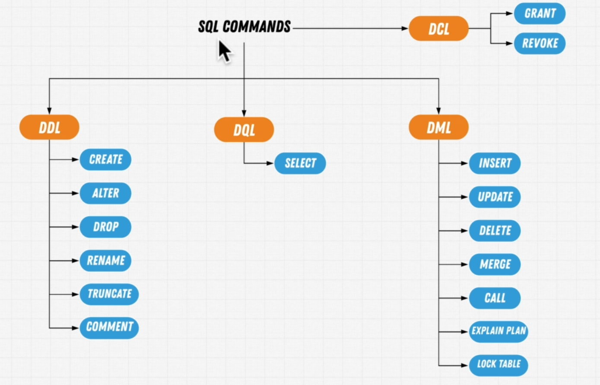
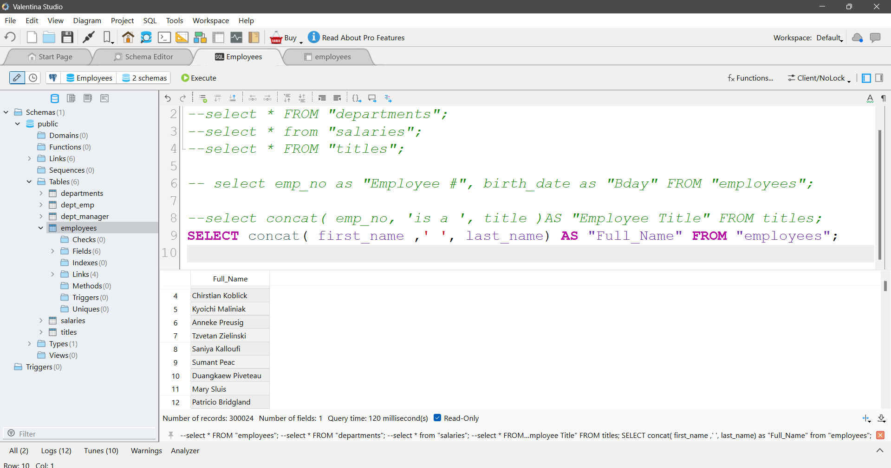
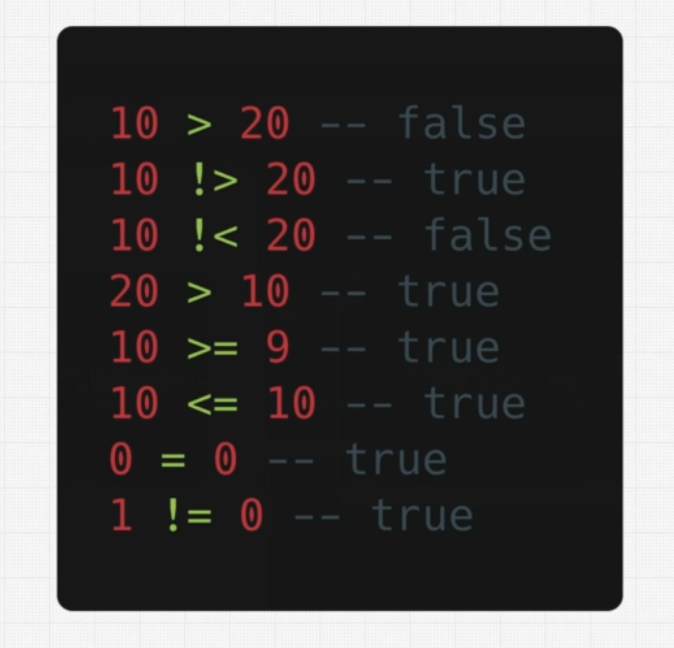
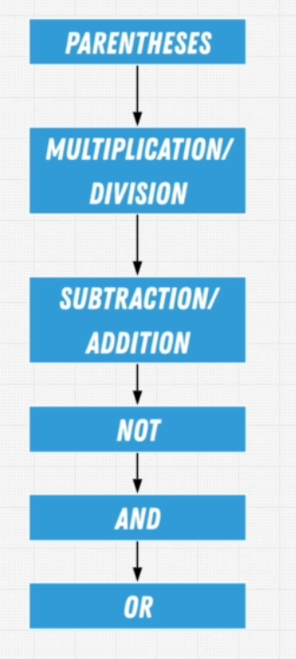

## 🔰 Complete SQL + Databases Bootcamp

⏱  24.5 Hours  📦 278 Lessons

Most comprehensive resource online to learn SQL and Database Management & Design + exercises to give you real-world experience working with all database types.

Taught By: Mo Binni, Andrei Neagoie

Download Full Course: https://t.me/+1kcu9r4nl-1lY2Rk

### SQL Fundamentals - [Reference](https://www.w3resource.com/sql/tutorials.php#HISTSQL)

#### Schema SQL

```sql
CREATE TABLE User (
  id varchar(255) NOT NULL,
  name varchar(255) NOT NULL,
  lastName varchar(255) NOT NULL,
  dob date NOT NULL,
  sex varchar(1) NOT NULL,
  role varchar(255) NOT NULL,
  PRIMARY KEY (id)
);

INSERT INTO User
VALUES ('u1', 'George', 'Jacobson', '1992-01-01', 'm', 'manager');

INSERT INTO User
VALUES ('u2', 'Macy', 'Waterson', '1992-01-01', 'f', 'employee');

INSERT INTO User
VALUES ('u3', 'Bill', 'Peters', '1992-01-01', 'm', 'employee');


INSERT INTO User
VALUES ('u4','Janine', 'Wilson', '1992-01-01', 'f', 'manager');


INSERT INTO User
VALUES ('u5', 'Jason', 'Lipton', '1992-01-01', 'm', 'manager');
```

#### Query SQL

```sql
select * from User 
-- where role = 'employee';
```

### Imperative vs Declarative

- Imperative: How to do something, eg. Java
- Declarative: What to do, eg. SQL

### History of SQL

- 1970: SQL was developed at IBM by Donald D. Chamberlin and Raymond F. Boyce
- `Sequel`: Structured English Query Language
- For more information, check out the [video](https://youtu.be/KG-mqHoXOXY?si=ZQOvDpY2gS0W8dE7)

### SQL Standards

- SQL-86 (SQL-1)
- SQL-89 (SQL-2)
- SQL-92 (SQL-3)
- SQL:1999 (SQL-3)
- SQL:2003 (SQL-3)
- SQL:2008 (SQL-3)
- SQL:2011 (SQL-3)
- SQL:2016 (SQL-3)
- SQL:2019 (SQL-3)
- SQL:2023 (SQL-3)

- These are some of the SQL standards that have been released over the years and the latest one is SQL:2023.

### DATABASES

- A database is a collection of data stored in a computer system. Databases are organized in such a way that computer programs can easily access the data.

### Data Base Management System (DBMS)

- A DBMS is a software that allows a computer to perform database functions such as storing, retrieving, adding, deleting, and modifying data.

- Examples of DBMS include MySQL, PostgreSQL, SQLite, Oracle, SQL Server, and many more.

### Database Models

- Hierarchical Model: This model organizes data in a tree-like structure, with a single root, to which all the other data is linked. This model is not widely used today.

- Network Model: This model is an extension of the hierarchical model, where each child can have multiple parents. This model is also not widely used today.

- `Relational Model`: This model organizes data into tables, where each table has rows and columns. This model is the most widely used today. eg. MySQL, PostgreSQL, SQLite, Oracle, SQL Server, etc.

- Object-Oriented Model: This model organizes data into objects, which consist of attributes and methods. This model is used in object-oriented programming languages.

- Document Model: This model organizes data into documents, which can contain nested documents and arrays. This model is used in document-oriented databases.

- Graph Model: This model organizes data into nodes and edges, which represent entities and relationships. This model is used in graph databases.

- Entity-Relationship Model: This model organizes data into entities and relationships, which represent real-world entities and their relationships. This model is used in entity-relationship diagrams.

### TABLES

- A table is a collection of related data stored in rows and columns. Each row represents a record, and each column represents a field.

- A table is also known as a relation in the relational model.

- A table has a name, which is used to identify the table.

- A table has columns, which are used to define the fields of the table.

- A table has rows, which are used to store the records of the table.

- A table has a primary key, which is used to uniquely identify each row in the table.

### COLUMNS

- A column is a vertical arrangement of data in a table. Each column represents a field in the table.

- A column has a name, which is used to identify the column.

- A column has a data type, which defines the type of data that can be stored in the column.

- A column has a size, which defines the maximum length of the data that can be stored in the column.

- A column can have domain/constraints, which define the rules that the data in the column must follow.

- Columns are also known as attributes in the relational model.

### ROWS

- A row is a horizontal arrangement of data in a table. Each row represents a record in the table.

- A row has a primary key, which is used to uniquely identify the row in the table.

- A row has a value for each column in the table.

- A row is also known as a tuple in the relational model.

- A row is also known as a record in the database.

- Cardinality: The number of rows in a table is known as the cardinality of the table.

### PRIMARY KEY

- A primary key is a column or a set of columns that uniquely identifies each row in a table.

- A primary key must contain unique values.

- A primary key cannot contain NULL values.

- A primary key is used to enforce entity integrity.

- A primary key is also known as a candidate key in the relational model.

### FOREIGN KEY

- A foreign key is a column or a set of columns that references a primary key in another table.

- A foreign key is used to enforce referential integrity.

- A foreign key can contain NULL values.

- A foreign key is also known as a referencing key in the relational model.

### OLTP vs OLAP

- OLTP (Online Transaction Processing): OLTP systems are used to manage day-to-day transactions, such as sales, orders, and payments. OLTP systems are optimized for fast and efficient transaction processing.

- OLAP (Online Analytical Processing): OLAP systems are used to analyze and report on data, such as sales trends, customer behavior, and market share. OLAP systems are optimized for complex queries and data analysis.

### Popular SQL Databases

- MySQL: MySQL is an open-source relational database management system that is widely used for web applications.

- PostgreSQL: PostgreSQL is an open-source relational database management system that is known for its advanced features and extensibility.

- SQLite: SQLite is a lightweight relational database management system that is embedded in many applications.

- Oracle: Oracle is a commercial relational database management system that is widely used in enterprise applications.

- SQL Server: SQL Server is a commercial relational database management system that is developed by Microsoft.

### PostgreSQL

- PostgreSQL is an open-source relational database management system that is known for its advanced features and extensibility.

- PostgreSQL is widely used for web applications, data warehousing, and business intelligence.

- PostgreSQL supports a wide range of data types, including integers, floats, strings, dates, and arrays.

- PostgreSQL supports advanced features such as transactions, views, triggers, and stored procedures.

- PostgreSQL is known for its extensibility, with support for custom data types, custom functions, and custom indexes.

- PostgreSQL is known for its performance, with support for parallel query processing, query optimization, and indexing.

- PostgreSQL is known for its reliability, with support for high availability, replication, and backup and recovery.

- For this course, we will be using `PostgreSQL` as our database and `valentina studio`[To install](https://valentina-db.com/en/studio/download#:~:text=Valentina%20Studio%20Win%2064) as our database client.


    #### Assuming th employees.sql is the path in the cmd, and a DB called Employees is created, then the command to run the sql file is as follows:
    ```
    path: "C:\Program Files\PostgreSQL\16\bin\psql.exe" -U postgres -d Employees < employees.sql
    Password for user postgres:
    ```
    
### Queries in SQL

- A query is a request for data from a database. Queries are used to retrieve, insert, update, and delete data in a database.

- A query is written in SQL (Structured Query Language), which is a standard language for interacting with databases.

- A query consists of one or more SQL statements, which are used to perform operations on the database.

- A query can be simple or complex, depending on the requirements of the user.

- A query can be executed using a database client, such as `valentina studio`, `pgAdmin`, or `SQL Server Management Studio`.
 
### SQL Statements

  
- SQL statements are used to perform operations on a database. There are several types of SQL statements, including:

- Data Definition Language (DDL) statements: DDL statements are used to define, modify, and delete database objects, such as tables, indexes, and views.

- Data Manipulation Language (DML) statements: DML statements are used to retrieve, insert, update, and delete data in a database.

- Data Control Language (DCL) statements: DCL statements are used to grant and revoke permissions on database objects.

- Transaction Control Language (TCL) statements: TCL statements are used to manage transactions in a database.

- DQL (Data Query Language): SELECT - Retrieves data from a database

- DML (Data Manipulation Language): INSERT, UPDATE, DELETE  Modifies data in a database

- DDL (Data Definition Language): CREATE, ALTER, DROP  Creates, modifies, and deletes database objects

- DCL (Data Control Language): GRANT, REVOKE  Grants and revokes permissions on database objects

- TCL (Transaction Control Language): COMMIT, ROLLBACK  Manages transactions in a database

### SELECT Statement

- The SELECT statement is used to retrieve data from a database. The SELECT statement is the most commonly used SQL statement.

- The SELECT statement has the following syntax:

```sql
SELECT column1, column2, ...
FROM table_name;
```

- The SELECT statement retrieves data from the specified columns of the specified table.

- The SELECT statement can retrieve data from one or more columns of a table.

- The SELECT statement can retrieve data from one or more tables using JOINs.

- The SELECT statement can retrieve data based on specified conditions using WHERE clause.

- The SELECT statement can retrieve data in a specific order using ORDER BY clause.

- The SELECT statement can retrieve a subset of data using LIMIT clause.

- The SELECT statement can retrieve distinct values using DISTINCT clause.

- The SELECT statement can perform calculations on retrieved data using aggregate functions.

- The SELECT statement can group retrieved data using GROUP BY clause.

- The SELECT statement can filter grouped data using HAVING clause.

- The SELECT statement can retrieve data from multiple tables using JOINs.

- The SELECT statement can retrieve data from multiple tables using UNION clause.

- The SELECT statement can retrieve data from multiple tables using INTERSECT clause.

- The SELECT statement can retrieve data from multiple tables using EXCEPT clause.

- The SELECT statement can retrieve data from multiple tables using subqueries.

- The SELECT statement can retrieve data from multiple tables using common table expressions (CTEs).

- The SELECT statement can retrieve data from multiple tables using window functions.

- The SELECT statement can retrieve data from multiple tables using recursive queries.

- The SELECT statement can retrieve data from multiple tables using full-text search.

- The SELECT statement can retrieve data from multiple tables using spatial queries.

- The SELECT statement can retrieve data from multiple tables using JSON functions.

- The SELECT statement can retrieve data from multiple tables using XML functions.

- The SELECT statement can retrieve data from multiple tables using regular expressions.

- The SELECT statement can retrieve data from multiple tables using machine learning functions.

- The SELECT statement can retrieve data from multiple tables using graph functions.

- The SELECT statement can retrieve data from multiple tables using geospatial functions.

- The SELECT statement can retrieve data from multiple tables using time series functions.

- The SELECT statement can retrieve data from multiple tables using statistical functions.

- Here in the sql editor of valentina studio, we can run the following query to retrieve all the data from the User table:

```sql 
select * from User;
```
- Some of the examples tried out were:
```sql
select * FROM "employees";
select * FROM "departments";
select * from "salaries";
select * FROM "titles";
```

- The above queries were run on the employees database, which is a sample database provided by the course owner.

### Renaming Columns

- The AS keyword is used to rename columns in the SELECT statement. The AS keyword is optional, and the column name can be specified without it.

- The AS keyword is used to give an alias to the column name.

- The AS keyword is used to make the query more readable.

- The AS keyword is used to avoid conflicts with reserved keywords. 

- The AS keyword is used to give a meaningful name to the column.

- The AS keyword is used to give a short name to the column.

- The AS keyword is used to give a descriptive name to the column.  

- The AS keyword is used to give a unique name to the column.

- eg. The following query renames the column name to `first_name` and `last_name`:

```sql
select f_name as first_name, l_name as last_name from employees;
```

- Some of the examples tried out were:
```sql
select emp_no as "Employee #", birth_date as "Bday" FROM "employees";
```

### Column Concatenation

- Concat function is used to concatenate two or more columns in the SELECT statement.

- Concat function is used to combine two or more columns into a single column.

- eg. The following query concatenates the first name and last name columns:

  ```sql
  select concat(f_name, ' ', l_name) as full_name from employees;
  ```



### Functions in SQL

- SQL functions are used to perform operations on data in a database. There are several types of SQL functions, including:

- `Aggregate functions`: Aggregate functions are used to perform calculations on a set of values and return a single value. Examples of aggregate functions include SUM, AVG, COUNT, MIN, and MAX. [Reference](https://www.postgresql.org/docs/12/functions-aggregate.html)

    ```
    select sum(salary) from salaries; 
    select avg(salary) from salaries;
    ```

- `Scalar functions`: Scalar functions are used to perform calculations on a single value and return a single value. Examples of scalar functions include UPPER, LOWER, LENGTH, and SUBSTRING.

- `Date functions`: Date functions are used to perform calculations on date values and return a date value. Examples of date functions include DATE, MONTH, YEAR, and DAY.

- `String functions`: String functions are used to perform operations on string values and return a string value. Examples of string functions include CONCAT, SUBSTRING, and REPLACE.

- `Mathematical functions`: Mathematical functions are used to perform calculations on numeric values and return a numeric value. Examples of mathematical functions include ABS, ROUND, and CEIL.

- `Logical functions`: Logical functions are used to perform operations on boolean values and return a boolean value. Examples of logical functions include AND, OR, and NOT.

- `Window functions`: Window functions are used to perform calculations on a set of rows and return a single value for each row. Examples of window functions include ROW_NUMBER, RANK, and DENSE_RANK.

- `User-defined functions`: User-defined functions are functions that are defined by the user and can be used in SQL queries. Examples of user-defined functions include stored procedures and user-defined functions.

- Here are some of the examples of functions used in SQL:

  ```sql
  select count(*) from employees;
  select sum(salary) from salaries;
  select avg(salary) from salaries;
  select min(salary) from salaries;
  select max(salary) from salaries;
  select upper(f_name) from employees;
  select lower(f_name) from employees;
  select length(f_name) from employees;
  select substring(f_name, 1, 3) from employees;
  select abs(salary) from salaries;
  select round(salary) from salaries;
  select ceil(salary) from salaries;
  select floor(salary) from salaries;
  select date_part('year', birth_date) from employees;
  select date_part('month', birth_date) from employees;
  select date_part('day', birth_date) from employees;
  select concat(f_name, ' ', l_name) from employees;
  select replace(f_name, 'a', 'A') from employees;
  select coalesce(f_name, 'Unknown') from employees;
  select distinct f_name from employees;
  select distinct l_name from employees;
  select distinct f_name, l_name from employees;
  select distinct on (f_name) f_name, l_name from employees;
  select distinct on (l_name) f_name, l_name from employees;
  select distinct on (f_name, l_name) f_name, l_name from employees;
  select distinct on (f_name, l_name) f_name, l_name from employees order by f_name, l_name;
  select distinct on (f_name, l_name) f_name, l_name from employees order by f_name desc, l_name desc;
  select distinct on (f_name, l_name) f_name, l_name from employees order by f_name, l_name desc;
  select distinct on (f_name, l_name) f_name, l_name from employees order by f_name desc, l_name;
  select distinct on (f_name, l_name) f_name, l_name from employees order by f_name, l_name desc;
  select distinct on (f_name, l_name) f_name, l_name from employees order by f_name desc, l_name;
  select distinct on (f_name, l_name) f_name, l_name from employees order by f_name, l_name desc;
  select distinct on (f_name, l_name) f_name, l_name from employees order by f_name desc, l_name;
  select distinct on (f_name, l_name) f_name, l_name from employees order by f_name, l_name desc;
  select distinct on (f_name, l_name) f_name, l_name from employees order by f_name desc, l_name;
  select distinct on (f_name, l_name) f_name, l_name from employees order by f_name, l_name desc;
  select distinct on (f_name, l_name) f_name, l_name from employees order by f_name desc, l_name;
  select distinct on (f_name, l_name) f_name, l_name from employees order by f_name, l_name desc;

  ```

### Comments in SQL

- Comments are used to document SQL code and make it more readable. There are two types of comments in SQL:

- Single-line comments: Single-line comments start with -- and continue until the end of the line.

  - eg. The following query retrieves all the data from the User table:

    ```sql
    select * from User; -- This is a single-line comment
    ```

- Multi-line comments: Multi-line comments start with /* and end with */. Multi-line comments can span multiple lines.

    - eg. The following query retrieves all the data from the User table:

    ```sql
    /*
    This is a multi-line comment
    It spans multiple lines
    */
    select * from User;
    ```
  
- Comments are ignored by the SQL parser and do not affect the execution of the SQL code.

- Comments are used to document the purpose of the SQL code.

- Comments are used to explain complex SQL queries.

- Comments are used to provide context for the SQL code.

- Comments are used to document changes made to the SQL code.

### Common Select Mistakes

- Some of the common mistakes made while writing SQL queries are:

- Missing semicolon at the end of the query.

- Misspelling of column names.

- Missing quotes around string values.

- Using reserved keywords as column names.

- Using incorrect data types in the WHERE clause.

- Using incorrect operators in the WHERE clause.

- Using incorrect functions in the SELECT statement.

- Using incorrect functions in the WHERE clause.

- Using incorrect functions in the ORDER BY clause.

- Using incorrect functions in the GROUP BY clause.


### Filtering Data

- The WHERE clause is used to filter data in the SELECT statement. The WHERE clause specifies a condition that must be met for a row to be included in the result set.

- The WHERE clause has the following syntax:

```sql
SELECT column1, column2, ...
FROM table_name
WHERE condition;
```

- The WHERE clause can contain one or more conditions, which are combined using logical operators such as AND, OR, and NOT.

    - eg. The following query retrieves all the data from the User table where the role is 'employee':

    ```sql
    select * from User where role = 'employee' AND age > 30;
    ```


- The WHERE clause can contain comparison operators such as =, <, >, <=, >=, and <>.

  - eg. The following query retrieves all the data from the User table where the role is 'employee':

    ```sql
    select * from User where age > 30;
    ```

    

- The WHERE clause can contain range operators such as BETWEEN and IN.

  - eg. The following query retrieves all the data from the User table where the role is 'employee':

    ```sql
    select * from User where age BETWEEN 30 AND 40;
    ```

    ```sql
    select * from User where age IN (30, 40, 50);
    ```

- The WHERE clause can contain pattern matching operators such as LIKE and ILIKE and CAST.

  - eg. The following query retrieves all the data from the User table where the role is 'employee':

    ```sql
    select * from User where name LIKE 'A%';
    ```

    ```sql
    select * from User where name ILIKE 'a%';
    ```

    ```sql
    select * from User where CAST(age AS varchar) LIKE '3%';
    ```

- Not operator

  - eg. The following query retrieves all the data from the User table where the role is 'employee':

    ```sql
    select * from User where NOT role = 'employee';
    ```

- Operator Precedence

    

### Checking for NULL Values

- The IS NULL operator is used to check for NULL values in the SELECT statement. The IS NULL operator returns true if the value is NULL and false if the value is not NULL.

- The IS NULL operator has the following syntax:

  ```sql
  SELECT column1, column2, ...
  FROM table_name
  WHERE column IS NULL;
  ```

- The IS NOT NULL operator is used to check for non-NULL values in the SELECT statement. The IS NOT NULL operator returns true if the value is not NULL and false if the value is NULL.

- The IS NOT NULL operator has the following syntax:

  ```sql
  SELECT column1, column2, ...
  FROM table_name
  WHERE column IS NOT NULL;
  ```

- eg. The following query retrieves all the data from the User table where the role is 'employee':

  ```sql
  select * from User where role IS NULL;
  ``` 

  ```sql
  select * from User where role IS NOT NULL;
  ```

### Coalesce Function

- The COALESCE function is used to return the first non-NULL value in a list of values. The COALESCE function returns the first non-NULL value from the list of values.

- The COALESCE function has the following syntax:

  ```sql
  SELECT COALESCE(value1, value2, ...)
  FROM table_name;
  ```

- The COALESCE function can take one or more arguments, which are evaluated from left to right.

- The COALESCE function returns the first non-NULL value from the list of values.

- The COALESCE function is used to handle NULL values in the result set.

- eg. The following query retrieves all the data from the User table where the role is 'employee':

  ```sql
  select coalesce(role, 'Unknown') from User;
  ```

### Date Filtering

- The DATE function is used to extract the date part from a timestamp or date value. The DATE function returns the date part of a timestamp or date value.  

- The DATE function has the following syntax:

  ```sql
  SELECT DATE(date_column)
  FROM table_name;
  ```

- The DATE function returns the date part of the timestamp or date value.

- To check the timezone in valentina studio, we can run the following query:

  ```sql
  select current_setting('TIMEZONE');
  ```

  or 

  ```sql
  SHOW timezone;
  ```

### Format Date and Time

- The TO_CHAR function is used to format date and time values in the SELECT statement. The TO_CHAR function returns a formatted date or time value.

- Select current date
  
    ```sql
    select current_date;
    ```
- The TO_CHAR function has the following syntax:

  ```sql
  SELECT TO_CHAR(date_column, 'format')
  FROM table_name;
  ```

- The TO_CHAR function takes two arguments: the date or time column and the format string.

- The format string specifies the format in which the date or time value should be displayed.

- The format string can contain date and time format elements such as YYYY, MM, DD, HH, MI, SS, and AM.

- The format string can contain date and time separators such as /, -, and :.

- The format string can contain date and time literals such as 'YYYY', 'MM', 'DD', 'HH', 'MI', 'SS', and 'AM'.

- The format string can contain date and time modifiers such as FM, TH, and SP.

- The format string can contain date and time punctuation such as ., ,, and ;.

- The format string can contain date and time text such as 'January', 'February', 'March', 'April', 'May', 'June', 'July', 'August', 'September', 'October', 'November', and 'December'.

- eg. The following query retrieves all the data from the User table where the role is 'employee':

  ```sql
  select to_char(birth_date, 'YYYY-MM-DD') from User;
  ```
    
  ```sql
  select to_char(birth_date, 'YYYY-MM-DD HH24:MI:SS') from User;
  ```
  
  ```sql
  select to_char(birth_date, 'YYYY-MM-DD HH24:MI:SS AM') from User;
  ```
  
  ```sql
  select to_char(birth_date, 'YYYY-MM-DD HH24:MI:SS AM') from User;
  ```
    
  ```sql    
  select to_char(birth_date, 'YYYY-MM-DD HH24:MI:SS AM') from User;
  ```

- Calculate Age

  ```sql
  select extract(year from age(birth_date)) from User;
  ```

  or 

  ```sql
  select age(birth_date) from User;
  ```

### Distinct Operator

- The DISTINCT operator is used to remove duplicate rows from the result set in the SELECT statement. The DISTINCT operator returns unique rows from the result set.

- The DISTINCT operator has the following syntax:

  ```sql
  SELECT DISTINCT column1, column2, ...
  FROM table_name;
  ```

- The DISTINCT operator removes duplicate rows from the result set.

- The DISTINCT operator is used to retrieve unique values from a column.

- The DISTINCT operator is used to remove duplicate values from a column.

- The DISTINCT operator is used to remove duplicate rows from the result set.

- eg. The following query retrieves all the data from the User table where the role is 'employee':

  ```sql
  select distinct role from User;
  ```

### Sorting Data

- The ORDER BY clause is used to sort the result set in the SELECT statement. The ORDER BY clause specifies the order in which the rows should be returned.

- The ORDER BY clause has the following syntax:

  ```sql
  SELECT column1, column2, ...
  FROM table_name
  ORDER BY column1 [ASC|DESC];
  ``` 

### Multi Table Select

- Multi-table select is used to retrieve data from multiple tables in a single query. Multi-table select is used to join two or more tables using JOINs.

  ```sql 
  select a.emp_no, a.first_name, a.last_name, b.dept_name from employees AS a, departments AS b where a.dept_no = b.dept_no order by a.emp_no;
  ```

### Inner Join

- The INNER JOIN clause is used to combine rows from two or more tables based on a related column between them. The INNER JOIN clause returns rows when there is at least one match in both tables.

- The INNER JOIN clause has the following syntax:

  ```sql
  SELECT column1, column2, ...
  FROM table1
  INNER JOIN table2
  ON table1.column = table2.column;
  ```

- The INNER JOIN clause joins two or more tables based on a related column between them.

- The INNER JOIN clause returns rows when there is at least one match in both tables.

- The INNER JOIN clause is used to combine rows from two or more tables based on a related column between them.

- eg. The following query retrieves all the data from the User table where the role is 'employee':

  ```sql
  select a.emp_no, a.first_name, a.last_name, b.dept_name from employees AS a INNER JOIN departments AS b ON a.dept_no = b.dept_no order by a.emp_no;
  ```

### Self Join

- A self-join is a join that joins a table to itself. A self-join is used to combine rows from the same table based on a related column between them.

- A self-join is used to combine rows from the same table based on a related column between them.

- A self-join is used to join a table to itself.

- A self-join is used to combine rows from the same table based on a related column between them.

- eg. The following query retrieves all the data from the User table where the role is 'employee':

  ```sql
  select a.emp_no, a.first_name, a.last_name, b.emp_no, b.first_name, b.last_name from employees AS a INNER JOIN employees AS b ON a.emp_no = b.emp_no order by a.emp_no;
  ```

### Outer Join

- The OUTER JOIN clause is used to combine rows from two or more tables based on a related column between them. The OUTER JOIN clause returns rows when there is no match in both tables.

- The OUTER JOIN clause has the following syntax:

  ```sql
  SELECT column1, column2, ...
  FROM table1
  LEFT JOIN table2
  ON table1.column = table2.column;
  ```

- The OUTER JOIN clause joins two or more tables based on a related column between them.

- The OUTER JOIN clause returns rows when there is no match in both tables.

- The OUTER JOIN clause is used to combine rows from two or more tables based on a related column between them.

- eg. The following query retrieves all the data from the User table where the role is 'employee':

  ```sql
  select a.emp_no, a.first_name, a.last_name, b.dept_name from employees AS a LEFT JOIN departments AS b ON a.dept_no = b.dept_no order by a.emp_no;
  ```

### Cross Join

- The CROSS JOIN clause is used to combine rows from two or more tables without a related column between them. The CROSS JOIN clause returns the Cartesian product of the two tables.

- The CROSS JOIN clause has the following syntax:

  ```sql
  SELECT column1, column2, ...
  FROM table1
  CROSS JOIN table2;
  ```

- The CROSS JOIN clause combines rows from two or more tables without a related column between them.

- The CROSS JOIN clause returns the Cartesian product of the two tables.

- The CROSS JOIN clause is used to combine rows from two or more tables without a related column between them.

- eg. The following query retrieves all the data from the User table where the role is 'employee':

  ```sql
  select a.emp_no, a.first_name, a.last_name, b.dept_name from employees AS a CROSS JOIN departments AS b order by a.emp_no;
  ```

### Full Outer Join

- The FULL OUTER JOIN clause is used to combine rows from two or more tables based on a related column between them. The FULL OUTER JOIN clause returns rows when there is no match in both tables.
