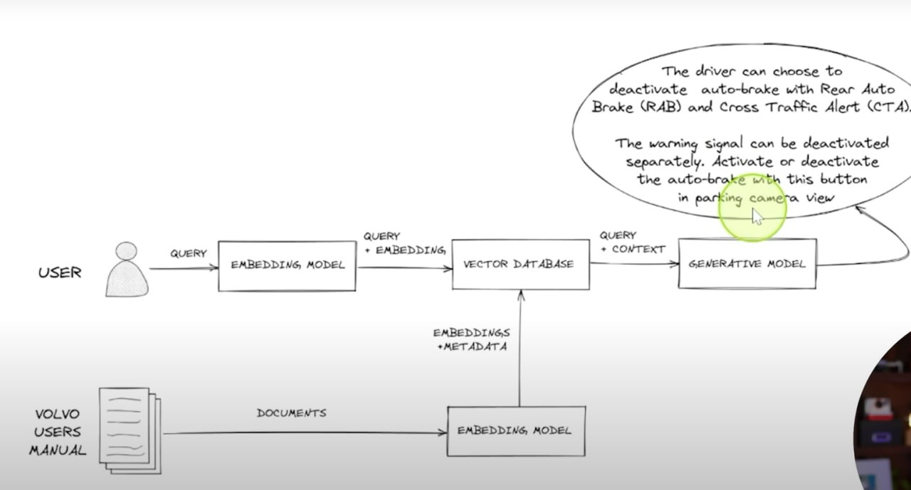

# 

1. LE vs OHE
2. RAG

    
    

3. Machine Learning Build Your First AI Model with Python | [Link](https://github.com/Subin-Vidhu/2024/blob/main/Machine%20Learning%20Build%20Your%20First%20AI%20Model%20with%20Python/Class%2B11-12.ipynb)

4. Flask_Introduction | [Link](https://github.com/Subin-Vidhu/2024/tree/main/Flask_Introduction/FlaskIntroduction)

5. Linux Terminal Productivity | [Link](https://github.com/Subin-Vidhu/2024/blob/main/Linux%20Terminal%20Productivity/Linux%20Terminal%20Productivity.pdf)

    ```
    # Introduction

    commands:
    whoami
    date
    echo "hello"

    # File System

    pwd
    ls
    cd Desktop (dir name is case sensitive)
    cd ..

    cat filename
    cd ~ - automatically to home dir.

    # Find

    pwd;ls; cat filename (outputs all commands line by line.)
    find / ~name passwd (searches the whole system for password file)
    touch notes.txt (create a new file)
    find ~name *.txt (search for these files in the current dir)

    # Search in file

    wc -l /etc/passwd (word count)
    grep "hello" /files/hello.txt (search particular word)

    # Shell Operators

    ls&
    date & date
    ls > files.txt
    whoami > me.txt (creates a new txt file and outputs the answer into it)
    date » date.txt (adds to the bottom of the file)
    cat date.txt

    # Flags

    ls -l (files in list format with time and date)
    ls -a, ls —all (all files including hidden ones)
    ls —help
    man ls
    man date
    man echo
    man ssh

    # More File system

    mkdir new_folder
    rm file.txt
    cp 1.txt 2.txt
    mv 1.txt Downloads
    file 1.txt (eg: ASCII text)
    rm -R folder

    # Permissions

    su root (enter the password if prompted)
    groups
    sudo cat file.txt

    # Common directories

    etc (passwords and other config files)
    var ( variable data )
    root (home of the root user)
    tmp (temporary files, gets deleted when computer restarts)```

6. 2024 Master class on Data Science using Python A-Z for ML | [Link](https://github.com/Subin-Vidhu/2024/tree/main/2024%20Master%20class%20on%20Data%20Science%20using%20Python%20A-Z%20for%20ML)

    ```
    list.sort() - sorts the list and modifies it as well

    list2 = list1 (both the content and id same)
    list2 = list1.copy() (only the content remains the same, id differs) [to find id = id(list)]

    tuple1 = 1,2,3 [Any comma-separated sequence of values defines a tuple]

    dict.get(key) - returns none if no value exists

    function exists as soon as the return statement is called. (define - parameters [DP], function_call - arguments [CA])

    Flatten matrix [transform a matrix to a one dimensional numpy array]
    a
    Out: 
    array([[1, 2, 3],
            [4, 5, 6]])
    
    a.flatten()
    Out: array([1, 2, 3, 4, 5, 6])

    ```

7. Python And Flask Demonstrations Practice Course | [Link](https://github.com/Subin-Vidhu/2024/tree/main/Python%20And%20Flask%20Demonstrations%20Practice%20Course)

    ```
    <script type = "text/javascript" src = "{{url_for('static', filename = 'js/hello.js')}}"></script>

    <input type = "button" onclick = "sayHello()" value = "Say Hello" />

    #hello.js
    function sayHello() {
    alert("Hello world")
    }

    #Cookies - refer github

    
    
    ...
    

    <form action = "http://localhost:5000/uploader" method = "POST" enctype = "multipart/form-data">
    <input type = "file" name = "file" />
    <input type = "submit"/>
    </form>


    # Mail Extension, WTF forms, SQLite - refer github
    ```

8. Flask Hacking Mastery | [Link](https://github.com/Subin-Vidhu/2024/tree/main/Flask%20Hacking%20Mastery)

9. Nginx for sys and web admins FREE | [Link](https://github.com/Subin-Vidhu/2024/tree/main/Nginx%20for%20sys%20and%20web%20admins%20FREE)

10. Windows Command Mastery for Ethical Hackers | [Link](https://github.com/Subin-Vidhu/2024/tree/main/Windows%20Command%20Mastery%20for%20Ethical%20Hackers)

    ```
    nslookup domain_name : to check the ip address

    hostname : display the hostname of the current computer

    attrib +h +s Hidden_Test : to hide a folder

    attrib -h -s Hidden_Test : to unhide a folder

    netsh wlan show profiles : displays all the wireless networks

    netsh wlan show profile "name" key=clear : to get the details of the network
    ```

11. SSH | [Link](https://github.com/Subin-Vidhu/2024/tree/main/SSH)

12. Ubuntu Network Server | [Link](https://github.com/Subin-Vidhu/2024/tree/main/Ubuntu%20Network%20Server)

13. Learning How to Learn: Powerful mental tools to help you master tough subjects | [Link](https://github.com/Subin-Vidhu/2024/tree/main/Learning%20How%20to%20Learn)

14. Python Full Course for free | Link (https://youtu.be/XKHEtdqhLK8?si=qaipuIrZQksSdLUF)

    - Refer the youtube link for more details or use telegram saved msgs for the same.

15. API

    ```
    # Getting started with apis
    https://rapidapi.com/
    rapidapi.py - python projects
    Rate limiting - restricts the number of requests a client can make within a specified time window, such as 100 request per minute.
                Once the limit is reached, the client must wait or receive an error response.
    Throttling - controls the rate at which requests are processed on the server side.
                excess requests are queued or delayed.
    ```

16. General

17. Complete SQL + Databases Bootcamp | [Link](https://github.com/Subin-Vidhu/2024/tree/main/Complete%20SQL%20%2B%20Databases%20Bootcamp)

18. Linux vs Ubuntu

    
    Linux and Ubuntu are two related but distinct concepts in the world of operating systems:

    **Linux**:

    * Linux is an open-source operating system kernel, created by Linus Torvalds in 1991.
    * It's a free and open-source software that provides a foundation for building an operating system.
    * Linux is the core component that manages hardware resources, provides a command-line interface, and enables users to run applications.
    * Linux is not a complete operating system, but rather a kernel that can be used to build a complete OS.

    **Ubuntu**:

    * Ubuntu is a complete, open-source operating system based on the Linux kernel.
    * It was created in 2004 by Canonical Ltd. and is one of the most popular Linux distributions.
    * Ubuntu is a user-friendly, free, and open-source OS that provides a graphical user interface (GUI), a wide range of software packages, and a large community of users and developers.
    * Ubuntu is built on top of the Linux kernel and adds many additional features, tools, and software packages to create a fully functional operating system.

    In summary:

    * Linux is the kernel, the core component of an operating system.
    * Ubuntu is a complete operating system that uses the Linux kernel and adds many additional features and software packages.

    Think of it like a car:

    * Linux is the engine (kernel).
    * Ubuntu is the complete car (operating system) that uses the Linux engine, with a body, wheels, and all the necessary features to make it run smoothly
    
19. Images and Path file path using index

    ```py
    import pathlib

    path = "D:\AI\AI-in-Medicine\Atrium-Segmentation\Dataset\Task02_Heart\labelsTr\la_003.nii"
    parts = list(pathlib.Path(path).parts)
    print(parts)
    print(pathlib.Path(*parts))

    # o/p:
    ['D:\\', 'AI', 'AI-in-Medicine', 'Atrium-Segmentation', 'Dataset', 'Task02_Heart', 'labelsTr', 'la_003.nii']
    D:\AI\AI-in-Medicine\Atrium-Segmentation\Dataset\Task02_Heart\labelsTr\la_003.nii
    ```