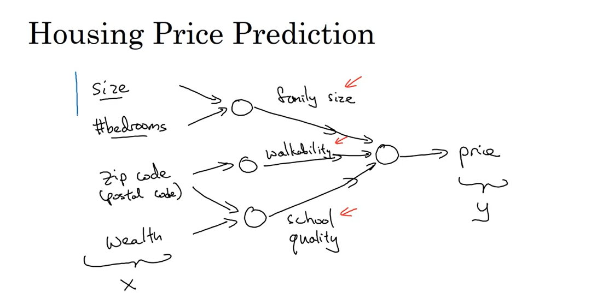
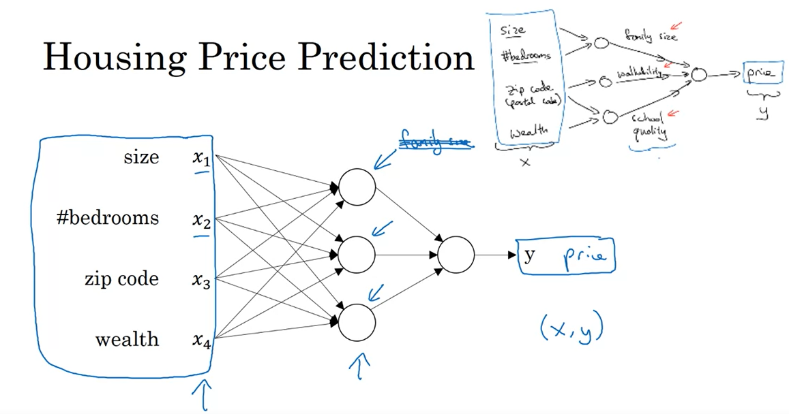
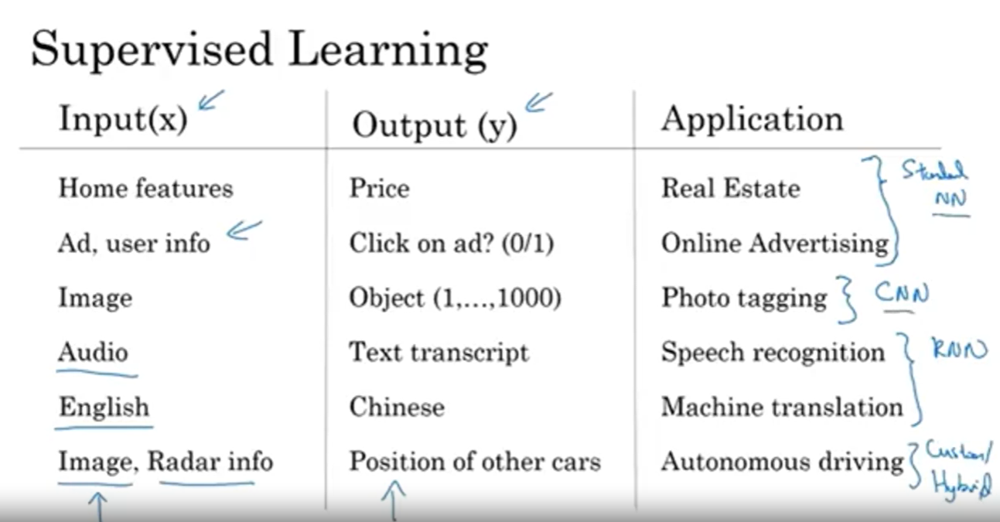
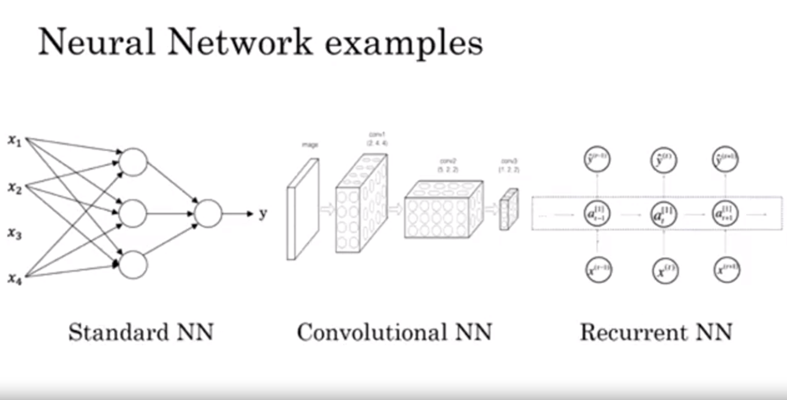
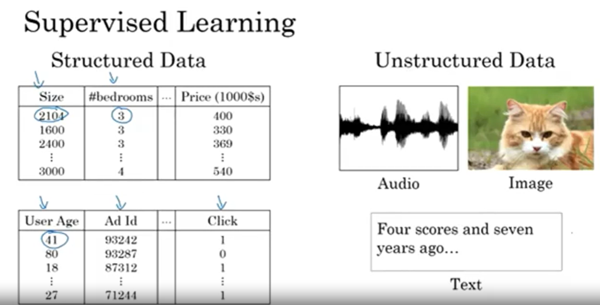

## References

- AI is the new electricity

- What is a Neural Network?
 
    - A neural network is a series of algorithms that endeavors to recognize underlying relationships in a set of data through a process that mimics the way the human brain operates. Neural networks can adapt to changing input; so the network generates the best possible result without needing to redesign the output criteria.

        

        

- Supervised Learning with Neural Networks

    - Supervised learning is a type of machine learning algorithm that uses a known dataset (called the training dataset) to make predictions. The training dataset includes input data and response values. The model learns on this dataset to make predictions on new, unseen data.

        

        

        

- Why is Deep Learning taking off?

    - Deep learning is taking off for a variety of reasons. Some of the main reasons are:

        - Deep learning has led to significant improvements in important applications such as speech recognition, image recognition, and natural language processing.

        - We have access to a lot more data.

        - We have access to a lot more computational power (through GPUs and cloud computing).

        - Deep learning has been enabled by many other advances in machine learning.
        
                    