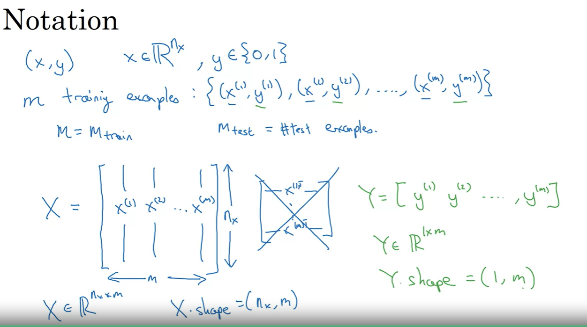

## References

- Logistic Regression

    -  algorithm for binary classification
    -  used for spam detection, image recognition, etc.
        eg. cat vs non-cat

        

- Notation

    -  m: number of training examples
    -  n: number of features
    -  x: input vector
    -  y: output vector
    -  (x, y): one training example
    -  (x(i), y(i)): ith training example
    -  X: matrix of input vectors
    -  Y: matrix of output vectors

        

- Logistic Regression

    - given x, want y-hat = P(y = 1 | x)
    - parameters: w, b
    - output: y-hat = sigmoid(w^T x + b)
    - sigmoid function: 1 / (1 + e^(-z))

        

- Logistic Regression Cost Function

    - loss (single example): L(y-hat, y) = -(y log(y-hat) + (1 - y) log(1 - y-hat))
    - cost (all examples): J(w, b) = (1 / m) * sum(L(y-hat, y))

        

- Gradient Descent

    - update parameters: w = w - alpha * dw, b = b - alpha * db
    - dw = (1 / m) * sum(dL/dw), db = (1 / m) * sum(dL/db)

        

        

- Intuition about derivatives

    - derivative: slope of a function
    - if slope > 0: increase parameter
    - if slope < 0: decrease parameter
    - if slope = 0: parameter is optimal

        
        
        