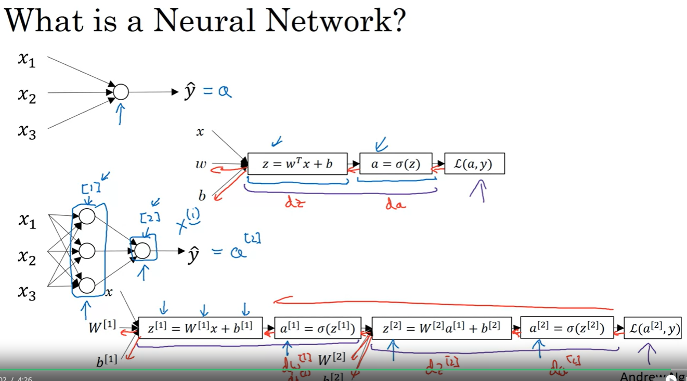
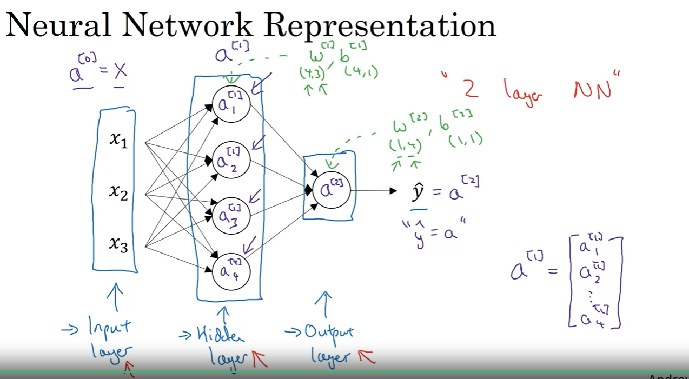
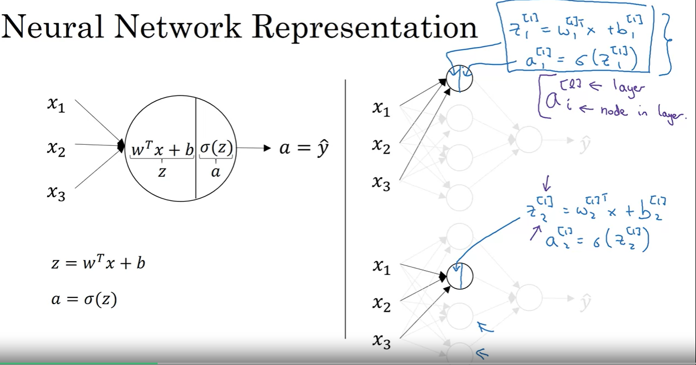
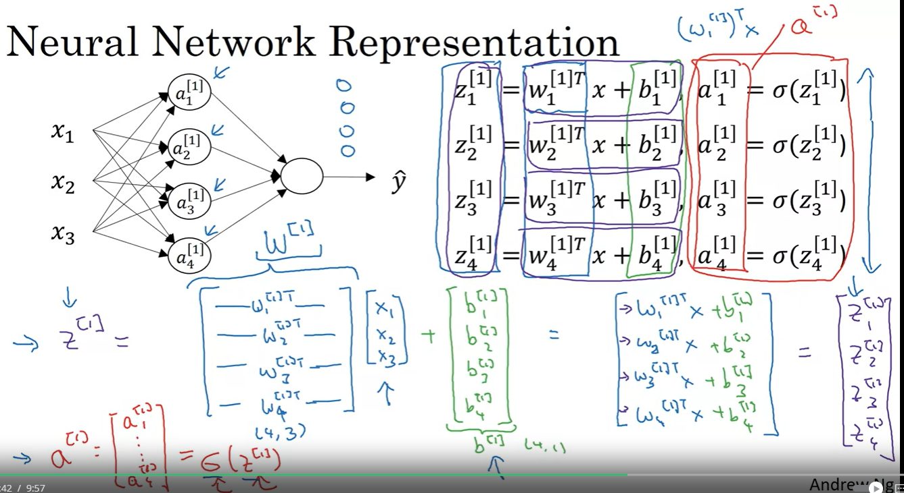
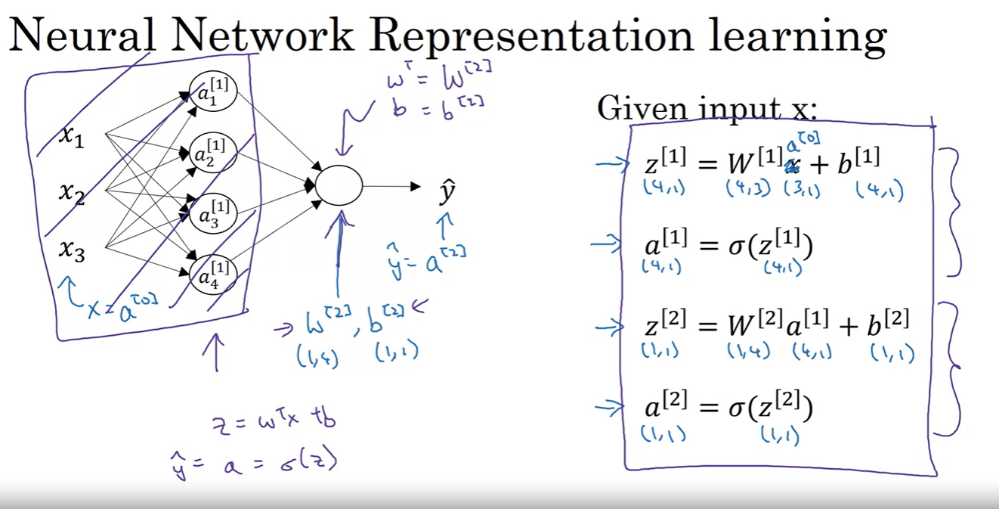
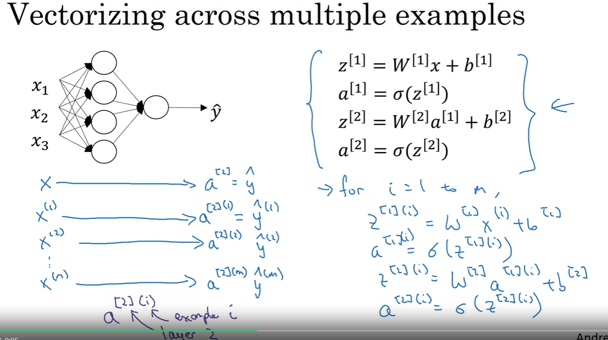
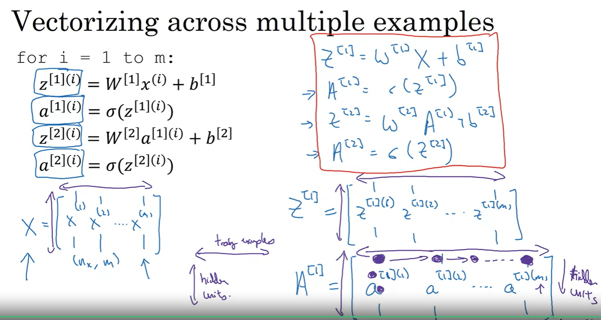

## References

- Shallow Neural Network

    - Only 1 hidden layer

        

- Neural Network Representation

    - 2 or more hidden layers

        

- Computing a Neural Network's Output

    - In logistic regression, we need to caluculate the output of the model by using the formula `z = w^T * x + b` and then apply the sigmoid function to get the output.
    - In a neural network, we need to calculate the output of the model by using the formula `z = w^T * x + b` for each neuron in the hidden layer and then apply the activation function to get the output. The output of the hidden layer is then used as input to the next layer and so on. The output of the last layer is the output of the model.

        

    - Neural Network Representation

        

        

- Vectorizing across multiple examples

    - In logistic regression, we can vectorize the computation by using the formula `z = w^T * X + b` where `X` is a matrix of shape `(n_x, m)` where `n_x` is the number of features and `m` is the number of examples.
    - In a neural network, we can vectorize the computation by using the formula `Z = W^T * A + b` where `A` is a matrix of shape `(n_h, m)` where `n_h` is the number of neurons in the hidden layer and `m` is the number of examples.

        

        