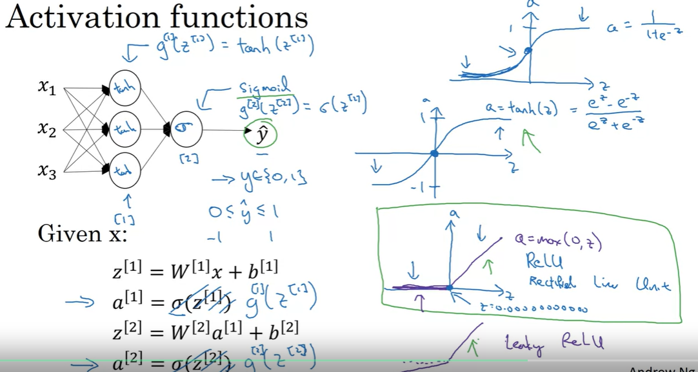
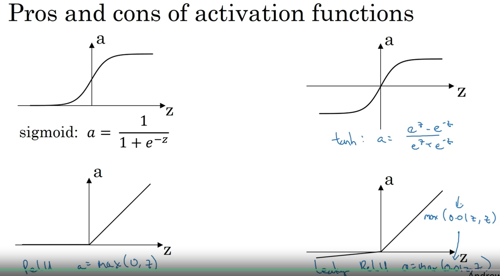
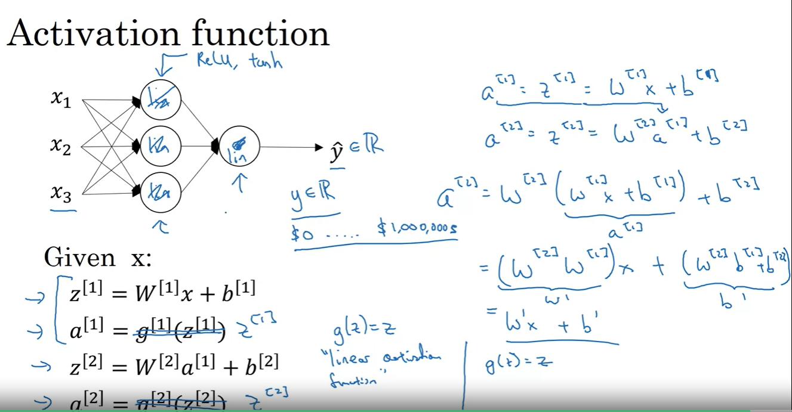
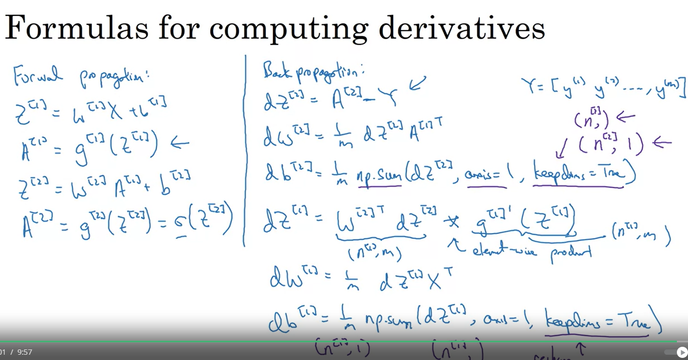

## References

- Shallow Neural Network

    - Only 1 hidden layer

        

- Neural Network Representation

    - 2 or more hidden layers

        

- Computing a Neural Network's Output

    - In logistic regression, we need to caluculate the output of the model by using the formula `z = w^T * x + b` and then apply the sigmoid function to get the output.
    - In a neural network, we need to calculate the output of the model by using the formula `z = w^T * x + b` for each neuron in the hidden layer and then apply the activation function to get the output. The output of the hidden layer is then used as input to the next layer and so on. The output of the last layer is the output of the model.

        

    - Neural Network Representation

        

        

- Vectorizing across multiple examples

    - In logistic regression, we can vectorize the computation by using the formula `z = w^T * X + b` where `X` is a matrix of shape `(n_x, m)` where `n_x` is the number of features and `m` is the number of examples.
    - In a neural network, we can vectorize the computation by using the formula `Z = W^T * A + b` where `A` is a matrix of shape `(n_h, m)` where `n_h` is the number of neurons in the hidden layer and `m` is the number of examples.

        

        

- Activation functions

    - Sigmoid, tanh, ReLU, Leaky ReLU, ELU, softmax

        

        

- Why do you need non-linear activation functions?

    - Without non-linear activation functions, the neural network would be equivalent to a linear model.

    - The purpose of the activation function is to introduce non-linearity into the model.

    - Linear activation functions are used in the output layer for regression problems, and you would typically use tanh or ReLU activation functions in the hidden layers.

        

- Derivatives of activation functions

    - Sigmoid: `g'(z) = g(z) * (1 - g(z))`

    - tanh: `g'(z) = 1 - g(z)^2`

    - ReLU: `g'(z) = 0 if z < 0, 1 if z >= 0`

    - Leaky ReLU: `g'(z) = 0.01 if z < 0, 1 if z >= 0`

    - ELU: `g'(z) = 1 if z < 0, e^z if z >= 0`

    - softmax: `g'(z) = g(z) * (1 - g(z))`

- Gradient descent for neural networks

    - Forward propagation: Calculate the output of the model

    - Backward propagation: Calculate the gradients of the loss function with respect to the parameters

    - Update the parameters using the gradients

        

- Backpropagation intuition

    - The backpropagation algorithm is used to calculate the gradients of the loss function with respect to the parameters of the model.

    - It works by propagating the error backwards through the network, starting from the output layer and moving towards the input layer.

    - The gradients are calculated using the chain rule of calculus.

