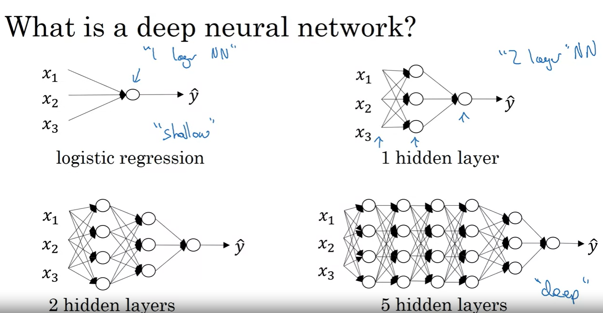
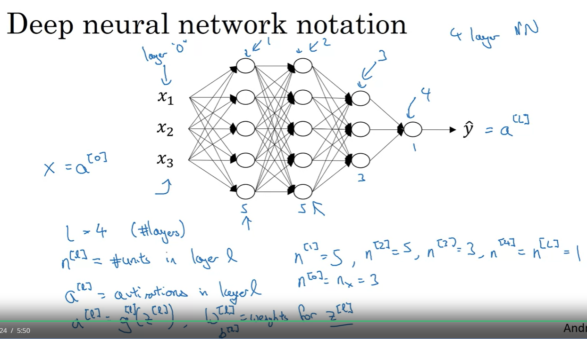
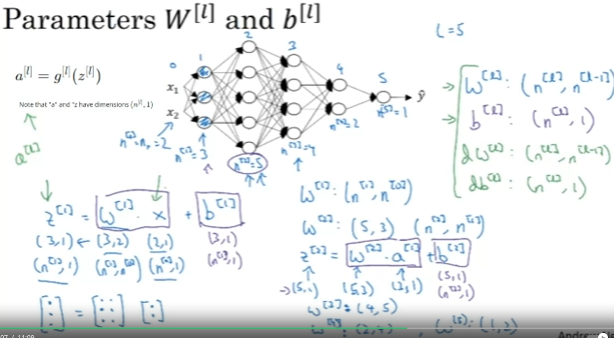
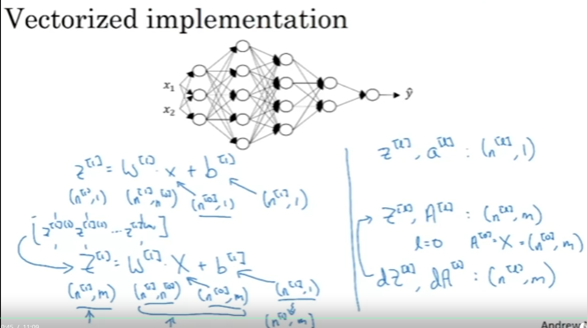

## References

- Deep Neural Network

    - neural network with more than one hidden layer.

        

    - Notation

        - L: number of layers in the network
        - n[l]: number of units in layer l
        - a[l]: activation in layer l
        - W[l]: weights for z[l]
        - b[l]: bias for z[l]
        - z[l]: linear function of the previous layer
        - g[l]: activation function for layer l
        - a[0] = x

            

    - Forward Propagation

        - Compute z[l] = W[l]a[l-1] + b[l]
        - Compute a[l] = g[l](z[l]) = g[l](W[l]a[l-1] + b[l])
        - Compute for l = 1 to L

        - Vectorized implementation

            - Z[l] = W[l]A[l-1] + b[l]
            - A[l] = g[l](Z[l])
            - A[0] = X
            - A[L] = Y_hat
            - Compute for l = 1 to L
            - A[L] = σ(Z[L])

                

    - Getting your matrix dimensions right

        - W[l]: (n[l], n[l-1])
        - b[l]: (n[l], 1)
        - Z[l]: (n[l], 1)
        - A[l]: (n[l], 1)

        - here m is the number of examples, n[l] is the number of units in layer l, n[l-1] is the number of units in layer l-1, W[l] is the weight matrix for layer l, b[l] is the bias vector for layer l, Z[l] is the linear function of the previous layer, A[l] is the activation function for layer l.

            

        - Same in vectorized implementation

            - Z[l]: (n[l], m)
            - A[l]: (n[l], m)

                

    - Why deep representations?