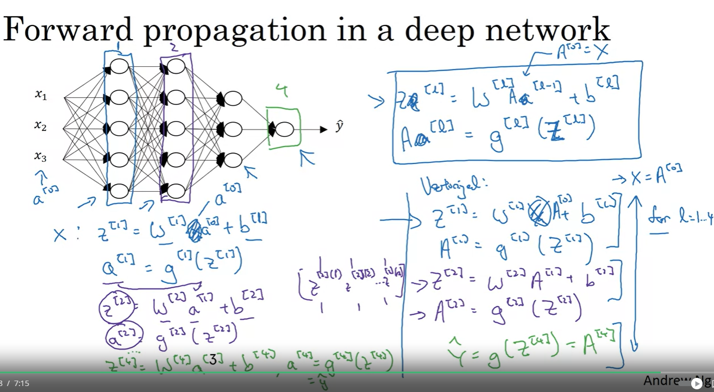

## References

- Deep Neural Network

    - neural network with more than one hidden layer.

        

    - Notation

        - L: number of layers in the network
        - n[l]: number of units in layer l
        - a[l]: activation in layer l
        - W[l]: weights for z[l]
        - b[l]: bias for z[l]
        - z[l]: linear function of the previous layer
        - g[l]: activation function for layer l
        - a[0] = x

            

    - Forward Propagation

        - Compute z[l] = W[l]a[l-1] + b[l]
        - Compute a[l] = g[l](z[l]) = g[l](W[l]a[l-1] + b[l])
        - Compute for l = 1 to L

        - Vectorized implementation

            - Z[l] = W[l]A[l-1] + b[l]
            - A[l] = g[l](Z[l])
            - A[0] = X
            - A[L] = Y_hat
            - Compute for l = 1 to L
            - A[L] = σ(Z[L])

                

    - Getting your matrix dimensions right

        - W[l]: (n[l], n[l-1])
        - b[l]: (n[l], 1)
        - Z[l]: (n[l], 1)
        - A[l]: (n[l], 1)

        - here m is the number of examples, n[l] is the number of units in layer l, n[l-1] is the number of units in layer l-1, W[l] is the weight matrix for layer l, b[l] is the bias vector for layer l, Z[l] is the linear function of the previous layer, A[l] is the activation function for layer l.

            

        - Same in vectorized implementation

            - Z[l]: (n[l], m)
            - A[l]: (n[l], m)

                

    - Why deep representations?

        - Deep neural networks can learn features at many different levels of abstraction.

        - Example: Face recognition

            

        - Circuit Theory and Deep Learning

            - The circuit theory is a theory that explains why deep networks can approximate complex functions.

            - The universal approximation theorem states that a feedforward network with a single hidden layer containing a finite number of neurons can approximate continuous functions on compact subsets of R^n, under mild assumptions on the activation function.

            - The circuit theory states that deep networks can approximate functions that shallow networks need exponentially more hidden units to compute.

            - The circuit theory explains why deep networks can learn features at many different levels of abstraction.

                

    - Building blocks of deep neural networks

        - Forward and backward propagation

            - Forward propagation

                - Compute Z[l] = W[l]A[l-1] + b[l]
                - Compute A[l] = g[l](Z[l])
                - Compute for l = 1 to L

            - Backward propagation

                - Compute dZ[l] = dA[l] * g'[l](Z[l])
                - Compute dW[l] = dZ[l]A[l-1].T
                - Compute db[l] = dZ[l]
                - Compute dA[l-1] = W[l].T * dZ[l]
                - Compute for l = L to 1

                    

                    

                    

                    

    - Parameters and Hyperparameters

        - Parameters

            - W[l], b[l]

        - Hyperparameters

            - Learning rate α
            - Number of iterations
            - Number of hidden layers L
            - Number of hidden units n[l]
            - Choice of activation function g[l]
            - Momentum β
            - Mini-batch size
            - Regularization λ

                

        - Applied deep learning is a very empirical process.

            