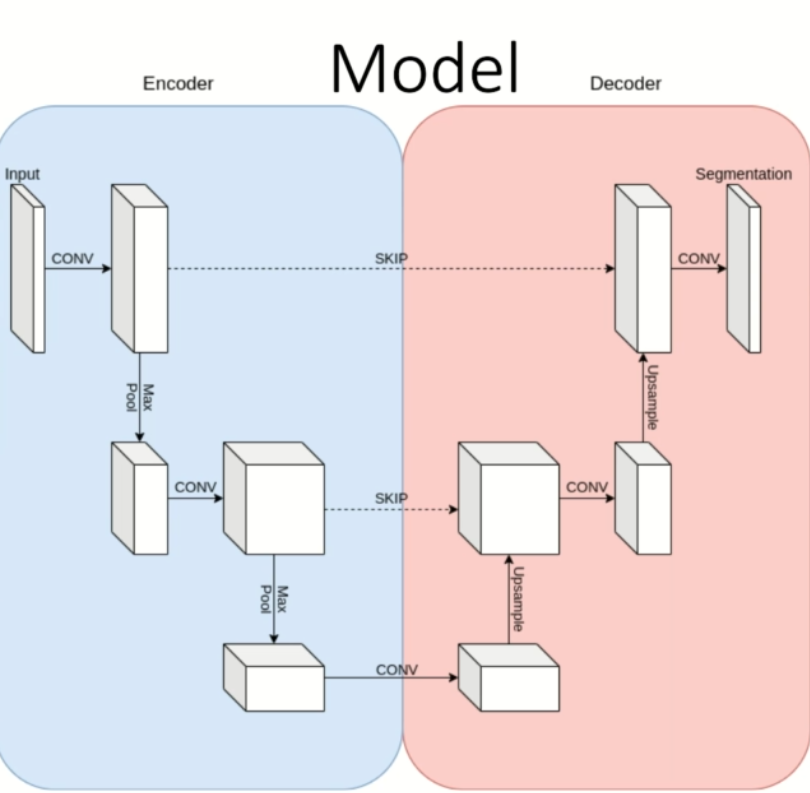

### Atrium Segmentation

- **Task**: Automatically segment the left atrium in cardiac MR images.

- Medical Background

    - Atrium Segmentation classifies each voxel in the MRI into either "Not Left Atrium" or "Left Atrium".

    - Enables exact volume measurements of the left atrium.

    - Changes in atrial volume are associated with cardiac disorders, such as atrial fibrillation or mitral valve stenosis(Narrowing of the mitral valve orifice, blocking blood flow).

    - Manual segmentation is time-consuming and tedious - Automation is needed.

- Data

    - Medical Segmentation Decathlon dataset [Link](http://medicaldecathlon.com/dataaws/)

    - 20 cardiac MR images with corresponding Ground Truth masks.

        - 4542 2D MRI and label slices.

- Preprocessing

    - Two dimensional setting, Extract slices.

    - Original image shape (352 * 352)

        - Crop away non-cardiac regions and background.

            - 32 pixel from all borders

            - **Also applied to segmentation mask**

    - Z-Normalization per subject

        - Compute mean and standard deviation for each subject separately.

    - Standardize the normalized subject into the interval [0, 1]

        - X_std = (X_n - min(X_n)) / (max(X_n) - min(X_n))

    - Use 16 patients as training data and the remaining 4 as validation data.

- Dataset

    - Task

        - Create a list of all 2D slices and their corresponding masks.
        - Extract and load slice and mask from the list.
        - Data Augmentation: Augment slice and mask identically
        - Return augmented slice and mask.

    - Data Augmentation

        - Scaling (0.85, 1.15)
        - Rotation (-45, 45)
        - Elastic Transformation - augment the image by moving the pixels locally around using a displacement field.

- Model

    - U-Net(Miccai, 2015)

        - Encoder-Decoder architecture with skip connections.

            - Encoder: Convolutional layers with max pooling.

                - reduces the feature maps by using convolutions + max pooling.

            - Decoder: Convolutional layers with upsampling.
                
                - reconstructs segmentation masks based on the original image and features by using Upsampling + Convolutional layers.

            - Skip connections: Concatenate encoder output with decoder input.

                - allow information flow from encoder to decoder, this directly allows to solve the problem of vanishing gradients.(Vanishing gradients occur when the gradients become very small and the network stops learning.)
            

                    <!--  -->
                    

- Training

    - Optimizer: Adam(lr=1e-4)

    - Loss: Dice Loss

        - L(y, y_hat) = 1 - 2 * |y ∩ y_hat| / |y| + |y_hat| # Intersection over Union

    - Use sigmoid activation function on the prediction

        - Threshold at 0.5 to obtain binary masks.

            - Predictions > 0.5 -> 1 (Left Atrium)
            - Predictions <= 0.5 -> 0 (Not Left Atrium)

    - Train for 75 epochs

        - Save the model with the best validation loss.

- Preprocessing

    ```python
    %matplotlib notebook 
    from pathlib import Path
    import nibabel as nib
    import numpy as np
    import matplotlib.pyplot as plt
    from tqdm.notebook import tqdm

    root = Path("Task02_Heart/imagesTr")
    labels = Path("Task02_Heart/labelsTr")

    def change_img_to_label_path(path):
        parts = list(path.parts) # Convert to list to modify
        parts[parts.index("imagesTr")] = "labelsTr" # Change the part
        return Path(*parts) # Convert back to Path

    sample_path  = list(root.glob("la*"))[0]
    sample_label = change_img_to_label_path(sample_path)

    print(sample_path, sample_label) # Check if the paths are correct

    data = nib.load(sample_path)
    label = nib.load(sample_label)

    mri = data.get_fdata()
    mask = label.get_fdata().astype(np.uint8) # Convert to uint8 for visualization because the mask has only 0 and 1, why not float? - It's a mask, not a probability map.

    print(mri.shape, mask.shape) # Check the shapes

    nib.aff2axcodes(data.affine) # Check the orientation of the image -('R', 'A', 'S') - Right, Anterior, Superior

    from celluloid import Camera
    from IPython.display import HTML

    fig = plt.figure()
    camera = Camera(fig)

    for i in range(mri.shape[2]):
        plt.imshow(mri[:,:,i], cmap="gray")
        mask_ = np.ma.masked_where(mask[:,:,i] == 0, mask[:,:,i]) # Mask the background
        plt.imshow(mask_, cmap="cool", alpha=0.5) # Overlay the mask
        camera.snap()

    animation = camera.animate(interval=100) # Interval in milliseconds between frames

    HTML(animation.to_html5_video()) # Display the animation as a video in the notebook

    def normalize(full_volume):
        mu = full_volume.mean()
        std = np.std(full_volume)
        normalized = (full_volume - mu) / std
        return normalized

    def standardize(normalized):
        standardized = (normalized - normalized.min()) / (normalized.max() - normalized.min())
        return standardized

    all_files = list(root.glob("la*"))
    len(all_files) # Check the number of files - 20

    save_root = Path("processed_data")

    for counter, path_to_mri_data in enumerate(tqdm(all_files)):
        path_to_mri_label = change_img_to_label_path(path_to_mri_data)

        mri = nib.load(path_to_mri_data)
        assert nib.aff2axcodes(mri.affine) == ('R', 'A', 'S') # Check the orientation of the image, if the orientation is not correct, you need to reorient the image.
        mri_data = mri.get_fdata()
        label_data = nib.load(path_to_mri_label).get_fdata().astype(np.uint8)

        # Crop the images
        mri_data = mri_data[32:-32, 32:-32] # Crop 32 pixels from all borders
        label_data = label_data[32:-32, 32:-32]

        # Normalize the images
        normalized_mri_data = normalize(mri_data)
        standardized_mri_data = standardize(normalized_mri_data)

        if conter < 17:
            current_path = save_root / "train"/ str(counter)
        else:
            current_path = save_root / "val" / str(counter)

        for i in range(standardized_mri_data.shape[2]):
            slice = standardized_mri_data[:,:,i]
            mask = label_data[:,:,i]
            slice_path = current_path/"data"
            mask_path = current_path/"mask"
            slice_path.mkdir(parents=True, exist_ok=True)
            mask_path.mkdir(parents=True, exist_ok=True)

            np.save(slice_path/str(i), slice)
            np.save(mask_path/str(i), mask)

    # Check the files created
    path = Path("processed_data/train/0")
    file= "50.npy"

    slice = np.load(path/"data"/file)   
    mask = np.load(path/"mask"/file)

    plt.figure()
    plt.imshow(slice, cmap="bone")
    mask_ = np.ma.masked_where(mask == 0, mask) # Mask the background, mask == 0 is the background, how this works is that it will show the mask where the mask is not equal to 0.
    plt.imshow(mask_, cmap="cool", alpha=0.5)
    ```

- Dataset Creation

    ```python
    from pathlib import Path
    import torch
    import numpy as np
    import imgaug
    from imgaug.augmentables.segmaps import SegmentationMapsOnImage

    class CardiacDataset(torch.utils.data.Dataset):
        def __init__(self, root, augment_params):
            self.all_files = self.extract_files(root)
            self.augment_params = augment_params

        @staticmethod # Static method can be called without creating an instance of the class
        def extract_files(root):
            files = []
            for subject in root.glob("*"):
                slice_path= subject/"data"
                fro slice in slice_path.glob("*.npy"):
                    files.append(slice)
            return files

        @staticmethod
        def change_img_to_label_path(path):
            parts = list(path.parts) # Convert to list to modify
            parts[parts.index("data")] = "masks" # Change the part
            return Path(*parts) # Convert back to Path

        def augment(self, slice, mask):
            random_seed = torch.randint(0, 100000, (1,)).item() # Generate a random seed as the threading and multiprocessing in PyTorch can cause the random number generator to generate the same random numbers.
            imgaug.seed(random_seed)

            mask = SegmentationMapsOnImage(mask, shape=slice.shape) # Convert the mask to SegmentationMapsOnImage so that it can be augmented
            slice_aug, mask_aug = self.augment_params(image=slice, segmentation_maps=mask) # Augment the slice and mask identically
            mask_aug = mask_aug.get_arr_int() # Convert back to numpy array
            return slice_aug, mask_aug

        def __len__(self):
            return len(self.all_files)

        def __getitem__(self, idx):
            file_path = self.all_files[idx]
            mask_path = self.change_img_to_label_path(file_path)

            slice = np.load(file_path).astype(np.float32)
            mask = np.load(mask_path)

            if self.augment_params is not None:
                slice, mask = self.augment(slice, mask)

            return np.expand_dims(slice, 0), np.expand_dims(mask, 0) # Add a channel dimension to the slice and mask so that we don't have to squeeze it later.

    # Test the dataset
    from imgaug import augmenters as iaa
    from matplotlib import pyplot as plt

    seq = iaa.Sequential([
        iaa.Affine(scale=(0.85, 1.15), rotate=(-45, 45)),
        iaa.ElasticTransformation()
    ])

    path = Path("processed_data/train")
    dataset = CardiacDataset(path, seq)

    fig, axis = plt.subplots(3,3 , figsize=(10,10))
    for i in range(3):
        for j in range(3):
            slice, mask = dataset[1]
            mask = np.ma.maske_where(mask == 0, mask)
            axis[i][j].imshow(slice[0], cmap="bone")
            axis[i][j].imshow(mask[0], cmap="cool", alpha=0.5)

    # Take all this and save it to a file called dataset.py so that we can import it later.
    ``` 

- **Unet**

    - U-Net is an encoder-decoder architecture with skip connections.

        ```python
        import torch

