### CNN

- Understanding the MNIST dataset

    - The MNIST dataset is a collection of 70,000 images of handwritten digits from 0 to 9.

    - Each image is 28x28 pixels in size.

    - Each pixel in the image is represented by a value between 0 and 255.

    - The dataset is split into two parts:

        - 60,000 images for training.

        - 10,000 images for testing.

    - The MNIST dataset is a popular dataset for training and testing machine learning models.

    - It is often used as a benchmark dataset for evaluating the performance of different machine learning algorithms.

    - MNIST with ANN

        - First, we will train a simple artificial neural network (ANN) on the MNIST dataset.

        - For that, we have to flatten the 28x28 images into a single vector of size 784.

        - We will use a simple feedforward neural network with hidden layers.

        - We will use the softmax activation function in the output layer to get the probabilities of each class ie 0 to 9.

        - We will use the cross-entropy loss function to calculate the loss.

        - We will use the Adam optimizer to update the weights of the network.

        - We will train the network for 10 epochs.

        - We will evaluate the performance of the network on the test set.

            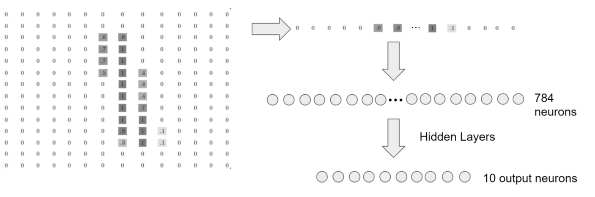

        - Things to keep in mind:

            - Flattening out the images into a single vector of size 784 loses the spatial information present in the images ie it ends up removing some of the 2-D information present in the images, such as the relationship of a pixel to its neighbouring pixels.

        - Code:

            -   ```python
                import torch
                import torch.nn as nn
                import torch.nn.functional as F
                from torch.utils.data import DataLoader
                from torchvision import datasets, transforms
                import matplotlib.pyplot as plt
                import numpy as np
                from sklearn.metrics import confusion_matrix
                %matplotlib inline

                # Load the MNIST dataset
                transform = transforms.ToTensor()
                train_data = datasets.MNIST(root='data', train=True, download=True, transform=transform)
                test_data = datasets.MNIST(root='data', train=False, download=True, transform=transform)
                print(train_data) #Dataset MNIST
                                    #Number of datapoints: 60000
                                    #Split: train
                                    #Root Location: data
                                    #Transforms (if any): ToTensor()
                                    #Target Transforms (if any): None
                print(test_data) #Dataset MNIST
                                    #Number of datapoints: 10000
                                    #Split: test
                                    #Root Location: data
                                    #Transforms (if any): ToTensor()
                                    #Target Transforms (if any): None

                type(train_data) #torchvision.datasets.mnist.MNIST
                train_data[0] #Returns a tuple of image and label
                image, label = train_data[0]
                image.shape #torch.Size([1, 28, 28])
                label #5
                plt.imshow(image.reshape(28, 28), cmap='gray') #cmap = 'gray' is used to display the image in grayscale, use 'viridis' for color, use 'gist_yarg' for opposite grayscale

                torch.manual_seed(101) #arbitrary seed for reproducibility
                train_loader = DataLoader(train_data, batch_size=100, shuffle=True)
                test_loader = DataLoader(test_data, batch_size=500, shuffle=False)

                from torchvision.utils import make_grid
                np.set_printoptions(formatter=dict(int=lambda x: f'{x:4}')) # to widen the printed array

                # Display the first batch of images
                for images, labels in train_loader:
                    break

                images.shape #torch.Size([100, 1, 28, 28]) - 100 images, 1 channel(colour channel, 1 since it is a gray scale image), 28x28 pixels(height x width)
                labels.shape #torch.Size([100])

                # Print the first 12 labels
                print('Labels: ', labels[:12].numpy()) #Labels:  [   5    0    4    1    9    2    1    3    1    4    3    5]

                # Print the first 12 images
                im = make_grid(images[:12], nrow=12) #nrow is the number of images in each row
                plt.figure(figsize=(10, 4))
                # We need to transpose the images from CWH to WHC
                plt.imshow(np.transpose(im.numpy(), (1, 2, 0))) #transpose is used to change the order of the dimensions
                ```
                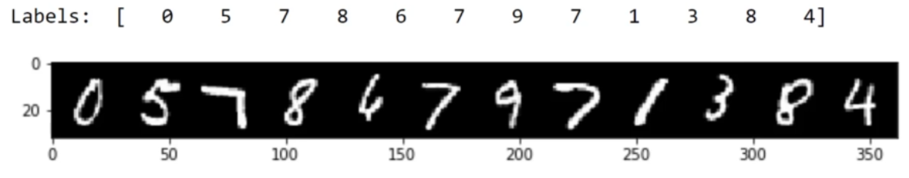
                ```python
                # Create the model
                class MultilayerPerceptron(nn.Module):
                    def __init__(self, in_sz=784, out_sz=10, layers=[120, 84]):
                        super().__init__() #super() is used to call the __init__() of the parent class so that we can access the attributes of the parent class
                        self.fc1 = nn.Linear(in_sz, layers[0])
                        self.fc2 = nn.Linear(layers[0], layers[1])
                        self.fc3 = nn.Linear(layers[1], out_sz)

                    def forward(self, X):
                        X = F.relu(self.fc1(X))
                        X = F.relu(self.fc2(X))
                        X = self.fc3(X)
                        return F.log_softmax(X, dim=1) #dim=1 is used to specify the dimension along which the softmax function is to be applied

                torch.manual_seed(101)
                model = MultilayerPerceptron()
                model
                # MultilayerPerceptron(
                #   (fc1): Linear(in_features=784, out_features=120, bias=True)
                #   (fc2): Linear(in_features=120, out_features=84, bias=True)
                #   (fc3): Linear(in_features=84, out_features=10, bias=True)
                # )

                for param in model.parameters():
                    print(param.numel()) 
                    # 94080 - 784*120 weights
                    # 120 - 120 bias
                    # 10080 - 120*84 weights
                    # 84 - 84 bias
                    # 840 - 84*10 weights
                    # 10 - 10 bias
                    # Total = 105,214 parameters

                # Loss and optimizer
                criterion = nn.CrossEntropyLoss()
                optimizer = torch.optim.Adam(model.parameters(), lr=0.001)

                images.shape #torch.Size([100, 1, 28, 28]) --> [100, 784] - 100 images, 784 pixels so that it can be fed to the model
                images.view(100, -1).shape #torch.Size([100, 784])

                # Training the model
                import time
                start_time = time.time()
                epochs = 10
                train_losses = []
                test_losses = []
                train_correct = []
                test_correct = []

                for i in range(epochs):
                    trn_corr = 0
                    tst_corr = 0

                    # Run the training batches
                    for b, (X_train, y_train) in enumerate(train_loader):
                        b += 1

                        # Apply the model
                        y_pred = model(X_train.view(100, -1)) #view is used to reshape the tensor
                        loss = criterion(y_pred, y_train)

                        # Tally the number of correct predictions
                        predicted = torch.max(y_pred.data, 1)[1] #torch.max returns the maximum value and its index
                        #[0.1, 0.0, ..., 0.8] --> 9 
                        # print y_pred.data to see the output
                        batch_corr = (predicted == y_train).sum()
                        trn_corr += batch_corr

                        # Update parameters
                        optimizer.zero_grad()
                        loss.backward()
                        optimizer.step()

                        # Print interim results
                        if b%200 == 0:
                            print(f'epoch: {i:2}  batch: {b:4} [{100*b:6}/60000]  loss: {loss.item():10.8f}  accuracy: {trn_corr.item()*100/(100*b):7.3f}%')

                    train_losses.append(loss)
                    train_correct.append(trn_corr)

                    # Run the testing batches
                    with torch.no_grad():
                        for b, (X_test, y_test) in enumerate(test_loader):

                            # Apply the model
                            y_val = model(X_test.view(500, -1))

                            # Tally the number of correct predictions
                            predicted = torch.max(y_val.data, 1)[1]
                            tst_corr += (predicted == y_test).sum()

                    loss = criterion(y_val, y_test)
                    test_losses.append(loss)
                    test_correct.append(tst_corr)
                print(f'Duration: {(time.time() - start_time)/60} minutes')

                plt.plot(train_losses, label='training loss')
                plt.plot(test_losses, label='validation loss')
                plt.legend()
                ############################################################
                train_acc = [t/600 for t in train_correct]
                test_acc = [t/100 for t in test_correct]
                plt.plot(train_acc, label='train acc')
                plt.plot(test_acc, label='test acc')
                plt.legend()
                plt.show()
                ############################################################
                test_load_all = DataLoader(test_data, batch_size=10000, shuffle=False)

                with torch.no_grad():
                    correct = 0
                    for X_test, y_test in test_load_all:
                        y_val = model(X_test.view(len(X_test), -1))  # pass in a flattened view of the image
                        predicted = torch.max(y_val,1)[1]
                        correct += (predicted == y_test).sum()

                correct.item()/len(test_data) #0.9717

                # Confusion matrix
                print(confusion_matrix(predicted.view(-1), y_test.view(-1)))
                ```

- Filters and Kernels

    - Computer Vision is a general term of using computers to process images and videos.

    - Filters and Kernels are used in computer vision to extract features from images.

        - Filters are essentially an `image kernel` which is a small matrix applied to an entire image.

            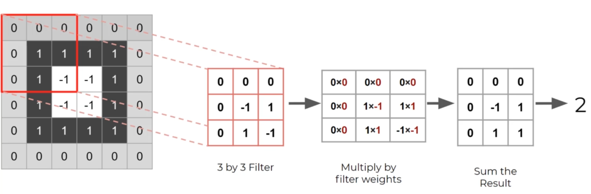

        - Certain popular filters are well known for edge detection, blurring, sharpening, embossing, etc.

            - Edge detection: Detects edges in an image.

            - Blurring: Blurs an image.

            - Sharpening: Sharpens an image.

            - Embossing: Creates a 3D effect on an image.

        - When applying filter, the dimensions of the output image are reduced.

            - eg: If we have a 5x5 image and a 3x3 filter, the output image will be 3x3.

        - Stride: The number of pixels by which the filter slides over the image.

            - eg: If the stride is 1, the filter moves one pixel at a time.

        - Padding: The number of pixels added to the border of the image.

            - Padding is used to preserve the dimensions of the image.

            - Padding is used to prevent the loss of information at the edges of the image.

        - To try out image kernels, visit this [link](https://setosa.io/ev/image-kernels/).

        - The extracted features are then used to train a machine learning model and these extracted features are called `feature maps`. It is referred to more generally as `convolutional layers`.

        - Kernel vs Filter

            - Kernel: A kernel is a small matrix used to extract features from an image.

            - Filter: A filter is a kernel applied to an entire image.
        
    - In the context of convolutional neural networks, these "filters" are referred to as `convolutional kernels`.
    - The process of applying these kernels to an image is called `convolution`.
    - The output of the convolution operation is called a `feature map`.
    - During convolution, we would lose border pixels. To prevent this, we can add `padding` to the image.
    - The size of the output feature map is determined by the size of the input image, the size of the kernel, the stride, and the padding. The formula is given by:
        - `output_size = (input_size - kernel_size + 2*padding)/stride + 1`
        - eg: If the input image is 5x5, the kernel is 3x3, the stride is 1, and the padding is 0, the output feature map will be 3x3.

            - If the padding is 1, the output feature map will be 5x5, and if the padding is 2, the output feature map will be 7x7.

            - If the stride is 2, the output feature map will be 2x2.

            - Applying it in the formula of the above examples looks like this:

                - `output_size = (5 - 3 + 2*1)/1 + 1 = 5`

                - `output_size = (5 - 3 + 2*2)/1 + 1 = 4`

                - `output_size = (5 - 3 + 2*0)/2 + 1 = 2`

- Convolutional layers

    - ANN for image data works well but it has some limitations:

        - It does not take into account the spatial information present in the images.

        - It does not take into account the relationship between pixels in the images.
        
            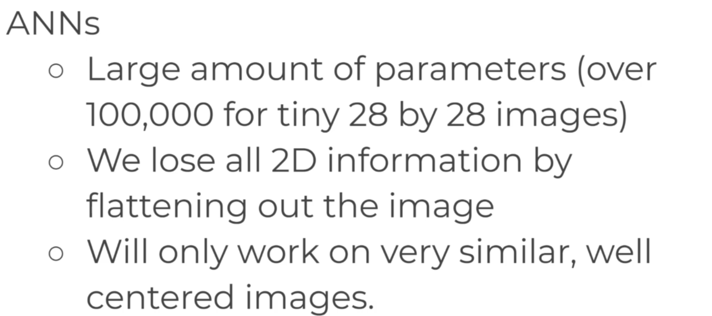

        - CNNs are designed to overcome these limitations.

    - CNNs are a type of neural network that is designed to work with image data.

    - A `convolutional layer` is created when we apply multiple image filters to the input image.

    - The layer will then be trained to figure out the best filter weight values.

    - CNN also helps reduce parameters by focusing on `local connectivity`.

    - Not all neurons will be fully connected.

    - Instead, neurons are only onnected to a subset of local neurons in the next layer.

    - This helps reduce the number of parameters in the network.

    - In ANN, the input layer is fully connected to the hidden layer, therefore lots of parameters.

    - In CNN, the input layer is connected to the hidden layer through a filter, therefore fewer parameters.

        - 1D Convolutional Layer: Used for 1D data such as time series data.

            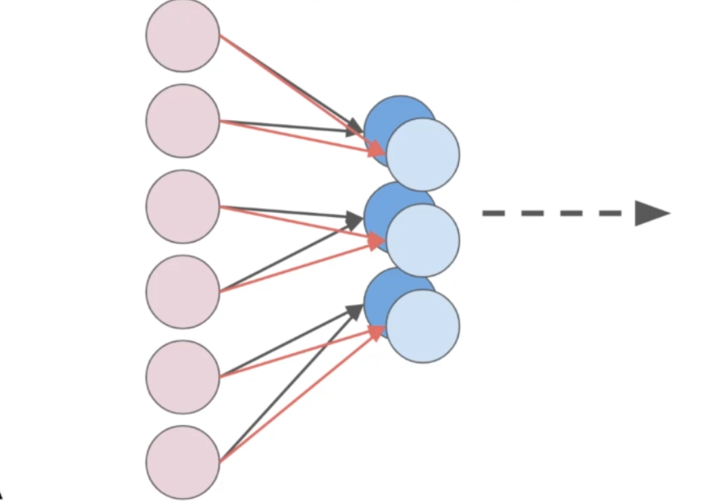

        - 2D Convolutional Layer: Used for 2D data such as image data.

            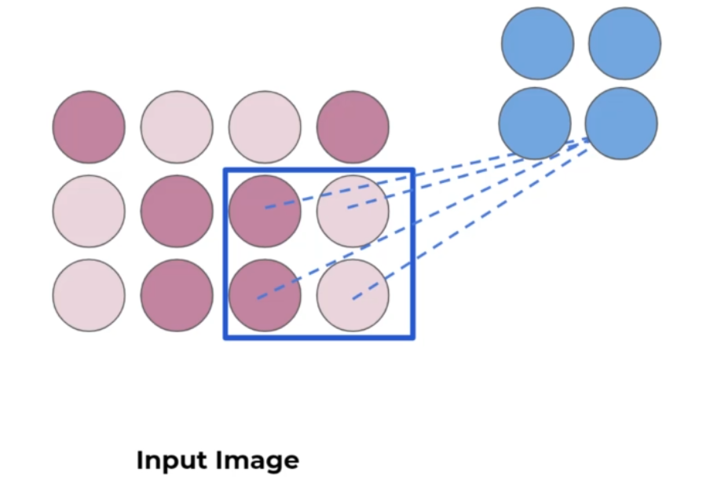  

            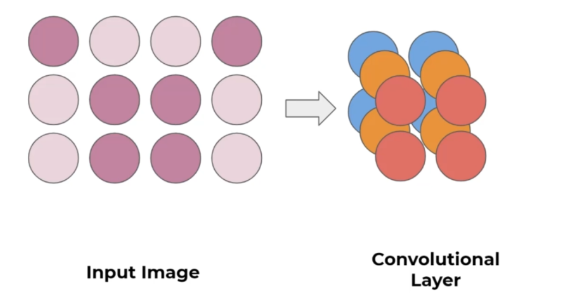

        - 3D Convolutional Layer: Used for 3D data such as color image data.

            - A color image has 3 channels: Red, Green, and Blue.

            - The shape of the color array has 3 dimensions: Height, Width, and Channels.

                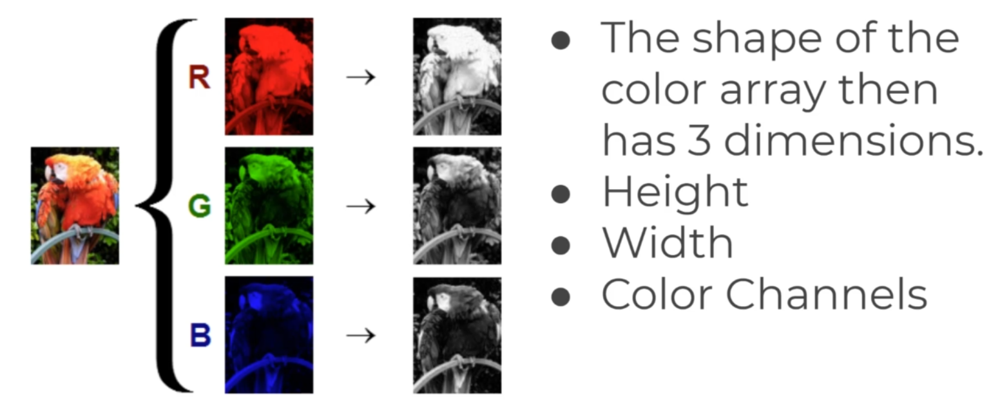

                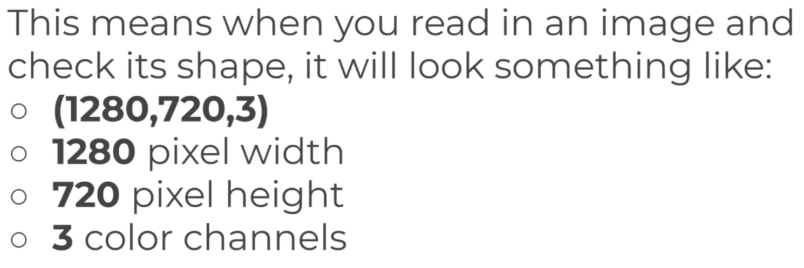

                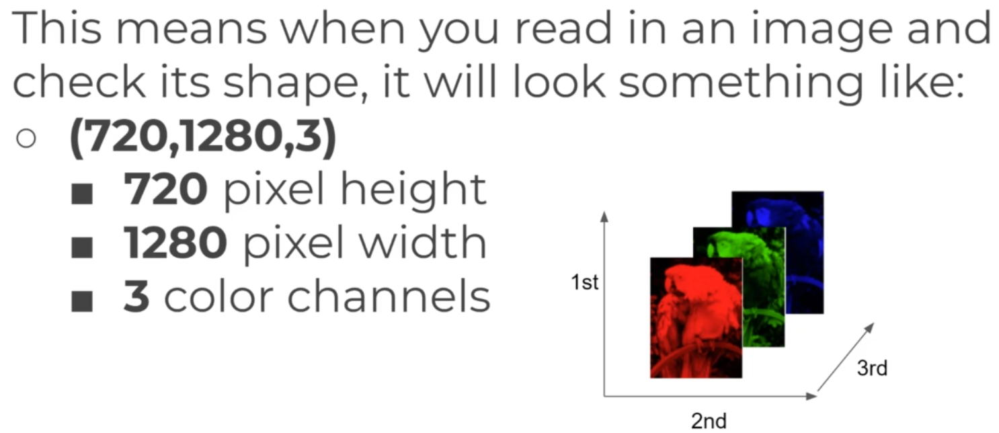

            - Keep in mind that the computer wont understand the image as we do. It will only see the image as a 3D array of numbers. ie it wont know that a channel is Red, it just knows that there are now 3 intensity channels.

        - How to perform convolution on a 3D image:

            - The kernel will also be 3D.

            - The kernel will have the same number of channels as the input image.

            - The kernel will slide over the image in 3 dimensions.

            - The output will be a 3D feature map.

                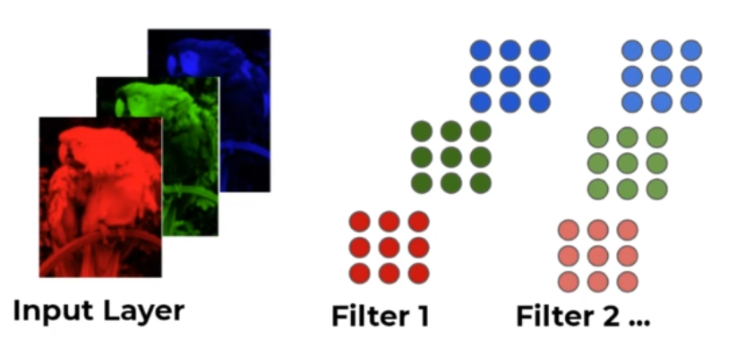

        - Often convolutional layers are fed into another convolutional layer. This is called `stacking convolutional layers`.

            - This allows the networks to discover patterns within patterns , usually with more complexity for later convolutional layers.

- Pooling Layers            

    - Pooling layers are used to reduce the dimensions of the feature maps.

    - Pooling layers accept a feature map as input and output a smaller feature map.

    - We can reduce the size using subsampling or pooling.

         - Max Pooling: Takes the maximum value from the window.

            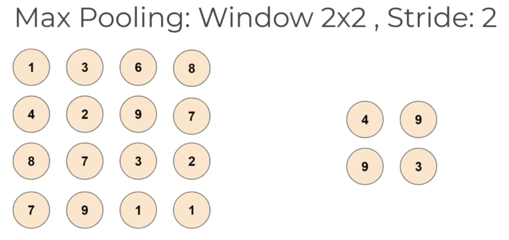

        - Average Pooling: Takes the average value from the window.

            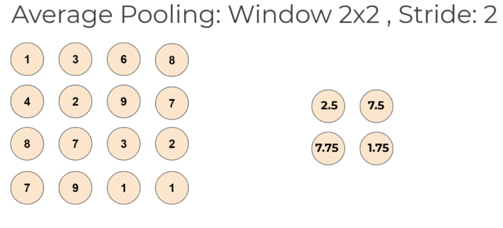
        
        - This greatly reduce the number of parameters in the network.

            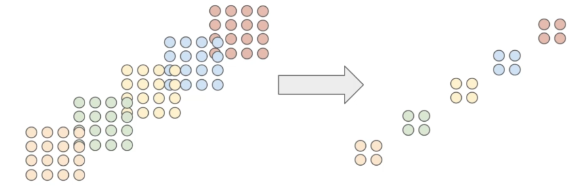

            - This pooling layer will end up removing a lot of infromation, even a small pooling "kernel" of 2x2 will remove 75% of the input data.

- Dropout
    
    - Another common technique deployed with CNN is called Dropout.

    - can be thought of as a form of regularization to help prevent overfitting.

    - During training, a fraction of the neurons are randomly set to zero.

    - This forces the network to learn more robust features and prevent units from "co-adapting" ie relying too much on other units.

    - Some famous architectures like AlexNet, VGG, and GoogleNet have used dropout.

- Some CNN Architectures

    - LeNet-5: One of the first successful CNNs.

    - AlexNet: A deeper and more complex CNN.

    - VGG: A very deep CNN with 19 layers.

    - GoogLeNet: A CNN with 22 layers.

    - ResNet: A CNN with 152 layers.

    - Inception: A CNN with 22 layers.

    - MobileNet: A CNN designed for mobile devices.

    - EfficientNet: A CNN designed for efficiency.

    - These architectures have been trained on large datasets like ImageNet and have achieved state-of-the-art performance on image classification tasks. 

    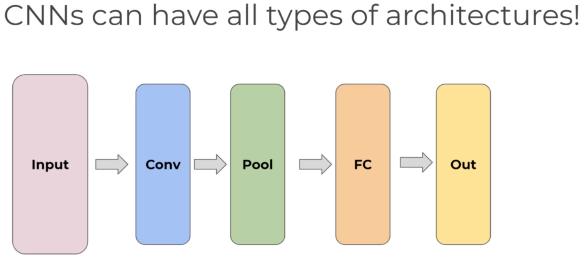


- MNIST Dataset with CNN

    - We will now train a CNN on the MNIST dataset.

    - Recall that flattened out the images into a single vector of size 784 caused us to lose some of the 2-D information present in the images.

    - With CNNs, we can feed in the data as an array of 2D images.

    - We can think of the entire group of the 60,000 images as a tensor(an n-dimensional array).

        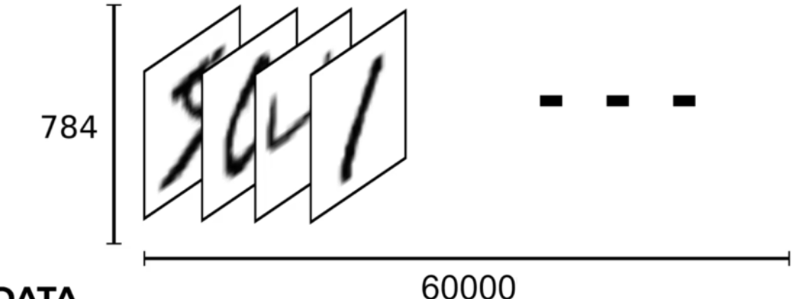

    - For the labes, we'll use One-Hot Encoding.

        - One-Hot Encoding is a process by which categorical variables are converted into a form that could be provided to ML algorithms to do a better job in prediction, ie that instead of having labels such as "One", "Two", "Three", we have labels such as [1, 0, 0], [0, 1, 0], [0, 0, 1] -  single array of 1s and 0s for each label.

        - It is a process of converting categorical variables into a binary vector.

        - The length of the binary vector is equal to the number of categories in the categorical variable.

        - The binary vector has a 1 at the index of the category and 0s in all other indexes.

        - eg: If we have a categorical variable with 3 categories: A, B, and C.

            - A will be represented as [1, 0, 0].

            - B will be represented as [0, 1, 0].

            - C will be represented as [0, 0, 1].

        - We can use the `torch.nn.functional.one_hot` function to perform One-Hot Encoding.

    - Keep in mind that when dealing with tensors of image data, we actually end up with 4 dimensions.

        - Number of images
        - Height
        - Width
        - Channels


- Code:

    ```python
    import torch
    import torch.nn as nn
    import torch.nn.functional as F
    from torch.utils.data import DataLoader
    from torchvision import datasets, transforms
    from torchvision.utils import make_grid


    import numpy as np
    import pandas as pd
    from sklearn.metrics import confusion_matrix
    import matplotlib.pyplot as plt
    %matplotlib inline

    transform = transforms.ToTensor()
    train_data = datasets.MNIST(root='data', train=True, download=True, transform=transform)
    test_data = datasets.MNIST(root='data', train=False, download=True, transform=transform)

    train_data #Dataset MNIST
                #Number of datapoints: 60000
                #Split: train
                #Root Location: data
                #Transforms (if any): ToTensor()
                #Target Transforms (if any): None
    
    test_data #Dataset MNIST
                #Number of datapoints: 10000
                #Split: test
                #Root Location: data
                #Transforms (if any): ToTensor()
                #Target Transforms (if any): None

    torch.manual_seed(101)  # for reproducible results
    train_loader = DataLoader(train_data, batch_size=10, shuffle=True)
    test_loader = DataLoader(test_data, batch_size=10, shuffle=False)

    conv1 = nn.Conv2d(1, 6, 3, 1) # 1 input channel, 6 output channels, 3x3 kernel, stride 1  # ---> 6 filters -->pooling --> conv2
    conv2 = nn.Conv2d(6, 16, 3, 1) # 6 input channel, 16 output channels, 3x3 kernel, stride 1


    for i, (X_train, y_train) in enumerate(train_data):
        break
    
    X_train.shape #torch.Size([1, 28, 28])
    # 4D tensor is required for the convolutional layer
    x = X_train.view(1, 1, 28, 28) # 1 image, 1 channel, 28x28 image

    x = F.relu(conv1(x))
    x.shape #torch.Size([1, 6, 26, 26]) # 6 filters, 26x26 image - lost 2 pixels on each side, ie why instead of 28x28, it is 26x26

    F.max_pool2d(x, 2, 2).shape #torch.Size([1, 6, 13, 13]) # 6 filters, 13x13 image - reduced by half due to pooling, 2x2 kernel, stride 2 - 26*26 changes to 13*13 using the formula ((26-2)/2)+1 = 13 where 2 is the kernel size and 2 is the stride

    x = F.relu(conv2(x))
    x.shape #torch.Size([1, 16, 11, 11]) # 16 filters, 11x11 image - lost 2 pixels on each side, ie why instead of 13x13, it is 11x11

    F.max_pool2d(x, 2, 2).shape #torch.Size([1, 16, 5, 5]) # 16 filters, 5x5 image - reduced by half due to pooling, 2x2 kernel, stride 2 - 11*11 changes to 5*5 using the formula ((11-2)/2)+1 = 5 where 2 is the kernel size and 2 is the stride, actually 5.5 but since it is an odd number, it is rounded down to 5


    # Create the model
    class ConvolutionalNetwork(nn.Module):
        def __init__(self):
            super().__init__()
            self.conv1 = nn.Conv2d(1, 6, 3, 1) # 1 input channel, 6 output channels, 3x3 kernel, stride 1
            self.conv2 = nn.Conv2d(6, 16, 3, 1) # 6 input channel, 16 output channels, 3x3 kernel, stride 1
            self.fc1 = nn.Linear(5*5*16, 120) # 5x5 image, 16 filters, 120 output neurons
            self.fc2 = nn.Linear(120, 84) # 120 input neurons, 84 output neurons
            self.fc3 = nn.Linear(84, 10) # 84 input neurons, 10 output neurons

        def forward(self, X):
            X = F.relu(self.conv1(X))
            X = F.max_pool2d(X, 2, 2) # 2x2 kernel, stride 2
            X = F.relu(self.conv2(X))
            X = F.max_pool2d(X, 2, 2) # 2x2 kernel, stride 2
            X = X.view(-1, 5*5*16) # flatten the image for the fully connected layer
            X = F.relu(self.fc1(X))
            X = F.relu(self.fc2(X))
            X = self.fc3(X)
            return F.log_softmax(X, dim=1)

    torch.manual_seed(101)
    model = ConvolutionalNetwork()
    model #ConvolutionalNetwork(
            # (conv1): Conv2d(1, 6, kernel_size=(3, 3), stride=(1, 1))
            # (conv2): Conv2d(6, 16, kernel_size=(3, 3), stride=(1, 1))
            # (fc1): Linear(in_features=400, out_features=120, bias=True)
            # (fc2): Linear(in_features=120, out_features=84, bias=True)
            # (fc3): Linear(in_features=84, out_features=10, bias=True)
            # )

    for param in model.parameters():
        print(param.numel())
        # 54 - 1*6*3*3
        # 6 - 6 bias
        # 864 - 6*16*3*3
        # 16 - 16 bias
        # 48000 - 400*120 # 5*5*16 = 400, 120 neurons out
        # 120 - 120 bias
        # 10080 - 120*84 # 120 neurons in, 84 neurons out
        # 84 - 84 bias
        # 840 - 84*10 # 84 neurons in, 10 neurons out
        # 10 - 10 bias 
        # Total = 60,074 parameters

    criterion = nn.CrossEntropyLoss()
    optimizer = torch.optim.Adam(model.parameters(), lr=0.001)

    # Training the model
    import time
    start_time = time.time()

    epochs = 5
    train_losses = []
    test_losses = []
    train_correct = []
    test_correct = []

    for i in range(epochs):
        trn_corr = 0
        tst_corr = 0

        # Run the training batches
        for b, (X_train, y_train) in enumerate(train_loader):
            b += 1

            # Apply the model
            y_pred = model(X_train) # we don't flatten the data here
            loss = criterion(y_pred, y_train)

            # Tally the number of correct predictions
            predicted = torch.max(y_pred.data, 1)[1]
            batch_corr = (predicted == y_train).sum()
            trn_corr += batch_corr

            # Update parameters
            optimizer.zero_grad()
            loss.backward()
            optimizer.step()

            # Print interim results
            if b%600 == 0:
                print(f'epoch: {i:2}  batch: {b:4} [{10*b:6}/60000]  loss: {loss.item():10.8f}  accuracy: {trn_corr.item()*100/(10*b):7.3f}%')

        train_losses.append(loss)
        train_correct.append(trn_corr)

        # Run the testing batches
        with torch.no_grad():
            for b, (X_test, y_test) in enumerate(test_loader):

                # Apply the model
                y_val = model(X_test)

                # Tally the number of correct predictions
                predicted = torch.max(y_val.data, 1)[1]
                tst_corr += (predicted == y_test).sum()

        loss = criterion(y_val, y_test)
        test_losses.append(loss)
        test_correct.append(tst_corr)

    print(f'\nDuration: {time.time() - start_time:.0f} seconds') # print the time elapsed

    plt.plot(train_losses, label='training loss')
    plt.plot(test_losses, label='validation loss')
    plt.title('Loss at the end of each epoch')
    plt.legend()
    plt.show()

    plt.plot([t/600 for t in train_correct], label='training accuracy')
    plt.plot([t/100 for t in test_correct], label='validation accuracy')
    plt.title('Accuracy at the end of each epoch')
    plt.legend()
    plt.show()

    # Extract the data all at once, not in batches
    test_load_all = DataLoader(test_data, batch_size=10000, shuffle=False)

    with torch.no_grad():
        correct = 0
        for X_test, y_test in test_load_all:
            y_val = model(X_test)
            predicted = torch.max(y_val,1)[1]
            correct += (predicted == y_test).sum()

    correct.item()/10000 #0.9881
    
    #print a row of values for reference
    np.set_printoptions(formatter=dict(int=lambda x: f'{x:4}'))
    print(np.arange(10).reshape(1,10))
    print()

    # Confusion matrix
    print(confusion_matrix(predicted.view(-1), y_test.view(-1)))

    #check random values for predictions
    plt.imshow(test_data[2019][0].reshape(28,28))
    model.eval()
    with torch.no_grad():
        new_pred = model(test_data[2019][0].view(1,1,28,28))

    new_pred.argmax() # tensor(9)
    ```

- Summary:

    - Regular neural networks do not take into account the spatial information present in images.

    - Convolutional neural networks are designed to work with image data.

    - Convolutional layers are created when we apply multiple image filters to the input image.

    - Pooling layers are used to reduce the dimensions of the feature maps.

    - Dropout is used to prevent overfitting.

    - Some famous CNN architectures are LeNet-5, AlexNet, VGG, GoogLeNet, ResNet, Inception, MobileNet, and EfficientNet.

    - We trained a CNN on the MNIST dataset and achieved an accuracy of 98.81%.

    - We used the CrossEntropyLoss function to calculate the loss.

    - We used the Adam optimizer to update the weights of the network.

    - We used the softmax activation function in the output layer to get the probabilities of each class.

    - We used the max pooling function to reduce the dimensions of the feature maps.

    - We used the relu activation function in the hidden layers.

    - We used the log softmax activation function in the output layer.

    - We used the flatten function to flatten the image for the fully connected layer.

    - We used the view function to reshape the tensor.

    - Refer to the code for more details.

- Why do we need GPUs?

    - The backpropogation process is dependent on matrix mulltiplication, for which GPUs are much faster than CPUs.

    - But why are GPUs better?

        -  Fundamentally, GPUs are designed to handle parallel processing, they have many more logical cores(Arithmetic Logic Units, ALUs) than CPUs.

        -  GPUs are designed to handle multiple tasks simultaneously.

            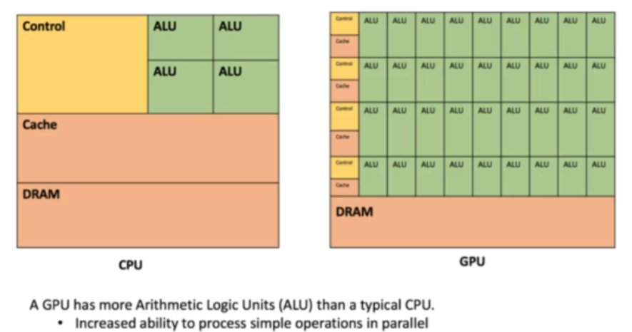
    
    - GPUs are better suited for deep learning because they can handle the large number of matrix multiplications required for training deep learning models.

    - NVIDIA created a parallel computing architecture called CUDA which gave deep learning library developers the ability to write code for parallel processing on GPUs.


