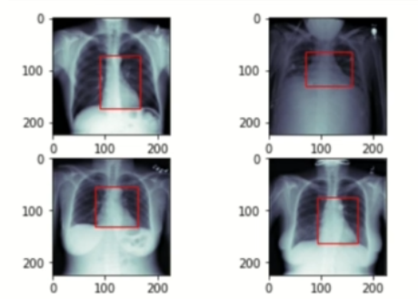

## Heart Detection

- Predict a bounding box around the heart in the X-ray image.

- Medical background

    - Cardiac Detection indicates size and position of the heart.

        - Cardiomyopathy(heart muscle disease muscle which might lead to heart failure or blood clots) often comes with an increased heart size.

        - Pneumothorax and Atelectasis (collapsed lung) can also be detected by the size and position of the heart.(may lead to cardiac displacement) 

    - Early detection reduces the risk of severe courses and long-term consequences.

- Dataset

    - RSNA Pneumonia Detection Challenge

    - with `custom labels` for heart detection

- Preprocessing

    - Original images are 1024x1024 pixels

    - Images are resized to 224x224 pixels

    - **Caution**: Bounding boxes must also be scaled accordingly

    - Standardize the pixel values into the interval [0, 1] by scaling with 1/255

    - Split the dataset into 400 training images and 96 validation images

        - Store train and validation subject ids

    - Compute training mean and standard deviation for normalization

    - Here unlike pneumonia classification we are not having any pre-labelled data for heart detection. So, we need to programmatically generate the bounding boxes for the heart in the images.

- Dataset

    - Task:

        - Given a subject idx, load the corresponding X-ray image and bounding box coordinates(xmin, xmax, ymin, ymax) of the heart.

    - Z-normalize images with computed mean and std

        x_normalized = (x - mean) / std

    - Apply data augmentation

        - (Gamma) Contrast changes (0.7, 1.7)

        - Scaling (0.8, 1.2)

        - Rotation (-10, 10)

        - Translation (-0.1, 0.1)

        - **Important**: Augment image and bounding box identically

- Training

    - Network Architecture

        - ResNet-18

        - Change the input channels from 3 to 1

        - Replace the last layer with a fully connected layer with 4 output units (xmin, xmax, ymin, ymax)

    - Loss Function
    
        - Mean Squared Error (MSE)
    
    - Optimizer

        - Adam (lr=1e-4)

    - Train for 50 epochs

- Preprocessing

    ```python
    from pathlib import Path
    import pydicom
    import numpy as np
    import cv2
    import matplotlib.pyplot as plt
    import pandas as pd
    import matplotlib.patches as patches

    # Load the dataset
    labels = pd.read_csv('stage_2_train_labels.csv')
    labels.head() # patientId, x, y, width, height, Target

    ROOT_PATH = Path('stage_2_train_images')
    SAVE_PATH = Path('stage_2_train_images_resized') 

    fig, axis = plt.subplots(1, 2, figsize=(10, 5))
    count = 0
    for i in range(2):
        for j in range(2):
            patientId = labels.iloc[count]['name']
            dcm_path = ROOT_PATH / f'{patientId}.dcm'
            image = pydicom.read_file(dcm_path).pixel_array
            
            dcm_array = cv2.resize(image, (224, 224))

            x = labels.iloc[count]['x0']
            y = labels.iloc[count]['y0']
            width = labels.iloc[count]['w']
            height = labels.iloc[count]['h']

            axis[i][j].imshow(dcm_array, cmap='bone')
            rect = patches.Rectangle((x, y), width, height, linewidth=1, edgecolor='r', facecolor='none') # (x, y), width, height, linewidth - is the thickness of the rectangle edge, edgecolor - is the color of the rectangle edge, facecolor - is the color of the rectangle face
            axis[i][j].add_patch(rect)
            count += 1
    ```
    
    ```python
    sums, sums_squared = 0, 0
    train_ids, val_ids = [], []

    for counter, patientId in enumerate(list(labels['name'])):
        dcm_path = ROOT_PATH / f'{patientId}.dcm'
        dcm = pydicom.read_file(dcm_path)
        dcm_array = dc.pixel_array
        dcm_array = cv2.resize(dcm_array, (224, 224))/255 # Normalizing the pixel values

        train_or_val = "train" if counter < 400 else "val"

        if train_or_val == "train":
            train_ids.append(patientId)
        else:
            val_ids.append(patientId)

        current_save_path = SAVE_PATH / train_or_val
        current_save_path.mkdir(parents=True, exist_ok=True)

        np.save(current_save_path/patient_id, dcm_array)

    
        normalizer = 224*224
        if train_or_val == "train":
            sums += np.sum(dcm_array)/normalizer
            sums_squared += np.sum(dcm_array**2)/normalizer

    np.save("stage_2_train_images_resized/train_subjects", train_ids)
    np.save("stage_2_train_images_resized/val_subjects", val_ids)

    mean = sums/ len(train_ids)
    std = np.sqrt(sums_squared/len(train_ids) - mean**2)

    print(f"Mean: {mean}, Std: {std}") # Mean: 0.482, Std: 0.244
    ```
    ```python
    ```


        