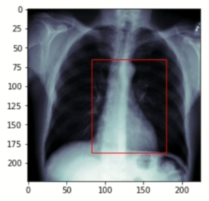

## Heart Detection

- Predict a bounding box around the heart in the X-ray image.

- Medical background

    - Cardiac Detection indicates size and position of the heart.

        - Cardiomyopathy(heart muscle disease muscle which might lead to heart failure or blood clots) often comes with an increased heart size.

        - Pneumothorax and Atelectasis (collapsed lung) can also be detected by the size and position of the heart.(may lead to cardiac displacement) 

    - Early detection reduces the risk of severe courses and long-term consequences.

- Dataset

    - RSNA Pneumonia Detection Challenge

    - with `custom labels` for heart detection

- Preprocessing

    - Original images are 1024x1024 pixels

    - Images are resized to 224x224 pixels

    - **Caution**: Bounding boxes must also be scaled accordingly

    - Standardize the pixel values into the interval [0, 1] by scaling with 1/255

    - Split the dataset into 400 training images and 96 validation images

        - Store train and validation subject ids

    - Compute training mean and standard deviation for normalization

    - Here unlike pneumonia classification we are not having any pre-labelled data for heart detection. So, we need to programmatically generate the bounding boxes for the heart in the images.

- Dataset

    - Task:

        - Given a subject idx, load the corresponding X-ray image and bounding box coordinates(xmin, xmax, ymin, ymax) of the heart.

    - Z-normalize images with computed mean and std

        x_normalized = (x - mean) / std

    - Apply data augmentation

        - (Gamma) Contrast changes (0.7, 1.7)

        - Scaling (0.8, 1.2)

        - Rotation (-10, 10)

        - Translation (-0.1, 0.1)

        - **Important**: Augment image and bounding box identically

- Training

    - Network Architecture

        - ResNet-18

        - Change the input channels from 3 to 1

        - Replace the last layer with a fully connected layer with 4 output units (xmin, xmax, ymin, ymax)

    - Loss Function
    
        - Mean Squared Error (MSE)
    
    - Optimizer

        - Adam (lr=1e-4)

    - Train for 50 epochs

- Preprocessing

    ```python
    from pathlib import Path
    import pydicom
    import numpy as np
    import cv2
    import matplotlib.pyplot as plt
    import pandas as pd
    import matplotlib.patches as patches

    # Load the dataset
    labels = pd.read_csv('stage_2_train_labels.csv')
    labels.head() # patientId, x, y, width, height, Target

    ROOT_PATH = Path('stage_2_train_images')
    SAVE_PATH = Path('stage_2_train_images_resized') 

    fig, axis = plt.subplots(1, 2, figsize=(10, 5))
    count = 0
    for i in range(2):
        for j in range(2):
            patientId = labels.iloc[count]['name']
            dcm_path = ROOT_PATH / f'{patientId}.dcm'
            image = pydicom.read_file(dcm_path).pixel_array
            
            dcm_array = cv2.resize(image, (224, 224))

            x = labels.iloc[count]['x0']
            y = labels.iloc[count]['y0']
            width = labels.iloc[count]['w']
            height = labels.iloc[count]['h']

            axis[i][j].imshow(dcm_array, cmap='bone')
            rect = patches.Rectangle((x, y), width, height, linewidth=1, edgecolor='r', facecolor='none') # (x, y), width, height, linewidth - is the thickness of the rectangle edge, edgecolor - is the color of the rectangle edge, facecolor - is the color of the rectangle face
            axis[i][j].add_patch(rect)
            count += 1
    ```
    
    ```python
    sums, sums_squared = 0, 0
    train_ids, val_ids = [], []

    for counter, patientId in enumerate(list(labels['name'])):
        dcm_path = ROOT_PATH / f'{patientId}.dcm'
        dcm = pydicom.read_file(dcm_path)
        dcm_array = dc.pixel_array
        dcm_array = cv2.resize(dcm_array, (224, 224))/255 # Normalizing the pixel values

        train_or_val = "train" if counter < 400 else "val"

        if train_or_val == "train":
            train_ids.append(patientId)
        else:
            val_ids.append(patientId)

        current_save_path = SAVE_PATH / train_or_val
        current_save_path.mkdir(parents=True, exist_ok=True)

        np.save(current_save_path/patient_id, dcm_array)

    
        normalizer = 224*224
        if train_or_val == "train":
            sums += np.sum(dcm_array)/normalizer
            sums_squared += np.sum(dcm_array**2)/normalizer

    np.save("stage_2_train_images_resized/train_subjects", train_ids)
    np.save("stage_2_train_images_resized/val_subjects", val_ids)

    mean = sums/ len(train_ids)
    std = np.sqrt(sums_squared/len(train_ids) - mean**2)

    print(f"Mean: {mean}, Std: {std}") # Mean: 0.482, Std: 0.244
    ```

- Create the custom dataset for cardiac-detection task

    ```python
    from pathlib import Path # Path handling
    import torch # for dataset creation
    import numpy as np  # to load the preprocessed images
    import pandas as pd # to load the labels
    import imgaug # for data augmentation
    from imgaug.augmentables.bbs import BoundingBox, BoundingBoxesOnImage # automatically augmenting images and bounding boxes in the same way

    class CardiacDataset(torch.utils.data.Dataset):

        def __init__(self, path_to_labels_csv, patients, root_path, augs):

            self.labels = pd.read_csv(path_to_labels_csv)
            self.patients = np.load(patients)
            self.root_path = Path(root_path)
            self.augment = augs
            

        def __len__(self):
            return len(self.patients)

        def __getitem__(self, idx):
            patient = self.patients[idx]
            data = self.labels[self.labels['name'] == patient]

            x_min = data['x0'].item() # item() is used to get the value of the scalar
            y_min = data['y0'].item()
            x_max = x_min + data['w'].item()
            y_max = y_min + data['h'].item()
            bbox = [x_min, y_min, x_max, y_max]

            file_path = self.root_path / patient
            img = np.load(f"{file_path}.npy").astype(np.float32)

            if self.augment:
                bb = BoundingBox(x1=bbox[0], y1=bbox[1], x2=bbox[2], y2=bbox[3])
                # due to multi threading in combination with pytorch data loaders, all augmentations are continously repeated and not randomly applied when using imgaug. So, we need to set a random seed for each image to get different augmentations for each image.
                random_seed = torch.randint(0, 10000, (1,)).item() # .item to convert the tensor to a scalar 
                imgaug.seed(random_seed)

                img, aug_bbox = self.augment(image=img, bounding_boxes=bb)
                bbox = aug_bbox[0][0], aug_bbox[0][1], aug_bbox[1][0], aug_bbox[1][1]

            img = (img - mean) / std # Z-normalize the image, Calculate in preprocessing
            img = torch.Tensor(img).unsqueeze(0) # unsqueeze(0) is used to add a dimension at the beginning
            bbox = torch.Tensor(bbox)
            return img, bbox
    ```

- Evaluate our functionality of creating the dataset

    ```python
    import imgaug.augmenters as iaa
    import matplotlib.pyplot as plt
    import matplotlib.patches as patches

    seq = iaa.Sequential([
        iaa.GammaContrast(),
        iaa.Affine(scale=(0.8, 1.2), rotate=(-10, 10),translate_px=(-10, 10))
    ]) # Sequential is used to apply the augmentations sequentially

    labels_path = 'stage_2_train_labels.csv'
    patients_path = 'stage_2_train_images_resized/train_subjects.npy'
    root_path = 'stage_2_train_images_resized/train'
    dataset = CardiacDataset(labels_path, patients_path, root_path, seq)

    img, bbox = dataset[0]

    fig, ax = plt.subplots(1, 1)
    ax.imshow(img.squeeze(0), cmap='bone') # squeeze(0) is used to remove the first dimension
    rect = patches.Rectangle((bbox[0], bbox[1]), bbox[2]-bbox[0], bbox[3]-bbox[1], linewidth=1, edgecolor='r', facecolor='none') # (x, y), width, height, linewidth - is the thickness of the rectangle edge, edgecolor - is the color of the rectangle edge, facecolor - is the color of the rectangle face, we need to subtract the x and y values to get the width and height
    axis.add_patch(rect)
    # 
    
    ```

- Train 

    ```python
    import torch
    import torchvision
    import pytorch_lightning as pl
    from pytorch_lightning.callbacks import ModelCheckpoint
    from pytorch_lightning.loggers import TensorBoardLogger
    import numpy as np
    import cv2
    import imgaug.augmenters as iaa
    from dataset import CardiacDataset # assuming the dataset is saved in a file named dataset.py

    train_root_path = 'stage_2_train_images_resized/train'
    train_subjects = 'stage_2_train_images_resized/train_subjects.npy'
    val_root_path = 'stage_2_train_images_resized/val'
    val_subjects = 'stage_2_train_images_resized/val_subjects.npy'

    train_transforms = iaa.Sequential([
        iaa.GammaContrast(),
        iaa.Affine(scale=(0.8, 1.2), rotate=(-10, 10), translate_px=(-10, 10))
    ])

    train_dataset = CardiacDataset('stage_2_train_labels.csv', train_subjects, train_root_path, train_transforms)
    val_dataset = CardiacDataset('stage_2_train_labels.csv', val_subjects, val_root_path, None)

    batch_size = 16
    num_workers = 4

    train_loader = torch.utils.data.DataLoader(train_dataset, batch_size=batch_size, shuffle=True, num_workers=num_workers)
    val_loader = torch.utils.data.DataLoader(val_dataset, batch_size=batch_size, shuffle=False, num_workers=num_workers)

    class CardiacDetectionModel(pl.LightningModule):

        def __init__(self):
            super().__init__()
            self.model = torchvision.models.resnet18(pretrained=True) # pretrained=True is used as our dataset it too small to train from scratch, therefore we randomly initialize the weights with the weights of a model trained on ImageNet - Transfer Learning (is a machine learning method where a model developed for a task is reused as the starting point for a model on a second task)
            self.resnet.conv1 = torch.nn.Conv2d(1, 64, kernel_size=(7, 7), stride=(2, 2), padding=(3, 3), bias=False) # Change the input channels from 3 to 1, as we have grayscale images, bias=False is used to not add a bias term
            self.resnet.fc = torch.nn.Linear(in_features=512, out_features=4) # Replace the last layer with a fully connected layer with 4 output units (xmin, xmax, ymin, ymax)
            self.optimizer = torch.optim.Adam(self.model.parameters(), lr=1e-4)
            self.loss = torch.nn.MSELoss() # Mean Squared Error (MSE)

        def forward(self, x):
            return self.model(data)

        def training_step(self, batch, batch_idx):
            x_ray, label = batch
            label = label.float()
            pred = self(x_ray)
            loss = self.loss_fn(pred, label)

            self.log('train_loss', loss)

            if batch_idx%50 == 0:
                self.log_images(x_ray.cpu(),pred.cpu(),label.cpu(),"Train")

            return loss

        def validation_step(self, batch, batch_idx):
            x_ray, label = batch
            label = label.float()
            pred = self(x_ray)
            loss = self.loss_fn(pred, label)

            self.log('val_loss', loss)

            if batch_idx%50 == 0:
                self.log_images(x_ray.cpu(),pred.cpu(),label.cpu(),"Val")

            return loss

        def log_images(self, x_ray, pred, label, name):
            results = []

            for i in range(4):
                coords_label = label[i]
                coords_pred = pred[i]

                img = (x_ray[i] * std + mean).numpy()[0] # Z-normalize the image, Calculate in preprocessing
                x0, y0 = coords_label[0].int().item(), coords_label[1].int().item()
                x1, y1 = coords_label[2].int().item(), coords_label[3].int().item()

                img = cv2.rectangle(img, (x0, y0), (x1, y1), (0, 0, 0), 2) # (x0, y0), (x1, y1), (0, 0, 0) - is the color of the rectangle, 2 - is the thickness of the rectangle edge, here the color is black

                x0, y0 = coords_pred[0].int().item(), coords_pred[1].int().item()
                x1, y1 = coords_pred[2].int().item(), coords_pred[3].int().item()

                img = cv2.rectangle(img, (x0, y0), (x1, y1), (1, 1, 1), 2) # (x0, y0), (x1, y1), (1, 1, 1) - is the color of the rectangle, 2 - is the thickness of the rectangle edge, here the color is white

                results.append(torch.Tensor(img).unsqueeze(0)) # unsqueeze(0) is used to add a dimension at the beginning


            grid = torchvision.utils.make_grid(results, 2)
            self.logger.experiment.add_image(f'{name}_images', grid, self.global_step) # self.logger.experiment.add_image is used to log the images to tensorboard, here we are logging the images to tensorboard

        def configure_optimizers(self):
            return [self.optimizer]

    model = CardiacDetectionModel()

    checkpoint_callback = ModelCheckpoint(
        monitor='val_loss',
        dirpath='checkpoints',
        filename='cardiac-detection-{epoch:02d}-{val_loss:.2f}',
        save_top_k=10,
        mode='min'
    )

    trainer = pl.Trainer(
        gpus=1,
        max_epochs=50,
        callbacks=checkpoint_callback,
        logger=TensorBoardLogger('logs', name='cardiac-detection'),
        log_every_n_steps=1
    )

    trainer.fit(model, train_loader, val_loader)
    ```

- Evaluation

    ```python
    import matplotlib.pyplot as plt
    import matplotlib.patches as patches
    import torch

    device = torch.device('cuda:0' if torch.cuda.is_available() else 'cpu')
    model = model.load_from_checkpoint('checkpoints/cardiac-detection-epoch=49-val_loss=0.00.ckpt') # Load the best model from the checkpoints
    model.eval(); # Set the model to evaluation mode
    model.to(device) # Move the model to the device

    preds = []
    labels = []

    with torch.no_grad():
        for data, label in val_loader:
            data = data.to(device).float().unsqueeze(0) # unsqueeze(0) is used to add a dimension at the beginning, convert to float as the model expects float input
            pred = model(data)[0].cpu() # Move the prediction to the cpu
            preds.append(pred)
            labels.append(label)

    preds = torch.stack(preds) # stack is used to concatenate a sequence of tensors along a new dimension
    labels = torch.stack(labels) # stack is used to concatenate a sequence of tensors along a new dimension

    # To compute the mean deviation between the predicted and the ground truth bounding boxes
    mean_deviation = torch.mean(torch.abs(preds - labels), dim=0) # abs is used to compute the absolute value of the tensor, mean is used to compute the mean of the tensor, dim=0 is used to compute the mean along the first dimension # abs(preds - labels).mean(dim=0) can also be used, you will get an output like tensor([4.70, 4.90, 6.05, 4.5538])- which means the mean deviation in x_min is 4.70, in x_max is 4.90, in y_min is 6.05, in y_max is 4.5538

    # Inspect some of the predictions
    IDX = 0
    img, label = val_dataset[IDX]
    pred = preds[IDX]

    fig, ax = plt.subplots(1, 1)
    ax.imshow(img[0], cmap='bone')
    heart = patches.Rectangle((pred[0], pred[1]), pred[2]-pred[0], pred[3]-pred[1], linewidth=1, edgecolor='r', facecolor='none') # (x, y), width, height, linewidth - is the thickness of the rectangle edge, edgecolor - is the color of the rectangle edge, facecolor - is the color of the rectangle face, we need to subtract the x and y values to get the width and height  
    axis.add_patch(heart)
    ```