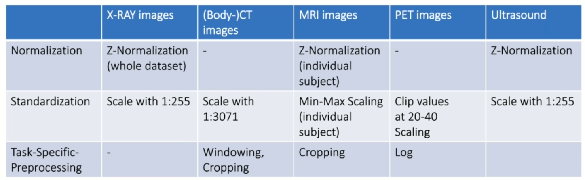

### Data Formats in Medical Imaging

- DICOM

    - Digital Imaging and Communications in Medicine- international standard for medical images and related information

    - International Standard for handling, storing, printing, and transmitting information in medical imaging

    - Defines the formats for medical images that can be exchanged with the data and quality necessary for clinical use

    - What is DICOM used for?

        - Store and share medical images

        - Communication between medical imaging devices

        - Most medical image data in hospitals is stored in DICOM format

    - Dicom file format:

        - Contains a header and image data

            - Header

                - Device information (manufacturer, model, etc.)
                - Patient information (name, ID, age, sex, etc.)
                - Study UID and Series UID (unique identifiers for the study and series - assign the scan to a patient and a study)
                - Image information (shape, slice thickness, pixel spacing, etc.)

            - Body

                - Actual image pixel data (2D, 3D, 4D)

        - Header contains metadata about the image

        - Image data is the actual image

            

        - Data Tag - Each entry is accessible by a unique tag

            - eg. (0010, 0010) - Patient's name
                
                (0018, 0015) - Body part examined

                (0020, 000D) - Study Instance UID

                (0020, 000E) - Series Instance UID

                (0028, 0002) - Samples per pixel

                (0028, 0004) - Photometric Interpretation

                (0028, 0010) - Rows

                (0028, 0011) - Columns

                (0028, 0030) - Pixel Spacing

                (0028, 0100) - Bits Allocated

                (0028, 0101) - Bits Stored

                (0028, 0102) - High Bit

                (0028, 0103) - Pixel Representation

                (7FE0, 0010) - Pixel Data

        - Dicom can be confusing because it is a very flexible format

            - Vendor-specific tags (private tags) can be added

            - 3D volumes often stored as multiple 2D DICOM files

            - DICOM file extension variable (.dcm, .dicom, .ima, sometimes none)

            - DICOM files can be compressed (lossless or lossy)

            - DICOM files can be encrypted (for security)

            - DICOM files can be `anonymized` (remove patient information)

            - Due to the flexibility, there are many DICOM libraries and tools, also dicom often requires conversion to other formats for research/ ML

    - Work with DICOM files

        - Python libraries

            - pydicom

            - SimpleITK

            - dicom2nifti

            - nibabel

        - DICOM viewers

            - RadiAnt

            - Osirix

            - Horos

            - 3D Slicer

    - DICOM in python

        - ```python
            from pathlib import Path
            import pydicom
            import matplotlib.pyplot as plt

            # Load the DICOM file
            dicom_file = pydicom.read_file('path/to/dicom/file.dcm')
            print(dicom_file) # display the DICOM file metadata

            dicom_file[0x0028, 0x0010] # (0028, 0010) - Rows

            dicom_file.Rows # 512

            # Display the image
            ct_image = dicom_file.pixel_array
            plt.figure(figsize=(10, 10))
            plt.imshow(ct_image, cmap='gray')

            path_to_head_mri = Path('path/to/mri/dicom/files')
            all_files = list(path_to_head_mri.glob('*.dcm'))

            mri_data = []
            for file in all_files:
                dicom_file = pydicom.read_file(file)
                mri_data.append(dicom_file)

            for slice in mri_data[:5]:
                print(slice.SliceLocation) # 89.999999995555
                #107. 99999999555
                #125.99999999555
                #144.99999999555
                #162.99999999555

            # Seems that dicom files are not ordered by SliceLocation, so to sort them
            mri_data.sort(key=lambda x: x.SliceLocation) #or
            mri_data_sorted = sorted(mri_data, key=lambda x: x.SliceLocation)

            for slice in mri_data_sorted[:5]:
                print(slice.SliceLocation) # 89.999999995555
                #107. 99999999555
                #125.99999999555
                #144.99999999555
                #162.99999999555

            full_volume = [slice.pixel_array for slice in mri_data_sorted]

            fig, axis = plt.subplots(1, 5, figsize=(20, 20))

            slice_count = 0
            for i in range(5):
                for j in range(5):
                    axis[i][j].imshow(full_volume[slice_count], cmap='gray')
                    slice_count += 1
            ```

    - SimpleITK

        - SimpleITK is a simplified interface to the Insight Segmentation and Registration Toolkit (ITK) for image analysis

        - ITK is a powerful library for image analysis, but it can be complex to use

        - SimpleITK provides a simplified interface to ITK, making it easier to work with medical images

        - SimpleITK supports many image formats, including DICOM

        - SimpleITK can be used for image processing, registration, segmentation, and more

            ```python
            import SimpleITK as sitk

            # Load the DICOM files
            series_ids = sitk.ImageSeriesReader.GetGDCMSeriesFileNames(str('path/to/dicom/files'))
            print(series_ids) # list of DICOM files

            series_file_names = sitk.ImageSeriesReader.GetGDCMSeriesFileNames(str('path/to/dicom/files'), series_ids[0]) # get the file names for the first series- sorted by slice location

            series_reader = sitk.ImageSeriesReader() # create the reader
            series_reader.SetFileNames(series_file_names) # set the file names

            image = series_reader.Execute() # load the image

            head_mri = sitk.GetArrayFromImage(image) # convert the image to a numpy array

            print(head_mri.shape) # (slices, rows, columns) - (20, 512, 512)

            plt.figure(figsize=(10, 10))
            plt.imshow(head_mri[10], cmap='gray') # display the 10th slice

            plt.figure(figsize=(10, 10))
            for i in range(5):
                plt.subplot(1, 5, i+1)
                plt.imshow(head_mri[i], cmap='gray')


            fig, axis = plt.subplots(1, 5, figsize=(20, 20))

            slice_count = 0
            for i in range(5):
                for j in range(5):
                    axis[i][j].imshow(head_mri[slice_count], cmap='gray')
                    slice_count += 1
            ```

- Nifti

    - Neuroimaging Informatics Technology Initiative

    - Open file format for storage of medical imaging data (historically used for neuroimaging, hence the name but not restricted to neuroimaging)

    - What is Nifti used for?

        - Efficiently store medical image data together with necessary metadata

        - Mainly used in research settings

        - Not a clinical standard

    - Nifti file format:

        - Contains a header and image data

            - Header

                - Image information - mainly about image geometry - resolution, position, orientation (shape, affine matrix, etc.)

            - Body

                - Actual image pixel data (3D, 4D)

            - In general, easier to handle than dicom files.

            - Extensions: .nii, .nii.gz

        - Nifti is a simpler format than DICOM

            - No private tags

            - 3D volumes stored in a single file

            - Nifti files are not compressed or encrypted

            - Nifti files can be anonymized

            - Nifti files can be converted to other formats for research/ ML

    - Work with Nifti files

        - Python libraries

            - nibabel

            - SimpleITK

        - Nifti viewers

            - FSL

            - MRIcron

            - ITK-SNAP

        - Transform DICOM to Nifti

            - dicom2nifti

    - Nifti in Python

        ```python
        import dicom2nifti
        path_to_dicom = 'path/to/dicom/files'
        dicom2nifti.convert_directory(path_to_dicom, 'path/to/nifti/file.nii.gz', compression=True) # convert dicom files to compressed nifti

        import nibabel as nib
        import matplotlib.pyplot as plt

        nifti_file = nib.load('path/to/nifti/file.nii.gz')
        print(nifti_file) # display the Nifti file metadata, only necessary information not like dicom

        nifti_file.header["qoffset_x"] # array(115.27232, dtype=float32)
        nifti.shape # (512, 512, 20)

        image_array = nifti_file.get_fdata() # get the image data as a numpy array
        
        fig, axis = plt.subplots(1, 5, figsize=(20, 20))
        slice_count = 0
        for i in range(5):
            for j in range(5):
                axis[i][j].imshow(image_array[:, :, slice_count], cmap='gray') # we have to use [:, :, slice_count] to get the slice because of the shape of the array during conversion from dicom to nifti
                slice_count += 1

        # The plotted images appears to be rotated as well as flipped, this is due to the difference in the orientation of the image in dicom and nifti formats which may have happened during the conversion process

        # We can not use nibabel only to load nifti but also to save nifti files - the reason is that many times you receive data that is preprocessed using some algorithm and you want to save the results in nifti format

        #eg:
        image_array_processed = image_array * (image_array > 300) # threshold the image
        #compare the original and processed images
        fig, axis = plt.subplots(1, 2, figsize=(20, 20))
        axis[0].imshow(image_array[:, :, 10], cmap='gray')
        axis[1].imshow(image_array_processed[:, :, 10], cmap='gray')

        # Save the processed image - to store the processed volume as a nifti, we have to create a nifti image first
        nifti_file_processed = nib.Nifti1Image(image_array_processed, nifti_file.affine) # nifti.afine is the affine matrix that defines the image orientation and position - we can use the same as that of the original image since we only changed the pixel values and not the orientation

        nib.save(nifti_file_processed, 'path/to/nifti/file_processed.nii.gz')

        ```

- Preprocessing

    - Preprocessing is an important step in medical image analysis

    - Preprocessing steps can include

        - Image registration

        - Image normalization

        - Image denoising

        - Image segmentation

        - Image augmentation

    - Preprocessing can improve the quality of the images and make them easier to analyze

    - Preprocessing can also help to remove noise, artifacts, and other unwanted features from the images

    - Preprocessing can be done using a variety of techniques, including

        - SimpleITK

        - nibabel

        - scikit-image

        - OpenCV

    - Why Preprocessing?

        - Data need to be prepared for training and testing

            - Modality specific preprocessing steps

            - Normalization and Standardization

            - Homogenization of image resolution / size / orientation

        - ML methods may require specific input formats (e.g. images of certain size)

        - Faster access to data during training 

    - Preprocessing steps

        1. Modality specific preprocessing steps - finding suitable techniques for the specific modality

            - Image Reconstruction algorithms (e.g. CT, MRI, PET) - convert the raw output of the scanner to a form that the human can actually understand. Usually, these are already applied by the scanner and are not necessary for further processing

            - Denoising algorithms (e.g. MRI, CT) - remove noise from the image

            - Complex artifact correction algorithms (e.g. motion, bias-field) - remove artifacts from the image

            - Quantification algorithms - convert the image to a quantitative measure ie standard units

        2. Orientation

            - Image orientation can vary between different scanners and imaging protocols

            - Images may need to be rotated, flipped, or resliced to a standard orientation

            - This is important for consistency and comparability between images

            - Goal: Standardized image orientation for the whole dataset

            - Data array axis should always correspond to the same physical dimensions - > axial, coronal, sagittal - > superior-inferior, anterior-posterior, left-right

        3. Spatial resampling / resizing

            - Goal: Standardized physical resolution and size

                - All your scans in the dataset should have the same shape and all the voxels in all slices should represent the same physical dimension

                - eg. 1mm x 1mm x 1mm - each voxel represents a 1mm x 1mm x 1mm cube, can be performed by resampling, padding, cropping

                - Most of the time used to reduce the size of the volume (eg. 512 x 512 x 512 -> 256 x 256 x 256)

            - Each pixel of a data array should represent the same physical dimension - Resampling, Padding, Cropping 

        4. Intensity normalization and Standardization

            - Goal: Standardized intensity values

                - All your scans in the dataset should have the same intensity range

                - Normalization: Rescale the intensity values to a specific range (eg. 0-1)

                - Standardization: Rescale the intensity values to have a mean of 0 and a standard deviation of 1

            - Modality specific standardization to defined values intervals (eg. [0, 1], [-1, 1])

                - Normalization and standardization per subject(eg. MR)

                - Standardization per dataset(eg. CT)

            - Advanced Methods: Log, Exponential, Histogram Equalization, Contrast Limited Adaptive Histogram Equalization (CLAHE), MNI-Template matching

            - Overview

                

                Always try different preprocessing steps and check the results - the above table is just a guideline

        5. Conversion to algorithm input format

            - Goal: Convert data to convenient format for ML algorithms

                - Convert data to numpy arrays

                - Convert data to tensors

                - Convert data to specific format required by the algorithm

            - Suitable medical image formats

                - Nifti

                - NRRD

            - Efficient storage for ML Data pipelines

                - HDF5

                - npy

                - pickle

                - zarr

                - TFRecord

            
    - Physical and Voxel coordinates

        - Physical coordinates: The physical location of a voxel in the real world

        - Voxel coordinates: The location of a voxel in the data array

        - Voxel coordinates[i, j, k] refer to the location of the voxel in the data array

        - Physical coordinates[x, y, z] refer to the location of the voxel in the real world

        - All voxel coordinates correspond to the physical coordinates in a one to one manner

        - Physical coordinate have SI-units (eg. mm, cm, m) and a standardised reference system(origina and axis orientation) wrt the scanner.

        - Conversion between physical and voxel coordinates is done using the affine matrix - a 4x4 matrix that defines the mapping between voxel and physical coordinates

            - X_physical = AX_voxel + X_origin, where A is a 3*3 matrix (Affine matrix)

                - A: Define the linear transformation corresponding of:

                    - Scaling

                    - Rotation

                    - Shearing(tilting)

                - By expanding the 3 * 3 matrix to a 4 * 4 matrix,it can directly incorporate the translation from the offset X_origin ie X_physical = AX_voxel + X_origin

                - The combination of these all transformations is called `affine transformation`

    - Preprocessing in Python

        - ```python
            %matplotlib notebook
            import nibabel as nib
            import numpy as np
            import matplotlib.pyplot as plt

            brain_mri = nib.load('path/to/nifti/file.nii.gz')
            brain_mri_data = brain_mri.get_fdata()
            affine = brain_mri.affine
            shape = brain_mri_data.shape

            print(shape) # (512, 512, 20)
            prnt(affine) # array([[ 1.,  0.,  0.,  0.],
            # [ 0.,  1.,  0.,  0.],
            # [ 0.,  0.,  1.,  0.],
            # [ 0.,  0.,  0.,  1.]])

            # size of a voxel in volume
            brain_mri.header.get_zooms() # (0.9375, 0.9375, 1.25) # (x, y, z)

            # To find the orientation
            nib2axcodes = nib.aff2axcodes(affine)
            print(nib2axcodes) # ('R', 'A', 'S') - Right, Anterior, Superior - these are the end points of the axes, ie the movement in the first axis is from left to right, in the second axis is from posterior to anterior and in the third axis is from inferior to superior

            # Lets go through each axis and plot some images
            fig, axis = plt.subplots(1, 5, figsize=(20, 20))
            axis[0].imshow(brain_mri_data[:, :, 10], cmap='gray') # 10th slice in the z-axis
            axis[1].imshow(brain_mri_data[:, :, 20], cmap='gray') # 20th slice in the z-axis

            # Voxel to physical coordinates
            voxel_coords = np.array([0, 0, 0, 1])
            physical_coords = affine @ voxel_coords
            physical_coords # array([-90.679, 102.829, -114.823, 1.])

            # To verify the results, print the last column of the affine matrix
            affine[:, 3:] # array([-90.679],
            # [102.829],
            # [-114.823],
            # [1.])

            # to calculate the physical coordinates manually
            physical_coords_manual = affine[:3, :3] @ np.array([0, 0, 0]) + affine[:3, 3]
            physical_coords_manual # array([-90.679, 102.829, -114.823])

            # Physical to voxel coordinates
            physical_coords = np.array([-90.679, 102.829, -114.823, 1.])
            voxel_coords = np.linalg.inv(affine) @ physical_coords
            voxel_coords.round() # array([0., 0., 0.])


            # Resampling - Resizing a volume is not as simple as resizing an image, because we have to take into account the physical dimensions of the voxels
            print(brain_mri.header.get_zooms()) # (0.9375, 0.9375, 1.25)
            print(brain_mri_data.shape) # (512, 512, 20)

            # Lets resize the brain_mri from 512 x 512 x 20 to 128 x 128 x 10
            import nibabel.processing
            voxel_size = (2, 2, 2.5) # new voxel size
            brain_mri_resampled = nib.processing.confirm(brain_mri, (128,128,10) , voxel_size, orientation='RAS') # resample the volume to 128 x 128 x 10 with voxel size 2 x 2 x 2.5
            brain_mri_resampled_data = brain_mri_resampled.get_fdata()
            print(brain_mri_resampled_data.shape) # (128, 128, 10)
            print(brain_mri_resampled.header.get_zooms()) # (2.0, 2.0, 2.5)

            # Lets compare the original and resampled images
            fig, axis = plt.subplots(1, 2, figsize=(20, 20))
            axis[0].imshow(brain_mri_data[:, :, 10], cmap='gray') # original image
            axis[1].imshow(brain_mri_resampled_data[:, :, 10], cmap='gray') # resampled image

            # Normalization and Standardization
            # CT scans have fixed and absolute values from -1024 to 3071. Don't need normalization here to keep these scales. We can assume that all the values lie between -1024 and 3071. Thus we can standardize the data by multiplying by 1/3071
            lung_ct = nib.load('path/to/nifti/file.nii.gz')
            lung_ct_data = lung_ct.get_fdata()

            lung_ct_data_standardized = lung_ct_data / 3071

            # Lets plot the original and standardized images
            fig, axis = plt.subplots(1, 2, figsize=(20, 20))
            axis[0].imshow(lung_ct_data[:, :, 10], cmap='gray') # original image
            axis[1].imshow(lung_ct_data_standardized[:, :, 10], cmap='gray') # standardized image

            plt.imshow(np.rot90(lung_ct_data[:, :, 10]), cmap='gray') # rotate the image 90 degrees

            # windowing
            # Windowing is a technique used to adjust the contrast and brightness of an image by changing the intensity values of the pixels
            lung_ct_data_windowed = np.clip(lung_ct_data, -1024, -500) # clip the values to the range -1024 to -500
            plt.figure()
            plt.imshow(np.rot(lung_ct_data_windowed[:, :, 10], cmap='bone')) # display the windowed image

            lung_ct_soft_tissue = np.clip(lung_ct_data, -250, 250) # clip the values to the range -250 to 250
            plt.figure()
            plt.imshow(np.rot90(lung_ct_soft_tissue[:, :, 10], cmap='gray')) # display the windowed image


            # MRI - Normalization and Standardization
            cardiac_mri = nib.load('path/to/nifti/file.nii.gz')
            cardiac_mri_data = cardiac_mri.get_fdata()

            mean, std = np.mean(cardiac_mri_data), np.std(cardiac_mri_data)
            cardiac_mri_data_norm = (cardiac_mri_data - mean) / std # z-score normalization

            # min-max scaling
            cardiac_mri_standardized = (cardiac_mri_data_norm - np.min(cardiac_mri_data_norm)) / (np.max(cardiac_mri_data_norm) - np.min(cardiac_mri_data_norm))

            # To verify the values
            print(np.mean(cardiac_mri_standardized),np.min(cardiac_mri_standardized), np.max(cardiac_mri_standardized)) # 0.5, 0.0, 1.0

            # Lets plot the original and standardized images
            fig, axis = plt.subplots(1, 2, figsize=(20, 20))
            axis[0].imshow(cardiac_mri_data[:, :, 10], cmap='gray') # original image
            axis[1].imshow(cardiac_mri_standardized[:, :, 10], cmap='gray') # standardized image
            ```