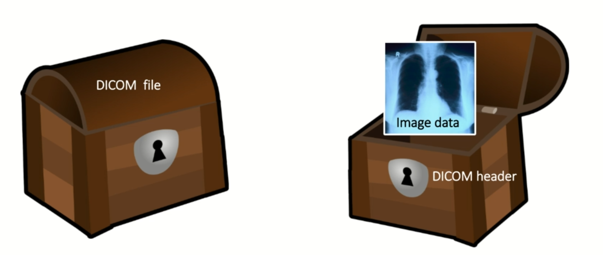

### Data Formats in Medical Imaging

- DICOM

    - Digital Imaging and Communications in Medicine- international standard for medical images and related information

    - International Standard for handling, storing, printing, and transmitting information in medical imaging

    - Defines the formats for medical images that can be exchanged with the data and quality necessary for clinical use

- What is DICOM used for?

    - Store and share medical images

    - Communication between medical imaging devices

    - Most medical image data in hospitals is stored in DICOM format

- Dicom file format:

    - Contains a header and image data

        - Header

            - Device information (manufacturer, model, etc.)
            - Patient information (name, ID, age, sex, etc.)
            - Study UID and Series UID (unique identifiers for the study and series - assign the scan to a patient and a study)
            - Image information (shape, slice thickness, pixel spacing, etc.)

        - Body

            - Actual image pixel data (2D, 3D, 4D)

    - Header contains metadata about the image

    - Image data is the actual image

        

    - Data Tag - Each entry is accessible by a unique tag

        - eg. (0010, 0010) - Patient's name
            
              (0018, 0015) - Body part examined

              (0020, 000D) - Study Instance UID

              (0020, 000E) - Series Instance UID

              (0028, 0002) - Samples per pixel

              (0028, 0004) - Photometric Interpretation

              (0028, 0010) - Rows

              (0028, 0011) - Columns

              (0028, 0030) - Pixel Spacing

              (0028, 0100) - Bits Allocated

              (0028, 0101) - Bits Stored

              (0028, 0102) - High Bit

              (0028, 0103) - Pixel Representation

              (7FE0, 0010) - Pixel Data

    - Dicom can be confusing because it is a very flexible format

        - Vendor-specific tags (private tags) can be added

        - 3D volumes often stored as multiple 2D DICOM files

        - DICOM file extension variable (.dcm, .dicom, .ima, sometimes none)

        - DICOM files can be compressed (lossless or lossy)

        - DICOM files can be encrypted (for security)

        - DICOM files can be `anonymized` (remove patient information)

        - Due to the flexibility, there are many DICOM libraries and tools, also dicom often requires conversion to other formats for research/ ML

- Work with DICOM files

    - Python libraries

        - pydicom

        - SimpleITK

        - dicom2nifti

        - nibabel

    - DICOM viewers

        - RadiAnt

        - Osirix

        - Horos

        - 3D Slicer

