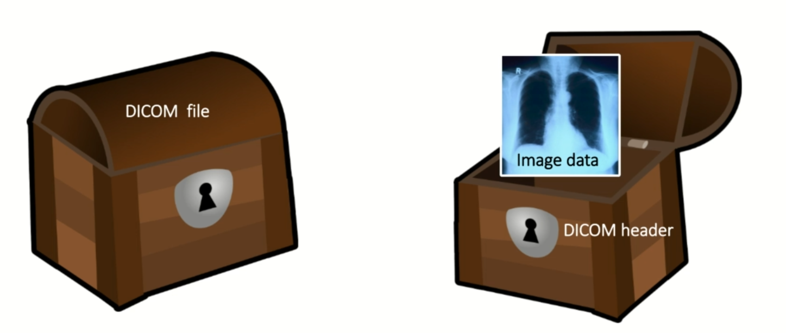

### Data Formats in Medical Imaging

- DICOM

    - Digital Imaging and Communications in Medicine- international standard for medical images and related information

    - International Standard for handling, storing, printing, and transmitting information in medical imaging

    - Defines the formats for medical images that can be exchanged with the data and quality necessary for clinical use

- What is DICOM used for?

    - Store and share medical images

    - Communication between medical imaging devices

    - Most medical image data in hospitals is stored in DICOM format

- Dicom file format:

    - Contains a header and image data

        - Header

            - Device information (manufacturer, model, etc.)
            - Patient information (name, ID, age, sex, etc.)
            - Study UID and Series UID (unique identifiers for the study and series - assign the scan to a patient and a study)
            - Image information (shape, slice thickness, pixel spacing, etc.)

        - Body

            - Actual image pixel data (2D, 3D, 4D)

    - Header contains metadata about the image

    - Image data is the actual image

            