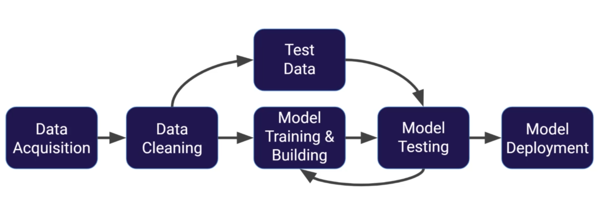
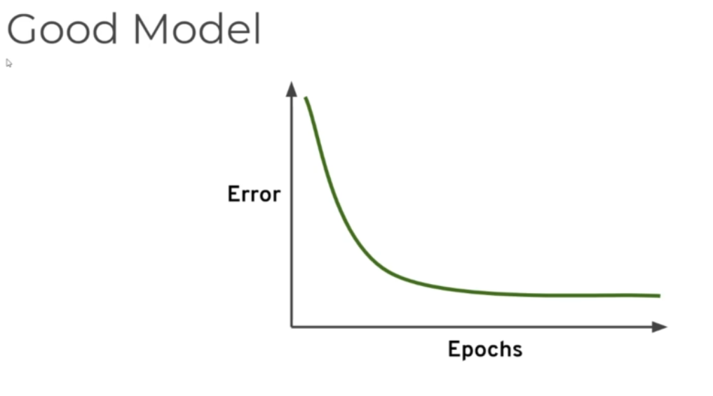
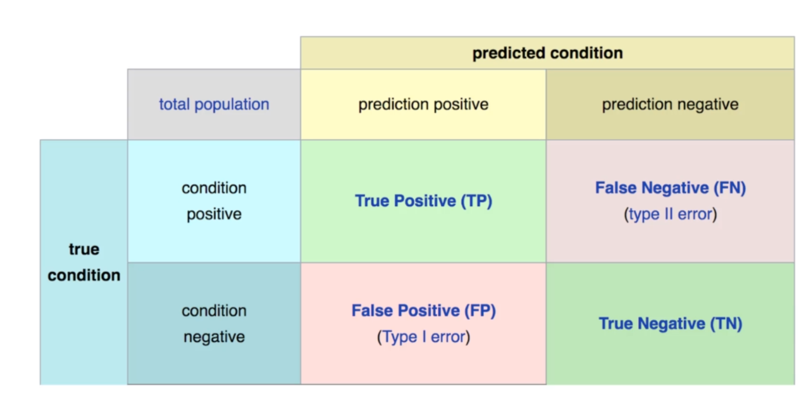
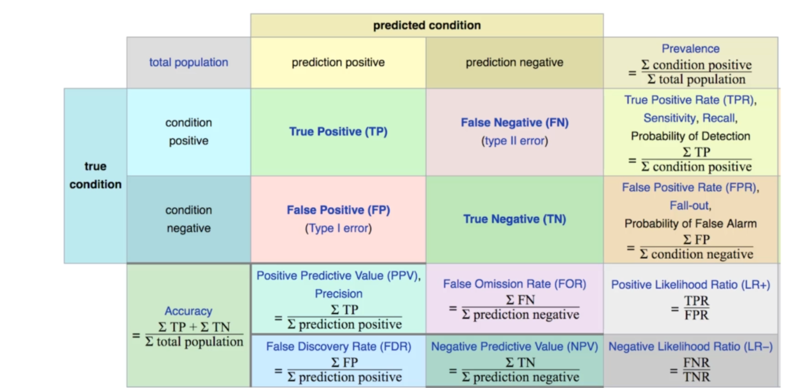

# ML Concepts Overview

- What is Machine Learning?

    - Machine learning is a method of data analysis that automates analytical model building. It is a branch of artificial intelligence based on the idea that systems can learn from data, identify patterns and make decisions with minimal human intervention.
    - Using algorithms that iteratively learn from data, machine learning allows computers to find hidden insights without being explicitly programmed where to look.
    - What is ML used for?
        - Fraud detection
        - Web search results
        - Real-time ads on web pages
        - Credit scoring and next-best offers
        - Prediction of equipment failures
        - New pricing models
        - Network intrusion detection
        - Recommendation engines
        - Customer segmentation
        - Text sentiment analysis
        - Predicting customer churn
        - Pattern and image recognition
        - Email spam filtering
        - Financial modeling
        - Forecasting
        - Data cleaning
        - And many more…

     - Neural Networks
        - Neural networks are a set of algorithms, modeled loosely after the human brain, that are designed to recognize patterns. They interpret sensory data through a kind of machine perception, labeling, clustering, and categorizing data.
        - Deep learning is a specialized form of machine learning. It involves a neural network with three or more layers, including an input layer, one or more hidden layers, and an output layer. (In deep learning, the hidden layers are typically much larger than the input layer.), so deep learning simply refers to neural networks with more than one hidden layer.

    - Types of Machine Learning
        - Supervised Learning
            - Supervised learning is the most common type of machine learning. It is the process of teaching or training a model using labeled data. The model learns to make predictions based on the features of the data. The model is trained using a labeled dataset, which means that the data is already tagged with the correct answer.
            - Examples of supervised learning include:
                - Classification: A classification problem is when the output variable is a category, such as “spam” or “not spam.”
                - Regression: A regression problem is when the output variable is a real or continuous value, such as “salary” or “weight.”

            - Machine learning process of supervised learning:
                - Collect and preprocess data
                - Split the data into training and testing sets
                - Choose a model
                - Train the model
                - Evaluate the model
                - Make predictions
                - Improve the model
                - Deploy the model

                    

            - Is it fair to test the model just on the test set?
                - No, it is not fair to test the model just on the test set. The model may overfit the test set, which means that it may perform well on the test set but poorly on new, unseen data. To avoid overfitting, it is important to split the data into three sets: training, validation, and testing. The model is trained on the training set, tuned on the validation set, and tested on the test set.
        - Unsupervised Learning
            - Unsupervised learning is a type of machine learning that looks for previously undetected patterns in a data set with no pre-existing labels. The system is not told the “right answer.” The algorithm must figure out what is being shown.
            - Examples of unsupervised learning include:
                - Clustering: A clustering problem is where you want to discover the inherent groupings in the data, such as grouping customers by purchasing behavior.
                - Association: An association rule learning problem is where you want to discover rules that describe large portions of your data, such as people that buy X also tend to buy Y.
        - Reinforcement Learning
            - Reinforcement learning is a type of machine learning that is about taking suitable action to maximize reward in a particular situation. It is employed by various software and machines to find the best possible behavior or path it should take in a specific situation.
            - Reinforcement learning is used in various fields, such as:
                - Robotics
                - Video games
                - Recommendation systems
                - Industrial automation
                - Finance
                - Healthcare
                - Natural language processing
                - And many more…

    - Overfitting and Underfitting
        - Overfitting
            - Overfitting occurs when a model learns the detail and noise in the training data to the extent that it negatively impacts the performance of the model on new data. This means that the model is too complex and captures the noise in the training data.
            - How to avoid overfitting:
                - Cross-validation
                - Regularization
                - Feature selection
                - Early stopping
                - Pruning
                - Ensembling
        - Underfitting
            - Underfitting occurs when a model is too simple to capture the underlying structure of the data. This means that the model is not complex enough to learn the patterns in the data.
            - How to avoid underfitting:
                - Increase the complexity of the model
                - Increase the number of features
                - Decrease the regularization parameter
                - Decrease the learning rate
                - Increase the number of iterations
                - Decrease the batch size

        - Good Model
            - A good model is one that generalizes well to new, unseen data. It is important to evaluate the model on a test set that is separate from the training set. The model should perform well on the test set, which means that it should have low error and high accuracy.
            - As epochs increase, the training error decreases, but the test error may increase. This is because the model may overfit the training data, which means that it may perform well on the training data but poorly on new, unseen data.

                

    - Bias and Variance
        - Bias
            - Bias is the error introduced by approximating a real-world problem, which may be complex, by a much simpler model. It is the difference between the expected prediction of the model and the true value.
            - High bias can cause an algorithm to miss the relevant relations between features and target outputs (underfitting).

        - Variance
            - Variance is the error introduced by the model due to its sensitivity to the fluctuations in the training data. It is the amount that the estimate of the target function will change if different training data were used.
            - High variance can cause an algorithm to model the random noise in the training data, rather than the intended outputs (overfitting).

        - Bias-Variance Tradeoff
            - The bias-variance tradeoff is the balance between the bias and variance of a model. It is the tradeoff between the error introduced by approximating a real-world problem by a much simpler model (bias) and the error introduced by the model due to its sensitivity to the fluctuations in the training data (variance).
            - A model with high bias and low variance may underfit the data, while a model with low bias and high variance may overfit the data. The goal is to find a model that has low bias and low variance, which means that it generalizes well to new, unseen data.

    - Model Evaluation
        - Model evaluation is the process of assessing the performance of a machine learning model. It is important to evaluate the model on a test set that is separate from the training set. The model should perform well on the test set, which means that it should have low error and high accuracy.
        - Common metrics for model evaluation include:
            - Accuracy: The proportion of correct predictions to the total number of predictions.
            - Precision: The proportion of true positive predictions to the total number of positive predictions.
            - Recall: The proportion of true positive predictions to the total number of actual positive instances.
            - F1 score: The harmonic mean of precision and recall.
            - ROC curve: The receiver operating characteristic curve, which shows the tradeoff between true positive rate and false positive rate.
            - AUC: The area under the ROC curve, which measures the performance of the model across all possible classification thresholds.   

            - Note:
                - Accuracy is not always the best metric for model evaluation. It is important to consider the problem domain and the goals of the model when choosing an evaluation metric. For example, in a highly imbalanced dataset, accuracy may not be a good metric because it may be biased towards the majority class.

            - Confusion Matrix
                - A confusion matrix is a table that is often used to describe the performance of a classification model on a set of test data for which the true values are known. It is a matrix with four cells, each representing a different combination of predicted and actual values.

                    

                - True positive (TP): The number of positive instances that were correctly predicted as positive.
                - False positive (FP) | Type 1 Error: The number of negative instances that were incorrectly predicted as positive.
                - True negative (TN): The number of negative instances that were correctly predicted as negative.
                - False negative (FN)| Type 2 Error: The number of positive instances that were incorrectly predicted as negative.

                    

        - Some model evaluations for regression problems include:
            - Mean Absolute Error (MAE): The average of the absolute differences between predictions and actual values.
                - MAE = 1/n * Σ |y - ŷ|
                - The smaller the MAE, the better the model.
                - They wont tell you if the model is overfitting or underfitting.
                - 
            - Mean Squared Error (MSE): The average of the squared differences between predictions and actual values.
            - Root Mean Squared Error (RMSE): The square root of the average of the squared differences between predictions and actual values.
            - R-squared (R2): The proportion of the variance in the dependent variable that is predictable from the independent variables.