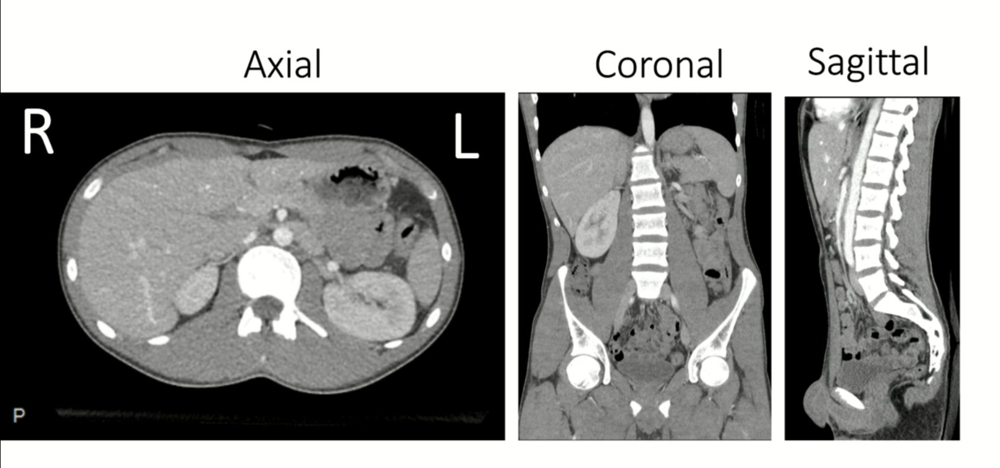
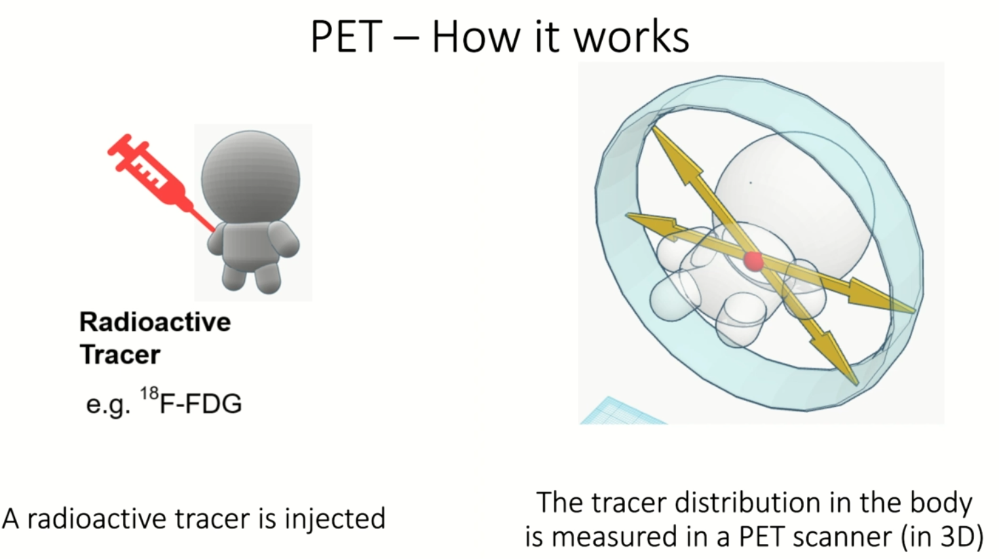

### Medical Imaging

- Why is medical imaging important?

    - Medical imaging is a key component of modern healthcare. It is used to diagnose and treat a wide range of diseases and conditions. Medical imaging techniques allow doctors to see inside the body and obtain detailed images of the organs and tissues. This information is used to make accurate diagnoses, plan treatments, and monitor the progress of patients.

    - A simple case study:

        - Young patient comes to emergency room

        - Has had a cold for the past week

        - Experiences sudden onset pain in the right chest region

        - Has difficulty breathing

        - Doctor orders a chest X-ray

        - Chest X-ray shows a large white area in the right lung

        - Diagnosis: Pneumothorax (collapsed lung)

            

- What is Medical Imaging?

    - Provides spatially resolved information from within the human body.

    - Has a wide range of applications in clinical practice, including:

        - Diagnosis

        - Treatment/Therapies planning

        - Monitoring of disease progression

        - Image-guided interventions

    - Is performed using different imaging modalities, such as:

        - Radiography(X-ray imaging)

            - Projection radiography(2D, e.g. chest X-ray imaging)

            - Computed tomography(CT, 3D, e.g. CT scan)

        - Magnetic resonance imaging(MRI, 3D)

        - Ultrasound imaging(2D/3D)

        - Nuclear medicine imaging(PET, SPECT, 3D) 

- Always mentions sides with respect to the patient's perspective, ie left and right are reversed.

    

- Planes and Orientation

    - We usually look at 3D images/volumes using 2D cross-sections.

        

    - Anatomical Orientation:

        - Sagittal plane: Divides the body into left and right parts.

        - Coronal plane: Divides the body into front and back parts.

        - Transverse plane: Divides the body into upper and lower parts.

            

- X-RAY

    - Projection radiography is the most common form of X-ray imaging.

    - It is used to visualize the internal structures of the body, such as bones, organs, and tissues.

    - X-ray images are produced by passing X-rays through the body and capturing the resulting image on a detector.

        

    - Contrast Mechanism

        - Different degrees of X-ray absorption by different tissues.

        - Image intensities are relative values, ie they are not absolute.

        - Dense or thick objects results in an x-ray shadow with less x-ray reaching the detector. eg bones and air, bones absorb more x-ray than air hence bones appear white and air appears black.

        - Usually:

            - high x-ray absorption: high image intensity ie white

            - low x-ray absorption: low image intensity ie black

            - Careful with the interpretation of the images, they can be inverted.

    - Measuring Distances

        - Radiologists diagnoses diseases by measuring distances between anatomical structures.

        - Distances are measured as the number of pixels on the detector.

        - Can be translated to approximate physical distances(e.g. in cm) through calibration.

- CT Scan

    - Computed tomography(CT) is a medical imaging technique that uses X-rays to create detailed images of the body.

    - CT scans are used to diagnose a wide range of conditions, including injuries, infections, and tumors.

    - CT scans provide cross-sectional images of the body, allowing doctors to see inside the body from different angles.

    - CT scans are particularly useful for imaging the brain, chest, abdomen, and pelvis.

    - CT scans are performed using a CT scanner, `which rotates around the patient and takes multiple X-ray images from different angles`.

        

    - The images are then processed by a computer to create detailed cross-sectional images of the body.

    - Contrast Mechanism

        - Different degrees of X-ray absorption by different tissues.

        - Image intensities are absolute values (Hounsfield units: air = -1000 HHU, water = 0 HU).

        - Usually:

            - high x-ray absorption: high image intensity ie white

            - low x-ray absorption: low image intensity ie black

        - CT scans are never inverted.

        - Distances between voxels(pixel in 3D) can be exactly quantified and directly translated to physical distances.

            

- MRI

    - Magnetic resonance imaging(MRI) is a medical imaging technique that uses a magnetic field and radio waves to create detailed images of the body.

    - Takes larger time than CT scans, therefore not used in emergency cases.

    - Images are acquired by:

        - electromagnetic excitation of protons in the body
        - in a strong magnetic field
        - and subsequent measurement of the emitted electromagnetic signals

    - No ionizing radiation is used, making it safer than X-ray and CT scans(CT scans use ionizing radiation).

    - Contrast Mechanism

        - Mutliple contrasts exist in MRI images, such as T1-weighted, T2-weighted, and proton density images.

        - Image intensitiesa are usually relative values.

        - Usually:

            - high signal intensity: high image intensity ie white

            - low signal intensity: low image intensity ie black

- PET

    - Positron emission tomography(PET) is a medical imaging technique that uses a radioactive tracer to create detailed images of the body.

        

    - PET scanners are usually combined with other imaging modalities (hybrid imaging), such as CT or MRI, to provide complementary information.

        - PET + CT: PET/CT

        - PET + MRI: PET/MRI

    - PET acquisition takes several minutes, as the tracer needs time to accumulate in the body.

    - Contrast Mechanism

        - Differences in tracer concentration in different tissues.

        - Image intensities are absolute values (standardized uptake value, SUV).

        - Image contrast depends on specific treacer