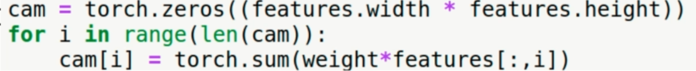

### Identify signs of pneumonia in chest X-ray images

- Medical background

    - Pneumonia is an infection in one or both lungs. Bacteria, viruses, and other germs cause the lungs' air sacs to become inflamed and filled with fluid or pus. This can make it difficult for the patient to breathe. Pneumonia can range in seriousness from mild to life-threatening. It is most serious for infants and young children, people older than age 65, and people with health problems or weakened immune systems.
 
    - Common infectious disease

    - Symptoms: cough, fever, chills, and difficulty breathing

    - Diagnosis: chest X-ray, blood tests, and sputum tests

- Data

    - Will be using the data from RSNA Pneumonia Detection Challenge on Kaggle. 

    - 26684 chest X-ray images (JPEG) with 1 or more areas of pneumonia

        - 20672 images without pneumonia

        - 6012 images with pneumonia

- Preprocessing

    - Original image size: 1024 x 1024

        - Resized image size: 224 x 224

    - Standardize the pixel values into the interval [0, 1] by scaling with 1/255

    - Split dataset into 24000 training images and 2684 validation images

    - Store converted images in folders corresponding to their classes

        - 0 if no pneumonia

        - 1 if pneumonia

    - Compute training mean and standard deviation for normalization

        - Dataset does not fit into the memory -> Use a trick to compute mean and standard deviation

            - Compute ∑x and ∑x^2 for each image X and add those values to the global variables sums and squared_sums

            - μ = ∑x / N, (sums / N)

            - σ = sqrt(∑x^2 / N - μ^2), sqrt(squared_sums / N - μ^2)

- Dataset

    - Make use of `torchvision.DatasetFolder` to load images from the folders

        - No need for custom dataset class

    - Z- score normalization

        - Normalize the pixel values by subtracting the mean and dividing by the standard deviation

            - X_normalized = (X - μ) / σ

    - Apply data augmentation:

        - Random Rotations

        - Random Translations

        - Random Scales

        - Random resized crops

- Training    

    - Pytorch-lightning

        - High-level pytorch wrapper for simple and effective training

            - No manual implementation of training loop needed

            - Automatically handles multi-GPU training

            - Simple logging and callback interfaces

            - Full access to all variables and parameters

    - Network Architecture

        - ResNet-18

            - Pre-trained on ImageNet

            - Change the input channels from 3 to 1 (because the medical images are not RGB but grayscale)

            - Change the output dimension from 1000 to 1

    - Loss function

        - Binary Cross-Entropy with Logits loss

            - This loss is directly applied to the logits or in other words raw predictions by neural networks.


            - negative logits means that the network did not see any sign of pneumonia in the image

            - positive logits means that the network saw some signs of pneumonia in the image

    - Optimizer

        - Adam

            - Adaptive moment estimation

            - Combines the advantages of two other extensions of stochastic gradient descent

                - Adaptive Gradient Algorithm (AdaGrad)

                - Root Mean Square Propagation (RMSProp)

    - Epochs

        - 30

- Interpretability

    - Why does our model output "Pneumonia" for a given image?

        - Find out by extracting the image region with the largeset influence on the prediciton.

            - Which part of the image supports the classifier the most in its prediction?
        
        - Compute Class Activation Maps (CAMs) 

            - Produces a heatmap highlighting the important regions in the image for the classifier's decision

            - Class Activation Map

                - Extract output A(features) with k filters of the last convolutional layer

                - Extract weights w of the fully connected layer

                - Compute the dot product of A and w

                    - M = Σk(w_k * A_k)

                        

            - Restrictions

                - Only works with CNNs

                - Needs specific structure: Convolution -> Global Average Pooling -> Fully Connected

                    - Only works on networks with single fully connected layer

            - Alternatives

                - Grad-CAM

                    - Gradient-weighted Class Activation Mapping

                    - Works with any differentiable model

                    - Produces similar results to CAM

                - Grad-CAM++

                    - Improved version of Grad-CAM

                    - Produces better visualizations

                - Score-CAM

                    - Score-weighted Class Activation Mapping

                    - Uses the output score to weight the importance of each feature map

                    - Produces better visualizations

- Code

    ```python
    from pathlib import Path
    import pydicom
    import numpy as np
    import cv2
    import pandas as pd
    import matplotlib.pyplot as plt
    from tqdm.notebook import tqdm

    labels = pd.read_csv('stage_2_train_labels.csv')
    labels.head(6) # Display the first 6 rows of the dataframe

    labels = labels.drop_duplicates("patiendID")
    ROOT_PATH = Path("stage_2_train_images/")
    SAVE_PATH = Path("Processed")

    fig, axis = plt.subplots(1, 2, figsize=(10, 5))
    c = 0
    for i in range(3):
        for j in range(3):
            patientId = labels.patientId.iloc[c]
            dcm_path = ROOT_PATH / patientId
            dcm_path = dcm_path.with_suffix(".dcm") # Change the extension to .dcm
            dcm_data = pydicom.read_file(dcm_path).pixel_array

            label = labels["Target"].iloc[c]

            axis[i][j].imshow(dcm_data, cmap="bone")
            axis[i][j].set_title(f"Label: {label}")
            axis[i][j].axis("off")
            c += 1


    # Preprocessing

    sums, sums_squared = 0, 0

    for c, patient_id in enumerate(tqdm(labels.patientId)):
        patient_id = labels.patientId.iloc[c]
        dcm_path = ROOT_PATH / patient_id
        dcm_path = dcm_path.with_suffix(".dcm")
        dcm_data = pydicom.read_file(dcm_path).pixel_array/255 # Scale the pixel values to [0, 1]

        dcm_array = cv2.resize(dcm_data, (224, 224)).astype(np.float16) # Resize the image to 224 x 224

        label = labels["Target"].iloc[c]

        train_or_val = "train" if c < 24000 else "val"

        current_save_path = SAVE_PATH / train_or_val / str(label) / f"{patient_id}.npy"
        current_save_path.parent.mkdir(parents=True, exist_ok=True)
        np.save(current_save_path, dcm_array)

        normalized_dcm_data = 224*224
        
        if train_or_val == "train":
            sums += np.sum(dcm_array)/normalizer
            sums_squared += np.sum(dcm_array**2)/normalizer

        mean = sums/24000
        std = np.sqrt(sums_squared/24000 - mean**2)
        print(f"Mean: {mean}, Std: {std}") # Mean: 0.482, Std: 0.229


    # Training
    import torch
    import torchvison
    from torchvision import transforms
    import torch_metrics
    import pytorch_lightning as pl
    from pytorch_lightning.callbacks import ModelCheckpoint
    from pytorch_lightning.loggers import TensorBoardLogger
    from tqdm.notebook import tqdm
    import numpy as np
    import matplotlib.pyplot as plt
        

            