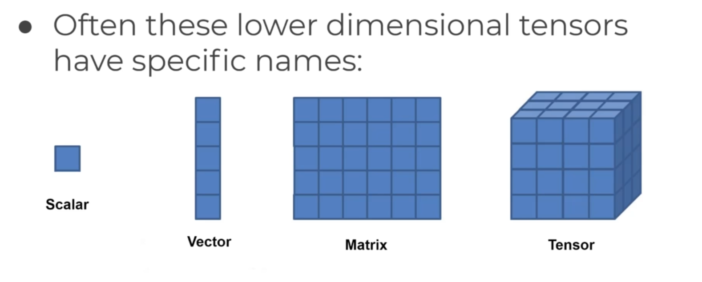

### Pytorch Basics

- What is PyTorch?
    - PyTorch is a Python-based scientific computing package serving two broad purposes:
        - A replacement for NumPy to use the power of GPUs
        - A deep learning research platform that provides maximum flexibility and speed
    - PyTorch is an open-source machine learning library for Python, based on Torch, used for applications such as natural language processing. It is primarily developed by Facebook's AI Research lab (FAIR), and Uber's Pyro software for probabilistic programming is built on it.
    - PyTorch provides two high-level features:
        - Tensor computation (like NumPy) with strong GPU acceleration
        - Deep neural networks built on a tape-based autograd system
    
- PyTorch Tensors

    - Often thought of as a generalization of a matrix, a tensor is an array with an arbitrary number of axes. A matrix is a tensor with two axes, and a scalar is a tensor with zero axes.

        

    - Tensors are similar to NumPy's ndarrays, with the addition being that Tensors can also be used on a GPU to accelerate computing.
    - Tensors are multi-dimensional arrays with support for automatic differentiation.
    - PyTorch has a rich library for operations on Tensors.
    - Tensors are the basic building blocks of PyTorch.
    
- Why do we use tensors?

    - Easiest to arrange data in the form of tensors.

- Tensor Basics

    - A tensor is a generalization of vectors and matrices and is easily understood as a multidimensional array.
    - A PyTorch Tensor is conceptually identical to a NumPy array.
    - A tensor is an n-dimensional array.
    - A tensor can be thought of as a generalized matrix.
    - A tensor is a fundamental data structure for deep learning.
    - Tensors are used to encode the signal, image, and other data types.
    - Tensors are used for high-dimensional data representation, data manipulation, and data storage, among other things.
    