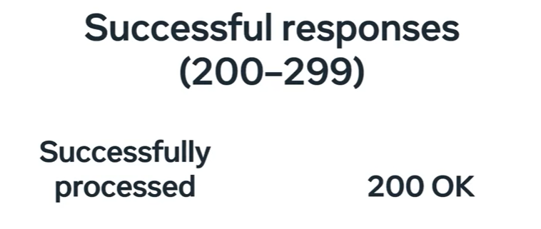

# Django

### Introduction


 - Django is an open-source web framework that is written in Python.
 - It is a high-level web framework that encourages rapid development and clean, pragmatic design.

### What is Django?

 - Django is a high-level Python web framework that enables rapid development of secure and maintainable websites.
 - It is a free and open-source web framework that follows the model-template-views architectural pattern.
 - Django is maintained by the Django Software Foundation (DSF), an independent organization established as a 501(c)(3) non-profit.
- Django's primary goal is to ease the creation of complex, database-driven websites.
- Django emphasizes reusability and "pluggability" of components, rapid development, and the principle of DRY (Don't Repeat Yourself).
- Python is used throughout, even for settings files and data models.
- Django also provides an optional administrative create, read, update and delete interface that is generated dynamically through introspection and configured via admin models.
- Some well-known sites that use Django include PBS, Instagram, Mozilla, The Washington Times, Disqus, Bitbucket, and Nextdoor.
- Django applications can be used with any client-side framework, and there are several options available for the front-end.
- Django admin is a built-in app that automatically generates a user interface to add and modify content in the database.
- Django REST framework is a powerful and flexible toolkit for building Web APIs.
- Django applications include some reusable components and more can be added to meet the requirements of a particular application.

### Features of Django

 - **Ridiculously fast** − Django was designed to help developers take applications from concept to completion as quickly as possible.
 - **Reassuringly secure** − Django takes security seriously and helps developers avoid many common security mistakes.
 - **Exceedingly scalable** − Some of the busiest sites on the planet use Django’s ability to quickly and flexibly scale to meet the heaviest traffic demands.
 - **Incredibly versatile** − Companies, organizations, and governments have used Django to build all sorts of things — from content management systems to social networks to scientific computing platforms.
 - **Easy to learn** − Django was designed to be easy to learn and use.
 - **Free and open-source** − Django is free and open source, and it's easy to download and use.

### Course Content

- Syllabus: [Django-web-framework-Meta-Backend-course](https://www.coursera.org/learn/django-web-framework/supplement/LNFwv/course-syllabus)

### Python Installation

- installing-python-optional-for-windows-users: [Python Installation](https://www.coursera.org/learn/django-web-framework/supplement/NFk5o/installing-python-optional-for-windows-users)


### Setting up a project in VS Code

- setting-up-a-project-in-vs-code: [Setting up a project in VS Code](https://www.coursera.org/learn/django-web-framework/supplement/OdgJH/setting-up-a-project-in-vs-code)


### working-with-virtual-environments-on-your-local-machine

- working-with-virtual-environments-on-your-local-machine: [Working with virtual environments on your local machine](https://www.coursera.org/learn/django-web-framework/supplement/rZlSl/working-with-virtual-environments-on-your-local-machine)

### Working with labs in the course

- working-with-labs-in-the-course: [Working with labs in the course](https://www.coursera.org/learn/django-web-framework/supplement/b35Pn/working-with-labs-in-this-course)

### Django Installation

- Django installation steps:

    - Step 1: Install Django
    - Step 2: Verify the installation
    - Step 3: Create a Django project
    - Step 4: Create a Django app
    - Step 5: Start the Django development server

    - eg.
        ```python
        pip install Django
        django-admin --version
        django-admin startproject mysite
        cd mysite
        python manage.py runserver
        ```

- To run and view your Django app in the browser, execute the following command in terminal. (Verify you are in the directory where manage.py file resides.)
    
    ```python
    python3 manage.py runserver # To run the server
    python3 manage.py makemigrations # To compile the migrations
    python3 manage.py migrate  # To migrate the changes in Database
    ```

### Additional Resources

    - [Additional Resources](https://www.coursera.org/learn/django-web-framework/supplement/yqDlw/additional-resources)

### Project and Apps

- Basic structure of a webpage:
    
    - A webpage is made up of HTML, CSS, and JavaScript.
    - HTML is the structure of the webpage.
    - CSS is the styling of the webpage.
    - JavaScript is the interactivity of the webpage.

- Django project structure:

    - A Django project is made up of multiple apps.
    - Each app is a separate module that is designed to do one thing well.
    - Each app can be reused in multiple projects.
    - Each app can be developed by a separate team.

- What is required to create a dynamic web application?

    

    

    - Client sends a request to the server.
    - Database is used to store and retrieve data.
    - Server processes the request and sends a response back to the client, after fetching data from the database.
    - Client receives the response and displays the data.
    - The client can be a web browser, mobile app, or desktop app.
    - The server can be a web server, application server, or database server.
    - The database can be a relational database, NoSQL database, or in-memory database.
    - The client and server communicate using HTTP or HTTPS.
    - The server and database communicate using SQL or NoSQL queries.

- Django project structure: [Refer me](https://www.coursera.org/learn/django-web-framework/supplement/Ahqrc/project-structure)

    - PROJECT
        - In Django, a project represents the entire web application.
        - A project is made up of multiple apps.
        - Django provides a set of commands that automate the creation of projects and apps.
        - A project is a collection of settings, URLs, and apps.
        - Project structure means to organize the files and folders in a project.
        - This allows developers to code rather than configuration.
        - Django follows the DRY principle, which means Don't Repeat Yourself.

            

    - APP
        - In Django, an app represents a specific feature or functionality.
        - An app is a web application that does something.
        - An app is a collection of models, views, templates, and URLs.
        - An app can be reused in multiple projects.
        - An app can be developed by a separate team.
        - An app can be distributed as a package.
        - An app can be installed using pip.

            

    - For Django to recognize an app, it must be added to the INSTALLED_APPS list in the settings.py file.

        - 

    - 

### Creating a Django project

- Create a new directory for the project.

    ```python
    mkdir myproject
    cd myproject
    ```

- Virtualenv is a tool to create isolated Python environments.
    - Virtualenv is used to manage dependencies for different projects.
    - Virtualenv is used to avoid conflicts between dependencies.

    - To create a virtual environment, execute the following command in terminal.

        - Linux/Mac:
            ```python
            python3 -m venv myenv
            source myenv/bin/activate
            ```

        - Windows:
            ```python
            python -m venv myenv
            myenv\Scripts\activate
            ```


    - To install Django in the virtual environment, execute the following command in terminal.

        ```python
        pip install Django
        ```

    - To check the Django version, execute the following command in terminal.

        - 
            ```python
            django-admin --version
            ```

            OR

        -
            ```python
            python -m django --version
            ```

    - To create a Django project, execute the following command in terminal.

        ```python
        django-admin startproject mysite
        ```

    - To create a Django app, execute the following command in terminal.

        ```python
        python manage.py startapp myapp
        ```

    - To run the Django development server, execute the following command in terminal.

        ```python
        python manage.py runserver
        ```

    - To stop the Django development server, press Ctrl + C in terminal.

    - To deactivate the virtual environment, execute the following command in terminal.

        ```python
        deactivate
        ```

### Admin and Structures

- When working with Django projects, developer has 2 choices for command line utility:
    - django-admin
    - manage.py

        - django-admin is Django's command-line utility for administrative tasks.

        - manage.py is a thin wrapper around django-admin that takes care of several things for you.

        - django-admin vs manage.py:

            - django-admin
                - django-admin is Django's command-line utility for administrative tasks.
                - django-admin is a standalone program that is installed along with Django.
                - django-admin is used to create projects, apps, and other administrative tasks.
                - django-admin is used to manage the Django project as a whole.
                - django-admin is used to run management commands.
                - django-admin is used to start the development server.
            
            - manage.py
                - manage.py is a thin wrapper around django-admin that takes care of several things for you.
                - manage.py is a Python script that is created in the project directory.
                - manage.py is used to run management commands.
                - manage.py is used to start the development server.
                - manage.py is used to create an app.
                - manage.py is used to create a superuser.
                - manage.py is used to run migrations.

            - django-admin.py 

                - automatically installed
                - located on system path
                - activate virtual environment

            - manage.py
                
                - automatically created each time you create a new project
                - located in the project directory
                - specific to the virtual environment
                - points to the settings.py file in the project directory

        
    
- App Structures: [Refer Me](https://www.coursera.org/learn/django-web-framework/supplement/rDp6w/app-structures)


- Creating an App

    - To create a Django app, execute the following command in terminal.

        ```python
        python manage.py startapp myapp
        ```

    - To create a superuser, execute the following command in terminal.

        ```python
        python manage.py createsuperuser
        ```

    - To run migrations, execute the following command in terminal.

        ```python
        python manage.py makemigrations
        python manage.py migrate
        ```

    - To run the Django development server, execute the following command in terminal.

        ```python
        python manage.py runserver
        ```

    - To stop the Django development server, press Ctrl + C in terminal.

    - To deactivate the virtual environment, execute the following command in terminal.

        ```python
        deactivate
        ```

### Web Frameworks and MVT

- Web Framework
    - Fast Development
    - Clean Structure
    - Change and Modify
    - Secure
    - Reusable Components

    

    - Django
          - Feature-rich
          - Code Reusability
          - Scalability
        
- Three-tier architecture
    - Presentation Layer
    - Business Logic Layer
    - Data Layer

        

- MVT Overview: [Refer Me](https://www.coursera.org/learn/django-web-framework/supplement/hpwXW/mvt-overview)

- Additional Resources: [Refer Me](https://www.coursera.org/learn/django-web-framework/supplement/0AF6Z/additional-resources)

### Views

- Views in Django are Python functions that take a web request and return a web response.

- Views are the heart of Django web applications.

- Views are responsible for processing the request and returning the response.

- Views are used to interact with the database and render templates.

- Views are used to handle user input and display output.

- Views are used to implement business logic and application logic.

- Views are used to handle HTTP methods such as GET, POST, PUT, and DELETE.

- Views are used to handle form submissions and file uploads.

- Views are used to handle authentication and authorization.

- Views are used to handle errors and exceptions.

- Views are used to handle redirects and responses.

- Views are used to handle AJAX requests and JSON responses.

- Views are used to handle API requests and responses.

- Views are used to handle webhooks and websockets.

- Views are used to handle caching and performance optimization.- Views are used to handle testing and debugging.

   - eg. 
        ```python
        from django.http import HttpResponse

        def hello(request):
            return HttpResponse("Hello, World!")
        ```

    - Process Data
    - Retrieve Data
    - Transform Data
    - Render Templates

- Routing
    - Routing is the process of mapping URLs to views.

    - Routing is used to define the URL patterns for the web application.

    - eg.
        ```python
        from django.urls import path
        from . import views

        urlpatterns = [
            path('hello/', views.hello),
        ]
        ```

    - URL patterns are defined in the urls.py file of the app.

    - URL patterns are defined using the path() function and re_path() function.

        - eg with re_path.
        
            ```python
            from django.urls import re_path
            from . import views

            urlpatterns = [
                re_path(r'^hello/$', views.hello),
            ] # r'^hello/$' means that the URL should start with hello and end with a slash. 
            ```
        - eg with path.
            ```python
            from django.urls import path
            from . import views

            urlpatterns = [
                path('hello/', views.hello),
            ]
            ```
        - eg with include.
            ```python
            from django.urls import path, include
            from . import views

            urlpatterns = [
                path('hello/', include('myapp.urls')), # include('myapp.urls') means that the URL patterns in myapp.urls should be included in the URL patterns of the project.
            ]
            ```
            
- Creating Views and Mapping to URLS

    - To create a view, define a function in the views.py file of the app.

        ```python
        from django.http import HttpResponse

        def hello(request):
            return HttpResponse("Hello, World!")
        ```

    - To map the view to a URL, define a URL pattern in the urls.py file of the app.

        ```python
        from django.urls import path
        from . import views

        urlpatterns = [
            path('hello/', views.hello),
        ]
        ```

    - To include the URL patterns of the app in the URL patterns of the project, define a URL pattern in the urls.py file of the project.

        ```python
        from django.urls import path, include
        from myapp import views

        urlpatterns = [
            path('hello/', include('myapp.urls')),
        ]
        ```

    - To run the Django development server, execute the following command in terminal.

        ```python
        python manage.py runserver
        ```
    
        

    - View Logic: [Refer Me](https://www.coursera.org/learn/django-web-framework/supplement/o2Enm/view-logic)


### Requests and URLs

- HTTP request makeup

    ```
    GET /hello/ HTTP/1.1
    Host: www.example.com
    Accept- Language: en- US
    ```

    - Common HTTP methods:
        - GET: Retrieve data from the server.
        - POST: Submit data to the server.
        - PUT: Update data on the server.
        - DELETE: Delete data from the server.
        - PATCH: Partially update data on the server.
        - OPTIONS: Get information about the server.
        - HEAD: Get the headers of the response.

    - Common HTTP headers:
        - Host: The domain name of the server.
        - User-Agent: The browser or client making the request.
        - Accept: The media types accepted by the client.
        - Accept-Language: The languages accepted by the client.
        - Accept-Encoding: The encodings accepted by the client.
        - Content-Type: The media type of the request body.
        - Content-Length: The length of the request body.
        - Authorization: The credentials for the request.
        - Cookie: The cookies sent by the client.

    - Path parameters:
        - Path parameters are used to pass data in the URL.
        - Path parameters are defined using angle brackets <> in the URL pattern.
        - Path parameters are extracted from the URL and passed to the view as arguments.

        - eg.
            ```python
            from django.urls import path
            from . import views

            urlpatterns = [
                path('hello/<name>/', views.hello),
            ]
            ```

    - Common URL patterns:
        - Static URLs: Fixed URLs that do not change.
        - Dynamic URLs: URLs that change based on user input.
        - Query parameters: Parameters passed in the URL after a question mark ?.
        - Path parameters: Parameters passed in the URL as part of the path.
        - Wildcard URLs: URLs that match any path segment.
        - Regular expression URLs: URLs that match a pattern using regular expressions.

    - Headers 
        - Headers are used to pass additional information in the request.
        - Headers are key-value pairs that are sent in the request.
        - Headers are used to pass metadata, authentication, and other information.
        - Headers are used to control caching, compression, and other features.
        - Can contain server name , server port , request method, content type
            - eg. 
                ```python
                GET /hello/ HTTP/1.1
                Host: www.example.com
                Accept-Language: en-US
                ```

- HTTP Response

    - HTTP response makeup

        ```
        HTTP/1.1 200 OK
        Date: Mon, 01 Jan 2022 00:00:00 GMT
        Server: Apache
        Last-Modified: Sun, 31 Dec 2021 23:59:59 GMT
        ETag: "1234567890"
        Accept-Ranges: bytes
        Content-Length: 1234
        Content-Type: text/html
        ```
    - Message Body
        - The message body contains the content of the response.
        - The message body can be HTML, JSON, XML, or plain text.
        - The message body is sent after the headers.
        - The message body is separated from the headers by a blank line.
        - The message body is optional in some responses.
            - eg. 
                ```python
                HTTP/1.1 200 OK
                Content-Type: text/html

                <html>
                <head>
                <title>Hello, World!</title>
                </head>
                <body>
                <h1>Hello, World!</h1>
                </body>
                </html>
                ```
    - Common HTTP status codes:
        - 200 OK: The request was successful.
        - 201 Created: The request was successful and a new resource was created.
        - 204 No Content: The request was successful and there is no content to return.
        - 400 Bad Request: The request was invalid or malformed.
        - 401 Unauthorized: The request requires authentication.
        - 403 Forbidden: The request is not allowed.
        - 404 Not Found: The requested resource was not found.
        - 405 Method Not Allowed: The request method is not allowed.
        - 500 Internal Server Error: The server encountered an error.
        - 503 Service Unavailable: The server is unavailable.

            - Status code Division:
                - 1xx: Informational responses.
                - 2xx: Success responses.
                - 3xx: Redirection responses.
                - 4xx: Client error responses.
                - 5xx: Server error responses.

                    

                    

                    

                    

                    

                    

                    - Client Error 400: Bad data sent by the client.
                    - Client Error 401: Unauthorized access, should login ie authentication required.
                    - Client Error 403: Forbidden access, no permission to access the resource.
                    - Client Error 404: Resource not found, the requested resource does not exist.

                  

                    - Server Error 500: Internal server error, something went wrong on the server.
        

- HTTPS

    - HTTPS is a secure version of HTTP.
    - HTTPS encrypts the data sent between the client and server.
    - HTTPS uses SSL/TLS to secure the connection.
    - HTTPS uses port 443 by default.
    - HTTPS is used to protect sensitive information.
    - HTTPS is used to prevent eavesdropping and tampering.
    - HTTPS is used to verify the identity of the server.s

- Request and Response Objects: [Refer me](https://www.coursera.org/learn/django-web-framework/supplement/DMTe5/request-and-response-objects)


- Creating requests and responses

    - To create a request object, pass the request
    - To create a response object, pass the content and content type

        ```python
        from django.http import HttpRequest, HttpResponse

        def hello(request):
            return HttpResponse("Hello, World!")
        ```

    - To create a response object with a status code, pass the status code

        ```python
        from django.http import HttpResponse

        def hello(request):
            return HttpResponse("Hello, World!", status=200)
        ```

    - To create a response object with headers, pass the headers
    
        ```python
        from django.http import HttpResponse

        def hello(request):
            response = HttpResponse("Hello, World!")
            response['Content-Type'] = 'text/html'
            return response
        ```

    - To create a response object with a content type, pass the content type

        ```python
        from django.http import HttpResponse

        def hello(request):
            return HttpResponse("Hello, World!", content_type='text/html')
        ```
    
    - To create a response object with a status code and content type, pass the status code and content type

        ```python
        from django.http import HttpResponse

        def hello(request):
            return HttpResponse("Hello, World!", status=200, content_type='text/html')
        ```
    
    - To create a response object with a status code, headers, and content type, pass the status code, headers, and content type

        ```python
        from django.http import HttpResponse

        def hello(request):
            response = HttpResponse("Hello, World!", status=200)
            response['Content-Type'] = 'text/html'
            return response
        ```

- Understanding URLS

    - eg of a URL: http://www.example.com/hello/123

        - here http is the scheme, www is the subdomain, example is the domain, com is the top-level domain, hello is the file path, 123 is the path parameter.

    - URL components:

        - Scheme: The protocol used to access the resource.
        - Subdomain: The domain name before the domain.
        - Domain: The main part of the domain name.
        - Top-level domain: The last part of the domain name.
            - eg. 
                - .org: Organization
                - .com: Commercial
                - .net: Network
                - .edu: Education
                - .in: India
                - .uk: United Kingdom
                - .us: United States
                - .gov: Government
                - .mil: Military
                - .int: International
                - .ie: Ireland

        - File path: The path to the resource on the server ie the location of the resource on the server.

        - Path parameter: The parameter passed in the URL.

            - Query parameters: Parameters passed in the URL after a question mark ?.
            - Path parameters: Parameters passed in the URL as part of the path.

                - eg. 

                    - Query parameters: http://www.example.com/hello?name=John&age=30

            

    - URL patterns:

        - Static URLs: Fixed URLs that do not change.
        - Dynamic URLs: URLs that change based on user input.
        - Query parameters: Parameters passed in the URL after a question mark ?.
        - Path parameters: Parameters passed in the URL as part of the path.
        - Wildcard URLs: URLs that match any path segment.
        - Regular expression URLs: URLs that match a pattern using regular expressions.

    - URL Design

        - URL design is the process of designing the URLs for a web application.
        - URL design is important for search engine optimization (SEO).
        - eg. 

            - Bad URL: http://www.example.com/page?id=123
            - Good URL: http://www.example.com/page/123

        - URL design best practices:

            - Use lowercase letters.
            - Use hyphens to separate words.
            - Use slashes to separate directories.
            - Use file extensions for static files.
            - Use query parameters for filtering.
            - Use path parameters for resources.
            - Use regular expressions for complex patterns.

- Parameters : [Refer Me](https://www.coursera.org/learn/django-web-framework/supplement/OhSHQ/parameters)

- Mapping URLs with params

    - eg. 

        - To map a URL with a path parameter, define a URL pattern with angle brackets <> in the urls.py file of the app.

            ```python
            from django.urls import path
            from . import views

            urlpatterns = [
                path('hello/<name>/', views.hello),
            ]
            ```

        - To extract the path parameter in the view, define a function with the path parameter as an argument.

            ```python
            from django.http import HttpResponse

            def hello(request, name):
                return HttpResponse(f"Hello, {name}!")
            ```

        - To pass the path parameter in the URL, add the path parameter to the URL.

            ```python
            <a href="/hello/John/">Hello, John!</a>
            ```
        
        - To extract the path parameter in the view, define a function with the path parameter as an argument.

            ```python
            from django.http import HttpResponse

            def hello(request, name):
                return HttpResponse(f"Hello, {name}!")
            ```

- Additional Resources: [Refer Me](https://www.coursera.org/learn/django-web-framework/supplement/S9v2H/additional-resources)        

### Creating URLs and Views

- Regular Expressions in URLs

    - RegEx is a set of characters that specify a pattern and are used to search for or find patterns in a string.

      - Extraction and Validation
      - Advance Searching
      - Group Searches
      - Find and Replace

    - Universal, same across all languages

    - eg. 

        - To map a URL with a regular expression, define a URL pattern with a regular expression in the urls.py file of the app.

            ```python
            from django.urls import re_path
            from . import views

            urlpatterns = [
                re_path(r'^hello/(?P<name>\w+)/$', views.hello), # r'^hello/(?P<name>\w+)/$' means that the URL should start with hello, followed by a name, and end with a slash.
            ]
            ```

            - ^: Start of the string.
            - $: End of the string.
            - (): Grouping.
            - ?: Non-greedy.
            - \w: Word character.
            - +: One or more.
            - /: Slash.

        - To extract the path parameter in the view, define a function with the path parameter as an argument.

            ```python
            from django.http import HttpResponse

            def hello(request, name):
                return HttpResponse(f"Hello, {name}!")
            ```

    

    - URL Namespacing and Views: [Refer Me](https://www.coursera.org/learn/django-web-framework/supplement/9Bl6F/url-namespacing-and-views)
        

- Error Handling

    - Error handling is the process of handling errors in a web application.
    - eg. 
        - 404 Not Found: The requested resource was not found.
        - 500 Internal Server Error: The server encountered an error.

    - Common error handling techniques:
        - Try-catch: Catch exceptions and handle errors.
        - Status codes: Return appropriate status codes in the response.
        - Error messages: Display error messages to the user.
        - Logging: Log errors to a file or database.
        - Redirects: Redirect the user to an error page.
        - Custom error pages: Display custom error pages to the user.

    
    

    

- Handling errors in Views :[Refer Me](https://www.coursera.org/learn/django-web-framework/supplement/QpaMm/handling-errors-in-views)