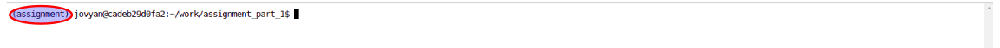
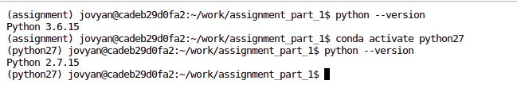

# Assignment Part 1 - Updating Code from Python 2 to Python 3

**To enhance your reading experience, please open this file as follows: Right-click on `instructions.md` (in the left panel) -> choose `Open with` -> select `Markdown preview`.**

## Introduction

**THIS EXERCISE WON'T BE GRADED** - You can skip it or even leave with errors, this won't impact your grade. 

The code in question, `magic_summation.py`, is initially designed for Python 2 and features a function named `magic_summation`. This function operates as outlined below:

1. It confirms that `n` is an integer exceeding 2.
2. It then generates a list of integers ranging from 1 to `n`.
3. A random selection of indices within this range is marked for removal. If every index is chosen, the function returns 0, indicating a magic summation of 0. If not, it alters the remaining list elements based on a particular rule: each element (bar the last one) is replaced with the result of dividing the subsequent element by the current one, using integer division. The final element is left as is.
4. Finally, it computes the sum of the elements in this modified list.

Example:

```python
n = 5
list = [1, 2, 3, 4, 5]
random_indices = [0, 3]
list_with_removed_indices = [2, 3, 5]
new_list_with_integer_division = [1, 1, 5]
result = 1 + 1 + 5 = 7
```

**Constraints**: Importing new libraries is not allowed. Ask the LLM to **NOT** use the random library and use the `numpy.random` library. 

**Hints**:
- Ask the AI to clarify any necessary changes to ensure thorough understanding and accuracy!
- When working with random number generation, it's important to consider how different Python versions might affect your results. Here are some key points to keep in mind:
- - The `set()` function includes a random component that underwent changes from Python 2 to Python 3. **AVOID USING THIS FUNCTION**.
- - There might be a temptation to modify the iterator function (lines 21 to 29). This is **not necessary** and could lead to inconsistent results.
  - 
Your objective is to update the function for compatibility with Python 3, maintaining its current functionality as it operates in Python 2.

## Important Information

- The original Python 2.7 version is named `magic_summation_python27.py`. Your task is to submit an updated version of this file, called `magic_summation`. You need to edit it in the same script.
- A folder titled `backup_data` contains a backup of `magic_summation_python27.py` should you need it.
- To open the terminal, click the **+ blue button** in the top left corner of the lab.
- Within the terminal, a `(assignment)` indicator shows, where commands can be entered:


This indicates you're in the `assignment` environment, which utilizes Python 3. You can verify the Python version with the command `python --version`.

- To run the Python 2 script, switch environments by executing `conda activate python27`:


- Execute scripts within the `assignment_part_1` folder. Use `ls` to view all directories and `cd folder` to navigate to a specific folder. To return to a parent directory, use `cd ..`.

- To test your solution, you may run python unittest.py in the **assignment** environment, just run `python unittests.py`. **NOTE**: This unittest only work in Python 3 environment as it will test your Python 3 script only.

- Opening a terminal defaults to the current folder (visible in the left panel).

- Always remember to check the current python version you are working with to avoid errors.

- **If you get indentation errors, you may ask an LLM to fix it for you :-)**

Execute the script via terminal with `python magic_summation_python27.py n seed`, where `n` is an integer and `seed` the random seed. (ensure you're in the Python 2 environment, or it won't run).

