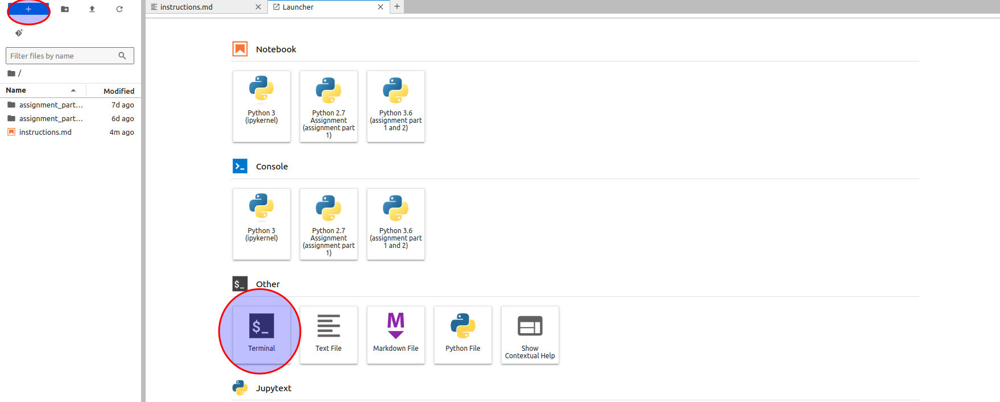

**THE AUTOGRADER FOR THIS ASSIGNMENT IS NOT IMPLEMENTED YET, BUT THERE ARE UNIT TESTS IN PART 1 AND A WAY OF CHECKING YOUR SOLUTION IN PART 2**

# General Assignment Instructions: Navigating Python Script Updates and Resolving Dependency Conflicts

Welcome to your comprehensive guide for successfully navigating through both parts of your assignment. These instructions are designed to provide you with an overarching understanding of how to approach the tasks, update code, and manage dependencies across different environments. For specific details, refer to the instructions within each assignment part.

**To ensure a better reading experience, it's recommended to open this and other instruction files in Markdown preview. Right-click on `instructions.md` (in the left panel)  -> choose `Open with` -> select `Markdown preview`.**

## Getting Started

1. **Workspace Preparation**: Each part of your assignment resides in its designated folder (`assignment_part_1` and `assignment_part_2`). Familiarize yourself with the contents and structure of these folders to navigate and manage files efficiently.

2. **Environment Setup**: Before diving into the tasks, activate the `assignment` environment by running `conda activate assignment` in the terminal. This step is crucial for both parts of the assignment to ensure you're working under the correct Python version and have access to necessary libraries.

3. **Backup Availability**: Each assignment part contains a backup folder (`backup_data`). These folders are your safety nets, containing original files you can revert to if needed.

4. **Access to Terminal**: To access the terminal, you must click the `+` blue button in the top left corner and scroll down to find the Terminal button.

## Assignment Overview

### Part 1: Updating Code from Python 2 to Python 3 - THIS EXERCISE WON'T BE GRADED AND WON'T COUNT FOR YOUR FINAL GRADE

- **Objective**: Your main task is to update the `magic_summation.py` script for Python 3 compatibility while retaining its original functionality.
- **Environment Switching**: You'll need to switch between Python versions. Use `conda activate python27` for Python 2 scripts and revert to the `assignment` environment for Python 3.
- **Execution**: Test your updated script in the `assignment` environment using the terminal. Navigate using `cd` commands and execute scripts with `python script_name.py`.

### Part 2: Resolving Dependency Conflicts

- **Task**: Focus on debugging and resolving library dependency issues within scripts managing employee schedules.
- **Script Interaction**: Understand how scripts (`df_converter.py`, `internal_stats.py`, `gen_employee_schedule.py`) interact and depend on each other, and manage their dependencies via the `requirements.txt` file.
- **LLM Assistance**: Utilize Large Language Models (LLM) like ChatGPT for clarifications, debugging assistance, and resolving dependency conflicts.

## General Tips

- **Read Specific Instructions**: Each part of the assignment contains detailed steps and hints. Always refer back to them for guidance.
- **Leverage LLMs**: Don't hesitate to ask for help from AI tools for explanations and troubleshooting steps.
- **Avoid New Libraries**: Unless specified, refrain from importing new libraries to solve tasks.
- **Terminal Commands**: Familiarize yourself with basic terminal commands listed in the instructions for navigating directories, activating environments, and executing scripts.

## Submission Guidelines

- Ensure your solutions meet the criteria outlined in the specific instructions of each part.
- Update the `requirements.txt` file in Part 2 with the final set of libraries used.
- The files to be submitted are: the script `magic_summation_solution.py` for Part 1, and the compressed file for `assignment_part_2` you will generate after finishing the part. More instructions in the respective folder.

By adhering to these instructions and utilizing the resources provided, you'll be well-equipped to tackle the challenges of updating Python code and managing library dependencies. Remember, the specific instructions within each assignment part will guide you through the detailed steps necessary to complete your tasks successfully.

- If you face any challenges or have questions about this assignment, feel free to [join our community](https://www.coursera.org/teach/team-software-engineering-with-ai/k6snBDf0Ee-9Ig7qA4dB5w/content/item/supplement/8E5g9) and seek assistance from our mentors!