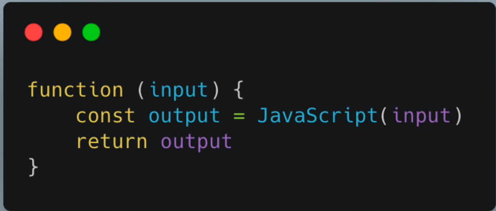

#  20 Projects to Build Your Portfolio

## 1. Introduction

- This repository contains 20 JavaScript projects that you can build to improve your coding skills. Each project is unique and will help you to understand the concepts of JavaScript, HTML, and CSS. You can use these projects to build your portfolio and showcase your skills to potential employers.

- JavaScript is a powerful programming language that is widely used for web development. It is a versatile language that can be used to create interactive websites, web applications, and games. By building these projects, you will gain hands-on experience with JavaScript and learn how to create dynamic and engaging web applications.

- Javascript is maily used for adding logic to the web pages. It is used to make the web pages interactive and dynamic. It is a client-side scripting language that runs on the user's browser. It is used to create dynamic content on the web pages, such as animations, interactive forms, and games.

    

## 2. Developer Setup

- Install git and VS Code
- "--template" folder testing out vscode and git features[Github Page Hosting]

## 3. Quotes Generator

- This project is a simple quotes generator that displays a random quote each time the user clicks on the "New Quote" button. The quotes are fetched from an external API and displayed on the screen. This project will help you to understand how to fetch data from an API using JavaScript and display it on a web page.

- async and await in js

    - async: The async keyword is used to create an asynchronous function in JavaScript. An asynchronous function is a function that operates asynchronously via the event loop, using an implicit Promise to return its result. The async and await keywords enable asynchronous, promise-based behavior to be written in a cleaner style, avoiding the need to explicitly configure promise chains.

    - await: The await keyword is used to wait for a Promise. It can only be used inside an async function. The keyword await makes JavaScript wait until the promise returns a result. It is used to handle asynchronous operations in JavaScript.

        - eg: 
        ```javascript
        async function fetchData() {
            const response = await fetch('https://api.quotable.io/random');
            const data = await response.json();
            return data;
        }
        ```

## 4. Infinite Scroll


