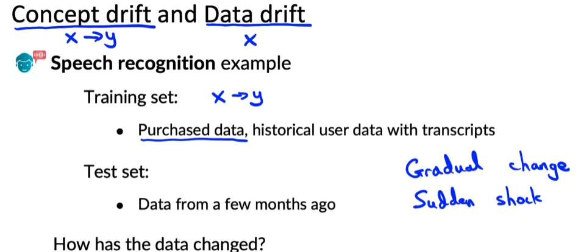
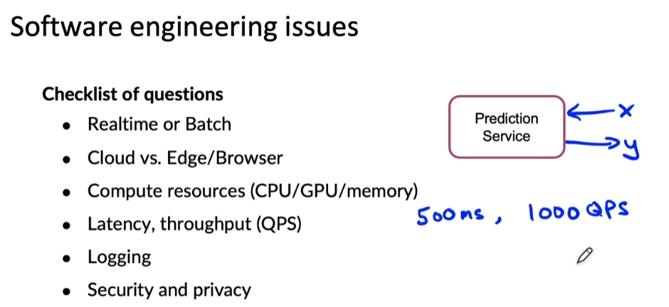
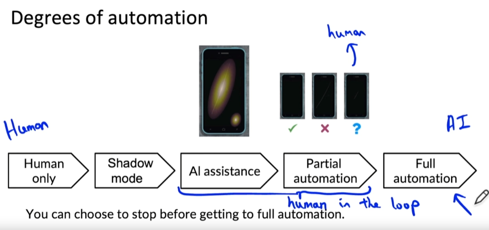
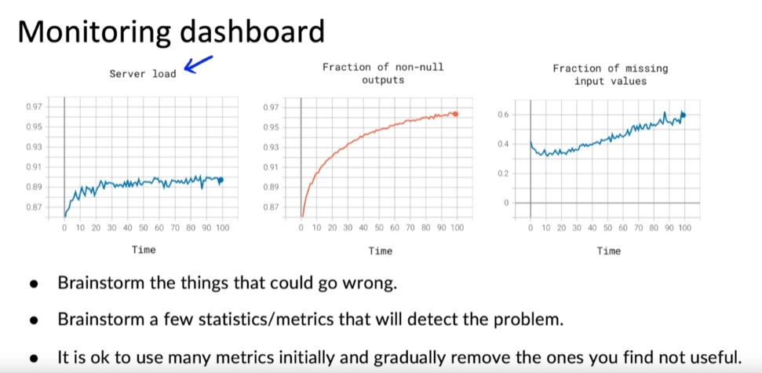
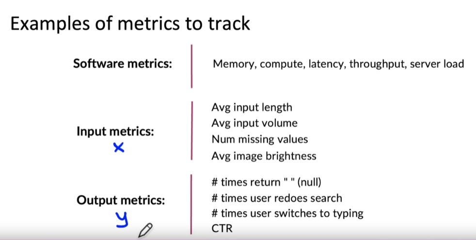
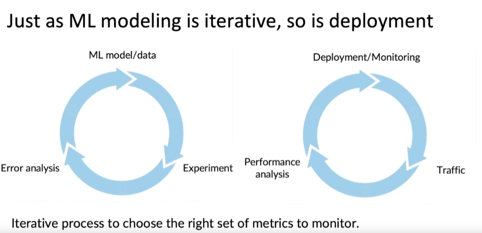
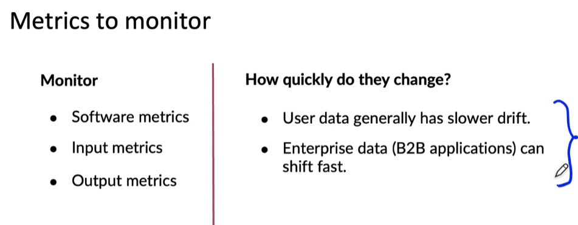

# Machine Learning in Production Specialization (MLOps)

- Some images for the readme are taken from the course slides and videos.(for educational purposes only) 

    - Week1

        - 

        - 

        - 

        - 

        - 

        - 

        - 

        - 

        - 

        - 

        - 

        - 

        - 

        - Some links to clear the concepts

            - [link](https://towardsdatascience.com/machine-learning-in-production-why-you-should-care-about-data-and-concept-drift-d96d0bc907fb)

            - [link](https://youtu.be/06-AZXmwHjo)

    - Week2

        - better to read lecture notes for this week