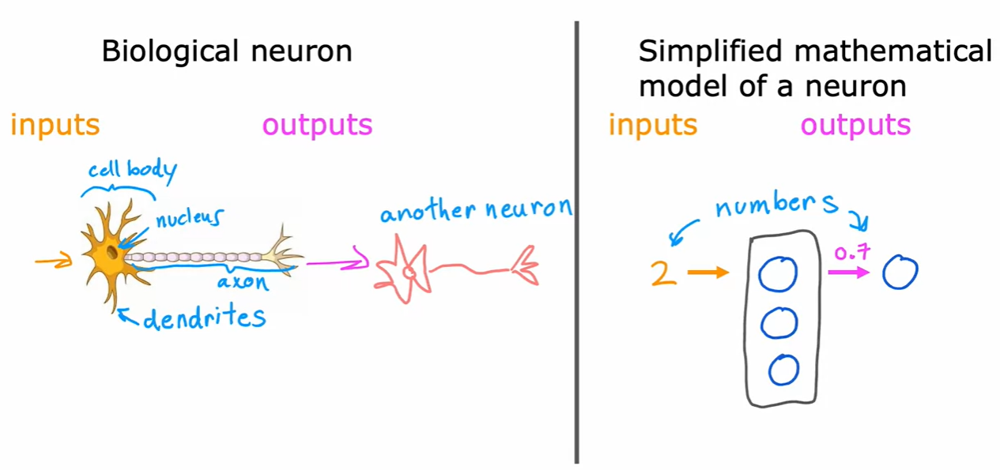
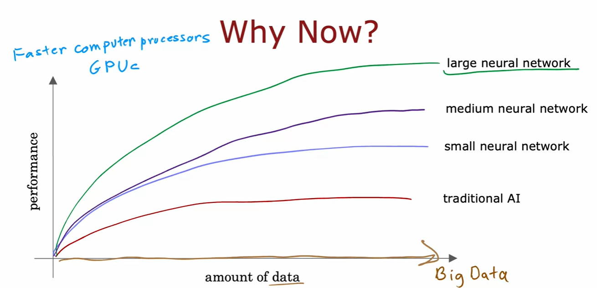
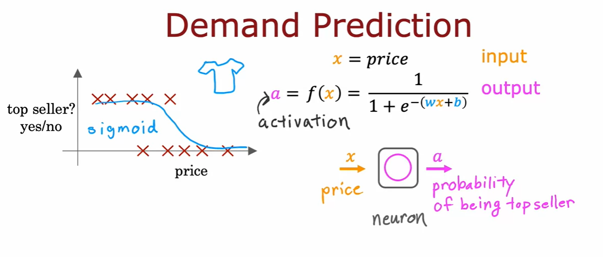
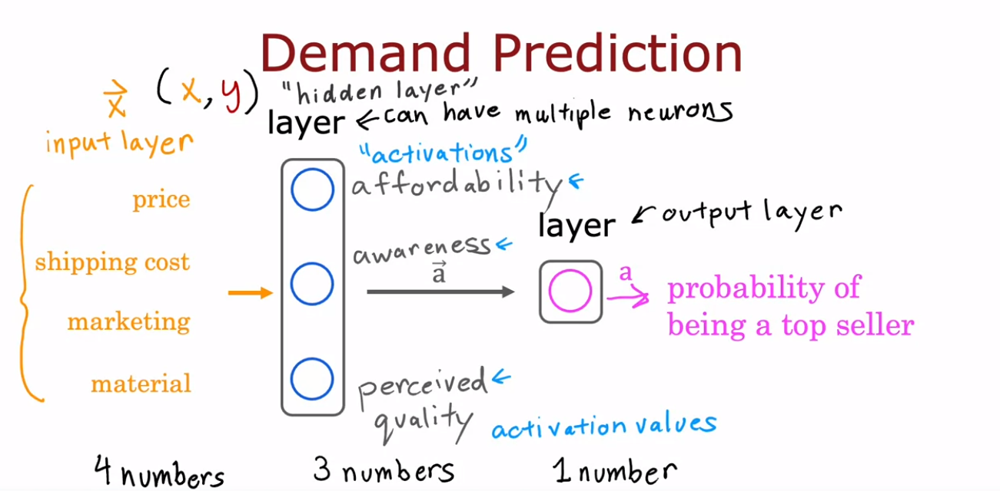
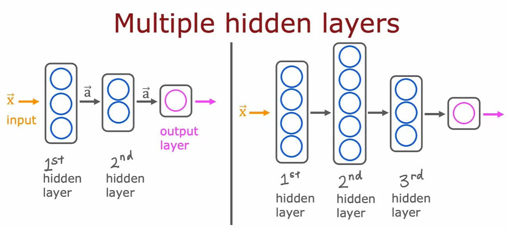
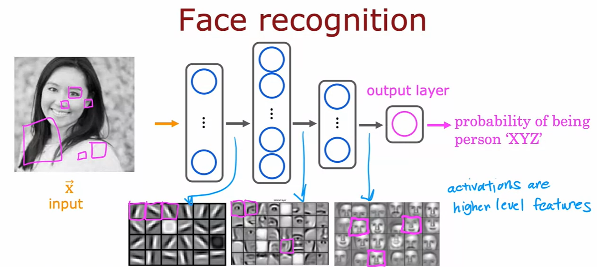
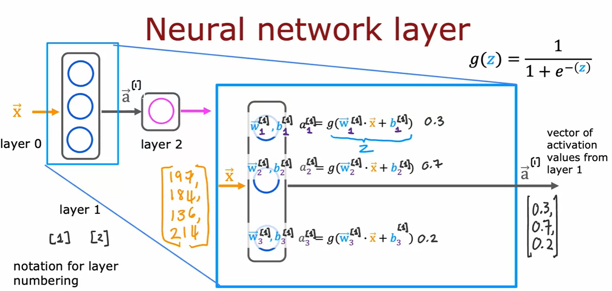
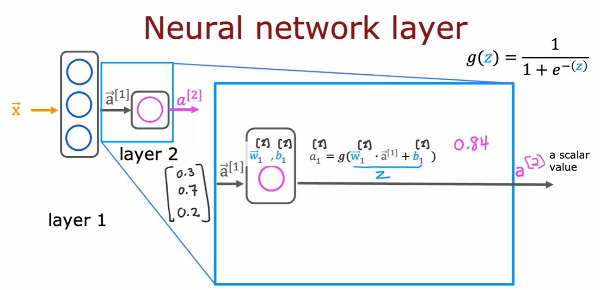

## Images for Reference

- Biological Neurons vs Artificial Neurons
    
    

- Why neural networks are so popular noewadays?
    
    

- Demand Prediction

    - single feature

        

    - multiple features

        

    - Neural Network can learn complex patterns and create new features by itself where as in traditional machine learning we have to manually create features(feature engineering).

- Multiple hidden layers

    - How many neurons and how many hidden layers is a question of the architecture of the neural network.*

        

- Recognizing Images

    - Can you train a neural network that takes as input a feature vector with a million brightness values and output the identity of the object in the image?

        

- Neural Network Model

    - Fundamental building block of most modern neural network is a layer of neurons.

    - Different Layers
S
        - Input Layer
        - Hidden Layer
        - Output Layer

            

            
