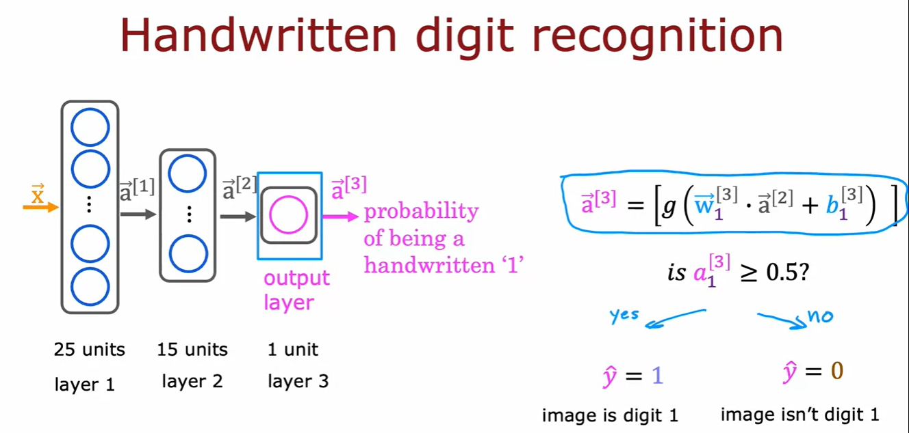

## Images for Reference

- Biological Neurons vs Artificial Neurons
    
    

- Why neural networks are so popular noewadays?
    
    

- Demand Prediction

    - single feature

        

    - multiple features

        

    - Neural Network can learn complex patterns and create new features by itself where as in traditional machine learning we have to manually create features(feature engineering).

- Multiple hidden layers

    - How many neurons and how many hidden layers is a question of the architecture of the neural network.*

        

- Recognizing Images

    - Can you train a neural network that takes as input a feature vector with a million brightness values and output the identity of the object in the image?

        

- Neural Network Model

    - Fundamental building block of most modern neural network is a layer of neurons.

    - Different Layers
S
        - Input Layer
        - Hidden Layer
        - Output Layer

            

            

            

        - Complex Neural Network

            

- Forward Propagation

    - Forward Propagation is the process neural network makes predictions.

    - Hand written digit recognition - binary classification

        

        

- Tensorflow Implementation

    - Tensorflow is a powerful open source software library for numerical computation, particularly well suited and fine tuned for large scale machine learning.

    - Tensorflow is a symbolic math library based on dataflow and differentiable programming.

    - Coffee Roasting Example

        
    
    - Digit Classification Example

        

- Data in Tensorflow

    - Data in Tensorflow is represented as tensors.

    - Tensors are n-dimensional arrays.

    - Tensors are the fundamental building blocks of data in Tensorflow.

    - Tensor is a datatype that the tensorflow team had created inorder to store and carry out computations on matrices efficiently.

           

- Building a Neural Network
    
    - Building a neural network involves defining the layers of the neural network, connecting the layers and defining the activation functions.

        

        

        