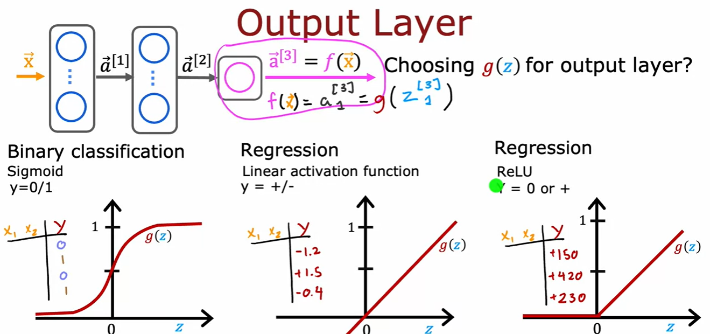

## Images for Reference

- Train a neural network in Tensorflow

    

- Model Training Steps

    

    - Create a model
     
        

    - Loss function and Cost function

        

    - Gradient Descent

        

- Activation Functions

    - Sigmoid, ReLU, Linear and many more

        

    
    - Choosing the right activation function

        

        

        
    
    - Why do we need activation functions?

        - Without activation functions, the neural network is just a linear regression model.

        - Activation functions introduce non-linearity to the model. Non-linearity is important because most real-world data is non-linear.

        - Activation functions help the neural network to learn complex patterns in the data.

        - eg.

            ```python
            def sigmoid(x):
                return 1 / (1 + np.exp(-x))
            ```

- Multiclass classification

    - more than 2 possible outputs

        


- Softmax function

    - Multiclass classification

        

    - Cost function

        

    - Neurel Network with Softmax

        

    - Improved implementation

        

        

        

        

- Multi label classification

    - Train one neural network to predict multiple labels

        

- Gradient Descent

    - Gradient Descent is an optimization algorithm used to minimize some function by iteratively moving in the direction of steepest descent as defined by the negative of the gradient.

        

    - Adam

        

- Additional Layer Types

    - Convolutional Neural Networks

        - Convolutional Neural Networks are a type of deep learning algorithm that can take in an input image, assign importance to various aspects/objects in the image and be able to differentiate one from the other.

            

