## Images for Reference

- Machine Learning Diagnositc

    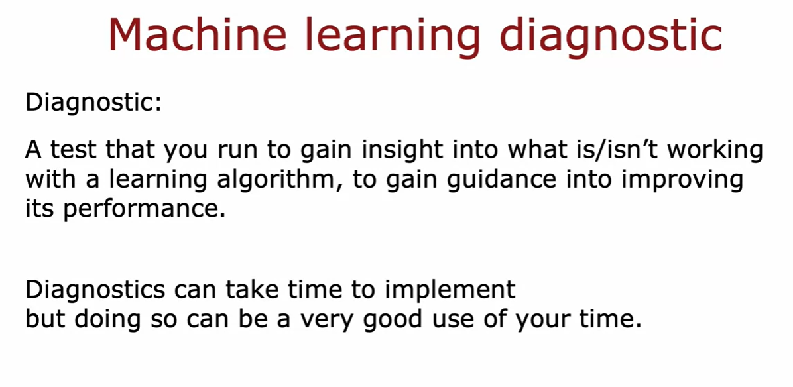

- Evaluating a model

    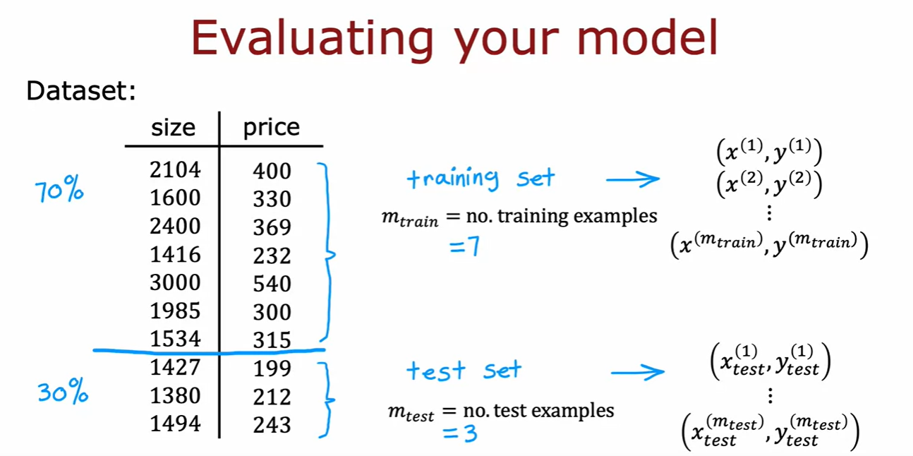

    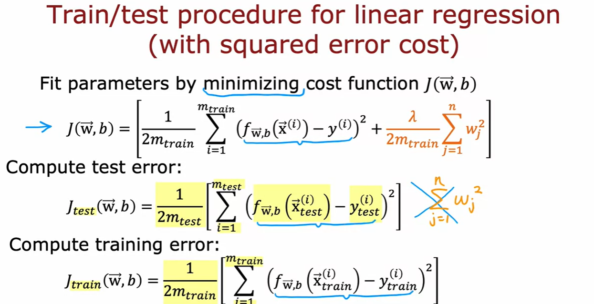

    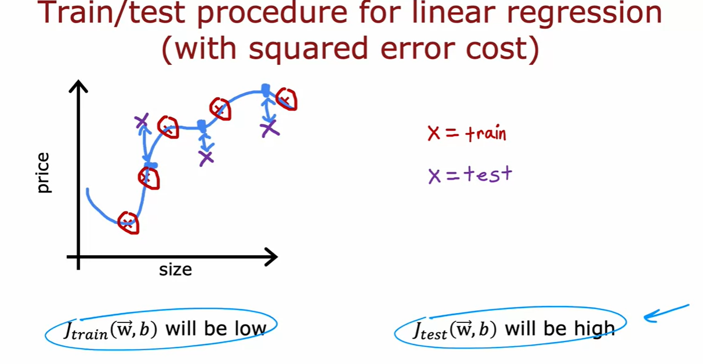

    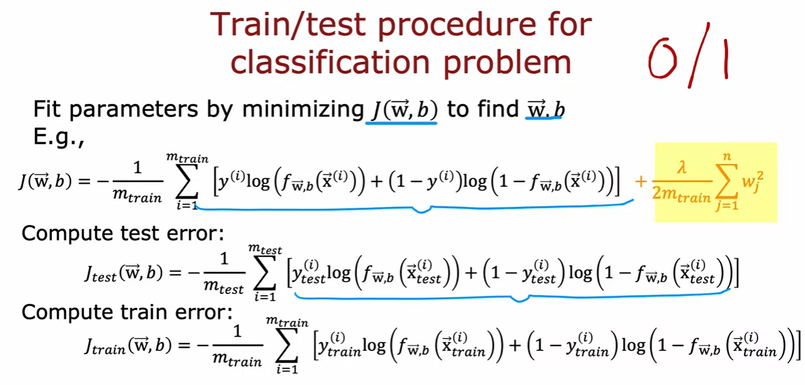

    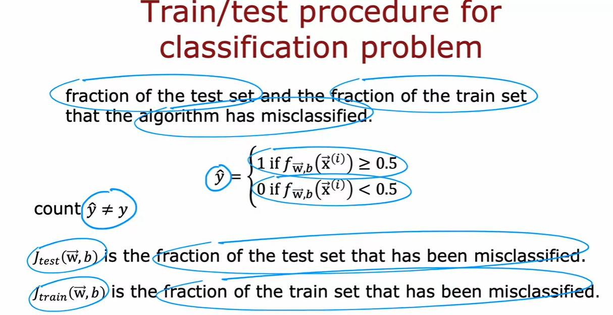

- Model Selection    

    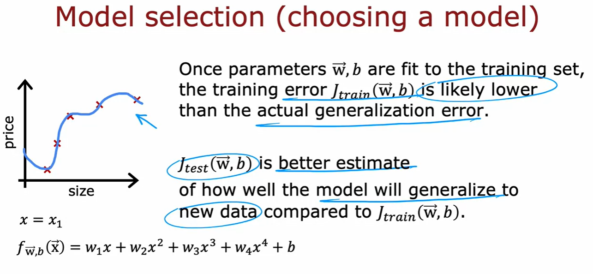

    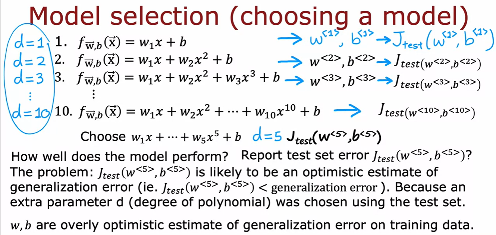

    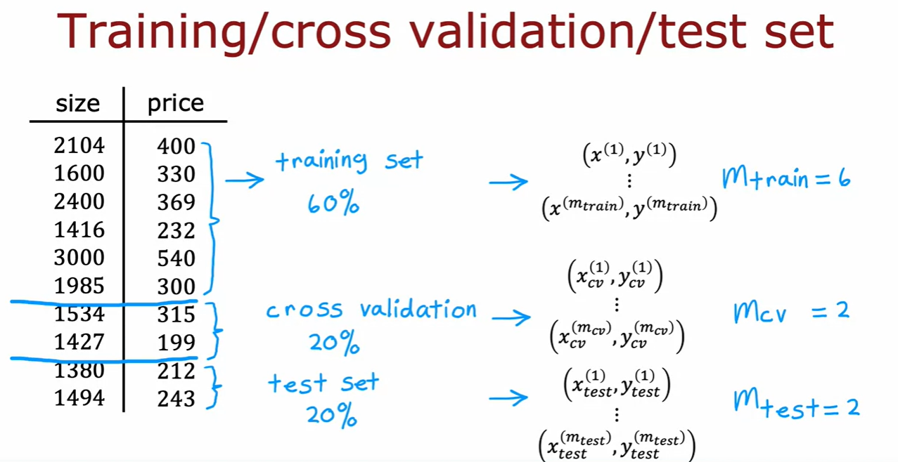

    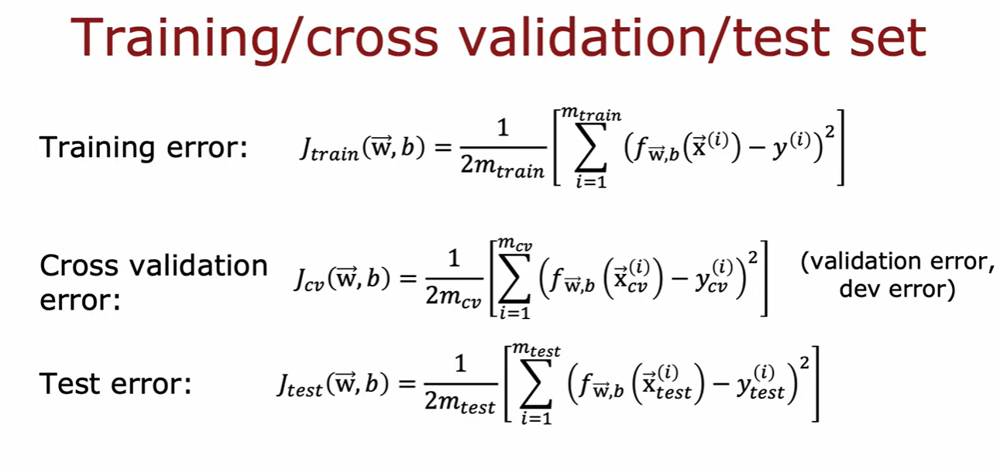

    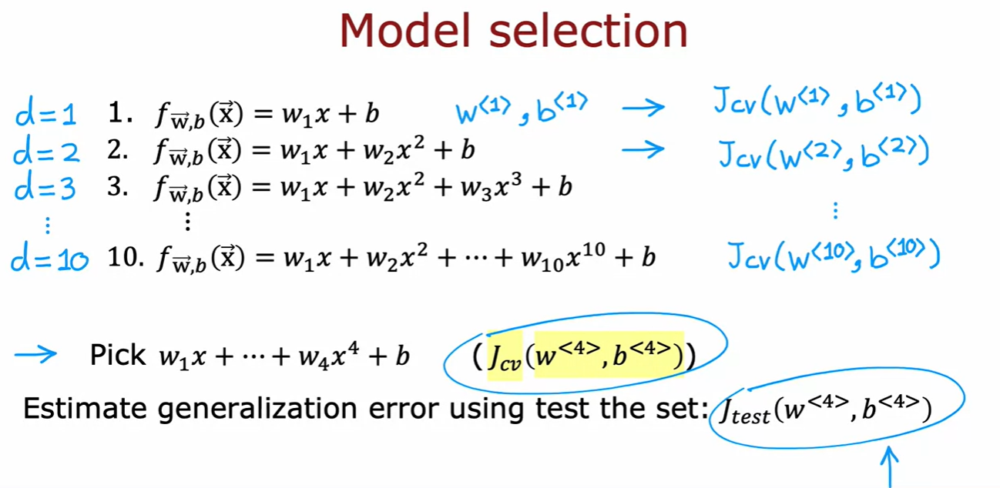

    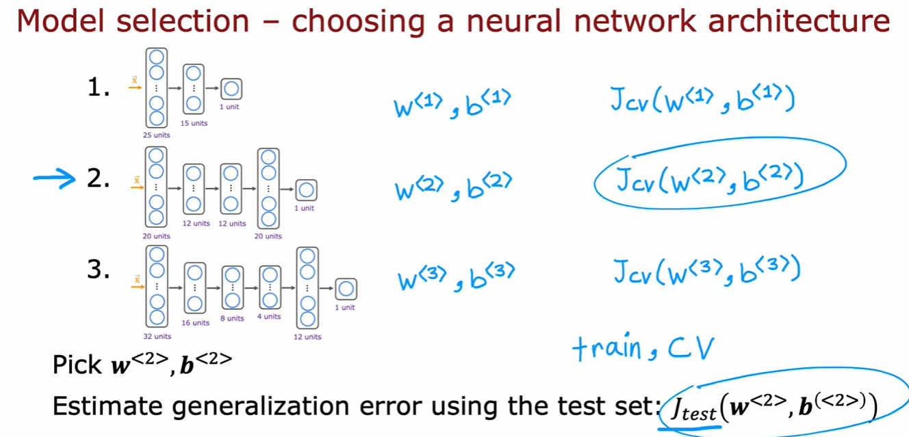

- Bias and Variance

    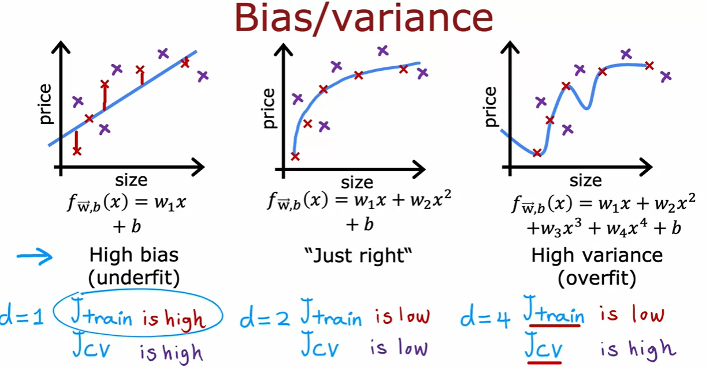

    - Diagnosing bias and variance

        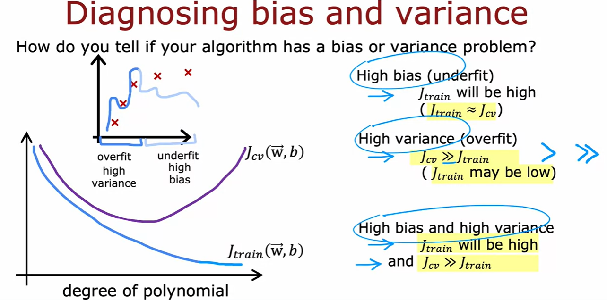

- Regularization and bias/variance

    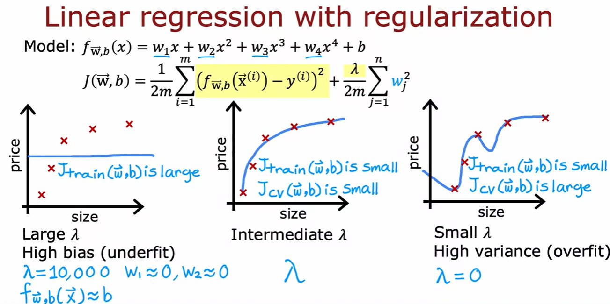