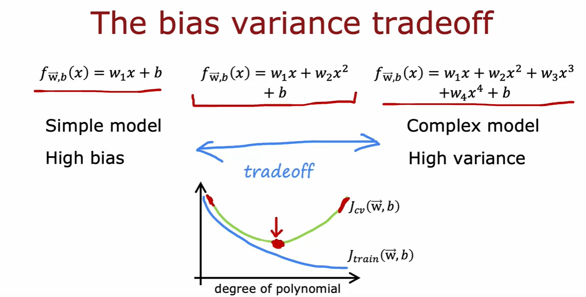

## Images for Reference

- Machine Learning Diagnositc

    

- Evaluating a model

    

    

    

    

    

- Model Selection    

    

    

    

    

    

    

- Bias and Variance

    

    - Diagnosing bias and variance

        

- Regularization and bias/variance

    

    

- Establishing a baseline level of performance

    

- Learning Curve

    

    

    

- Debugging a learning algorithm

    

- Bias Variance tradeoff

    

    

    

    

- Iterative loop of ML development

    

- Adding Data

    - Data Augmentation

        - is the process of artificially increasing the size of the training set by applying transformations to the original data.

    - Data Synthesis

        - is the process of generating new data from scratch.

    

- Transfer Learning

    

    