## Images for Reference

- Decision tree model

    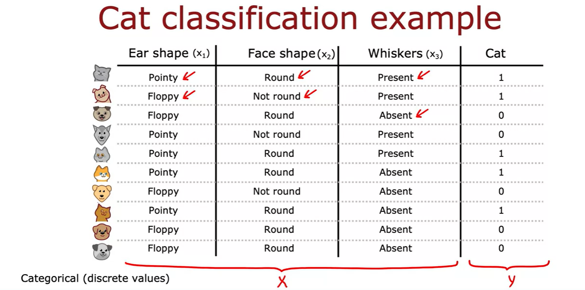

    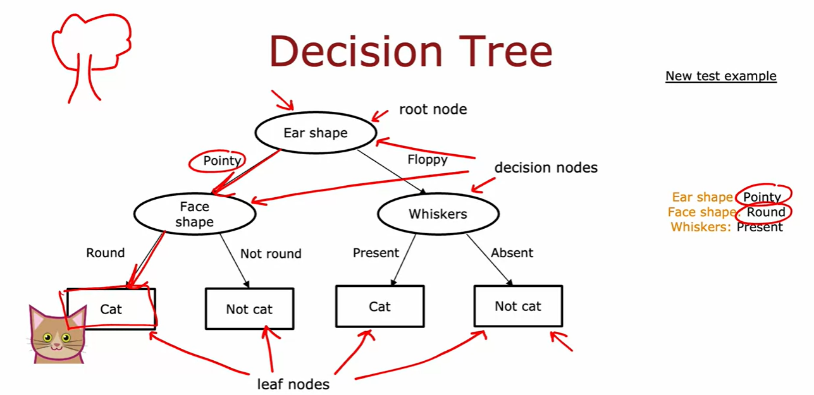

    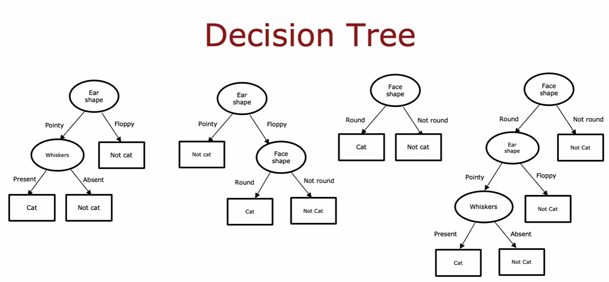

- Learning Process

    - How to choose what feature to split on at each node?

        - Greedy algorithm: At each node, choose the feature that maximizes the information gain.

        - Information gain: The reduction in entropy after a dataset is split on an attribute.

        - Entropy: The measure of randomness or uncertainty in a dataset.

        - Information gain = entropy(parent) - [weighted average]entropy(children)

        - Entropy = -Σp(x)log2p(x)

        - p(x) = fraction of examples in class x

    - When do you stop splitting?

        - When all data points belong to the same class.

        - When all data points belong to the same feature value.

        - When the tree reaches a maximum depth.

        - When the number of data points is less than a threshold.

- Measuring Purity

    - Entropy: The measure of randomness or uncertainty in a dataset, ie measure of impurity of a set of data points.

        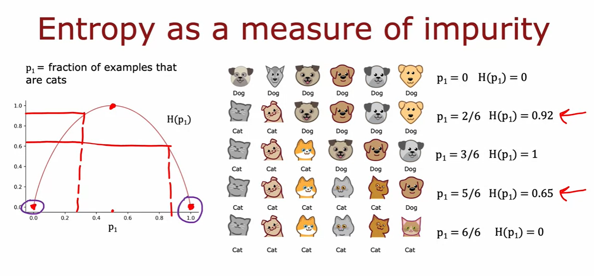

        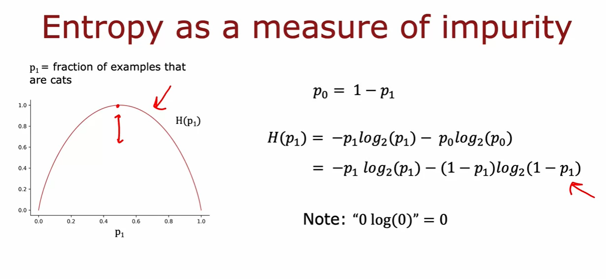

- Choosing a split: Information Gain

    - Information gain: The reduction in entropy after a dataset is split on an attribute.

        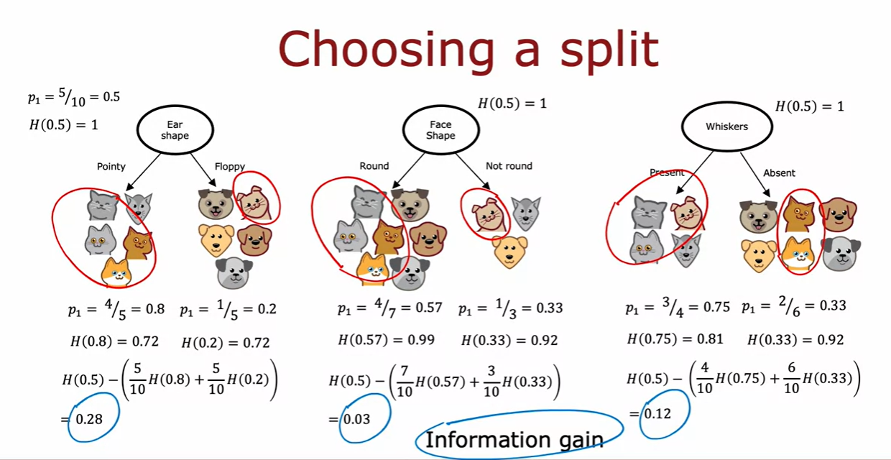

        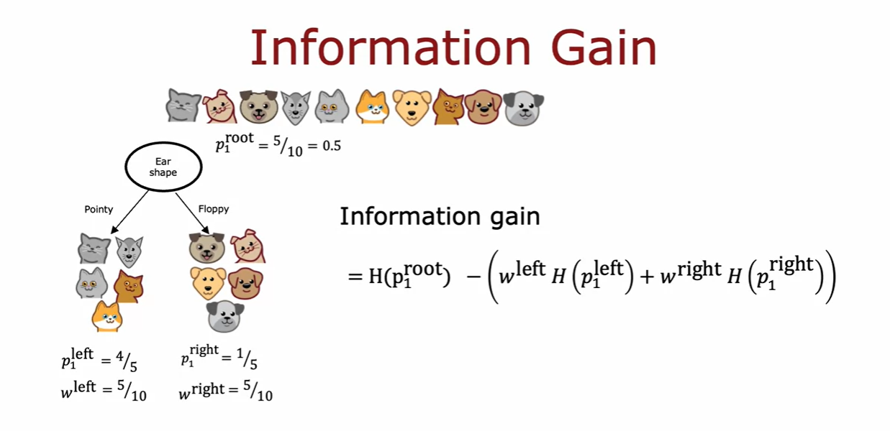        

        

        
    
- Putting it together

    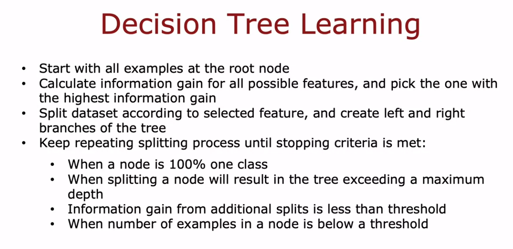

    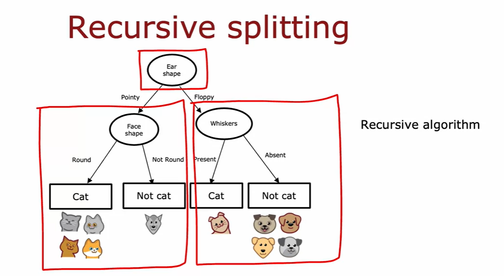

- One-hot encoding of categorical variables

    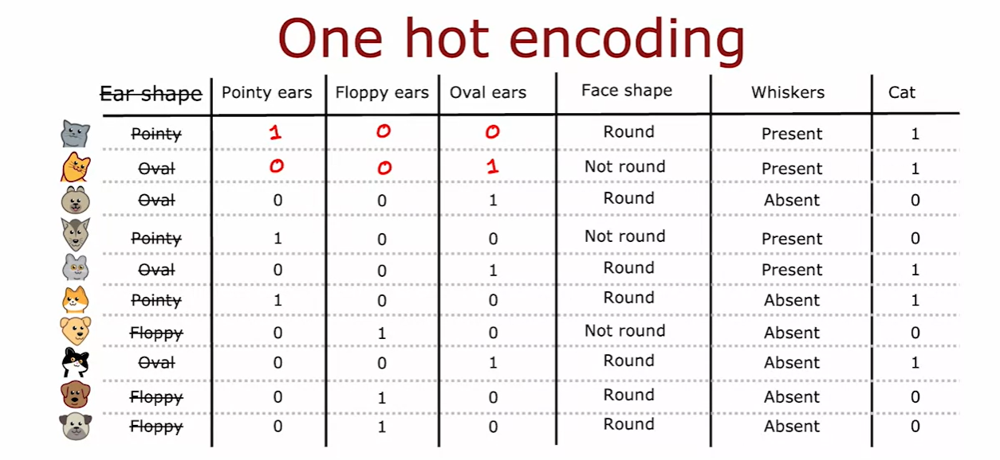   

    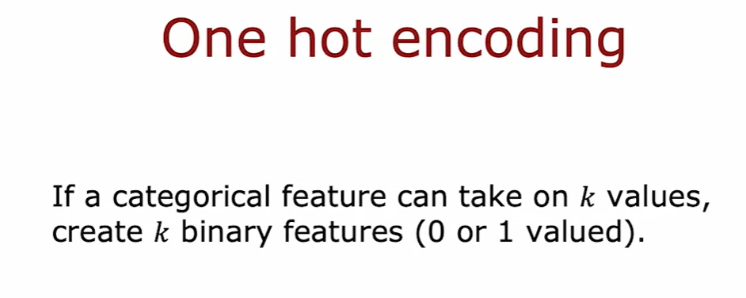

- Continous valued features

    - Carry out the usual information gain calculation and decide to split on the continous feature value that gives the maximum information gain.

        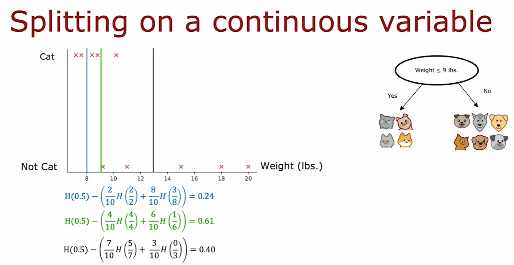

- Regression Trees

    - Instead of predicting a class label, we predict a continuous value.

    - The prediction is the average of the target values of the data points in the leaf node.

    - The split is decided based on the variance of the target values.

        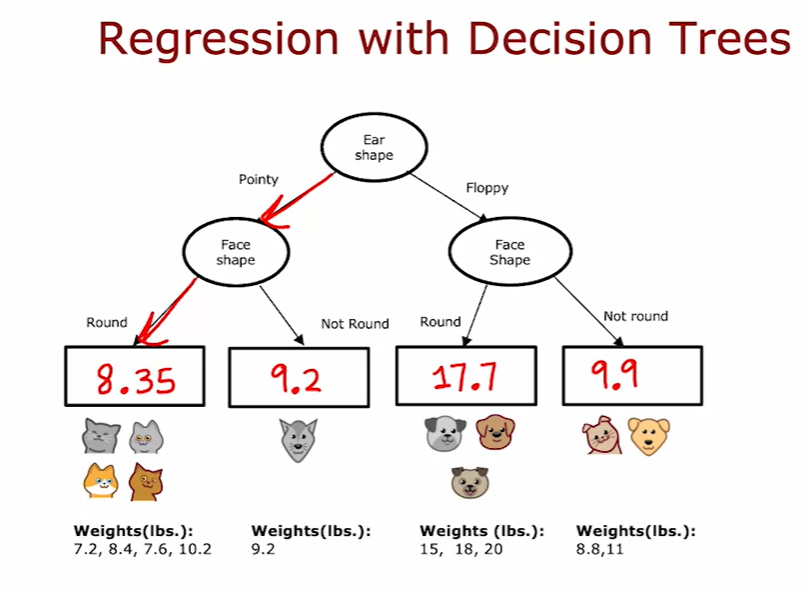

        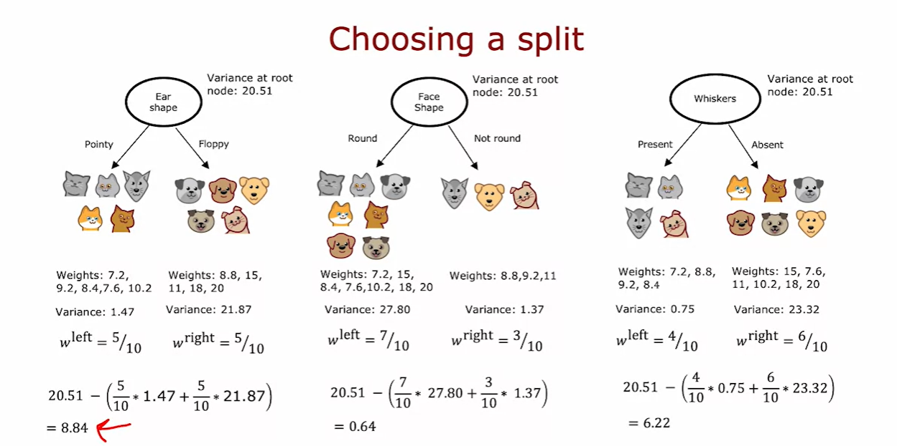

- Tree ensembles

    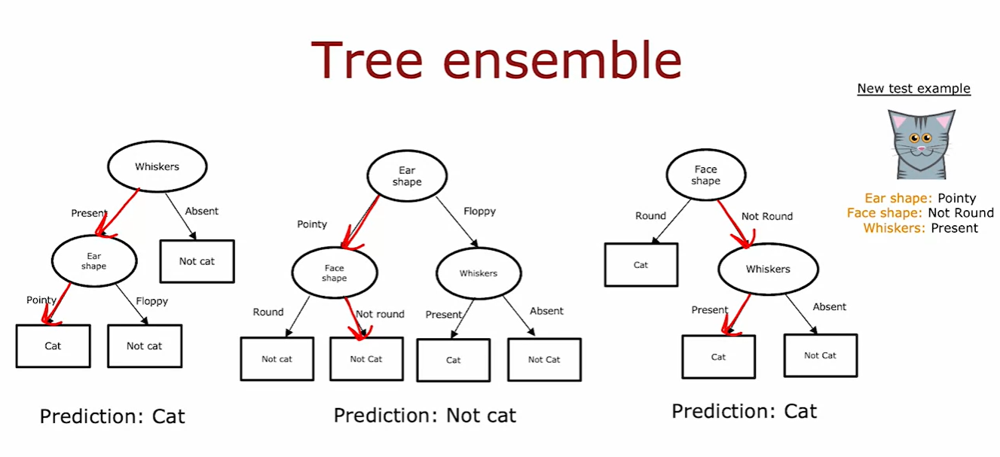

- Sampling with replacement

    - lets you create multiple datasets from the original dataset.

        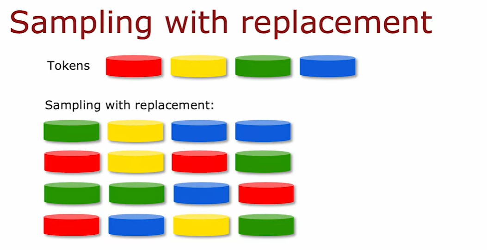

        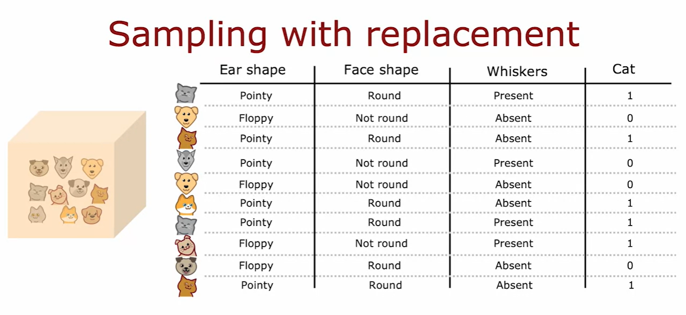

- Random Forest Algorithm

    - Random forest is an ensemble of decision trees.

    - Each tree is trained on a random subset of the data.

    - Each tree is trained on a random subset of the features.

    - The final prediction is the average of the predictions of the individual trees.

    - Random forests are robust to overfitting.

        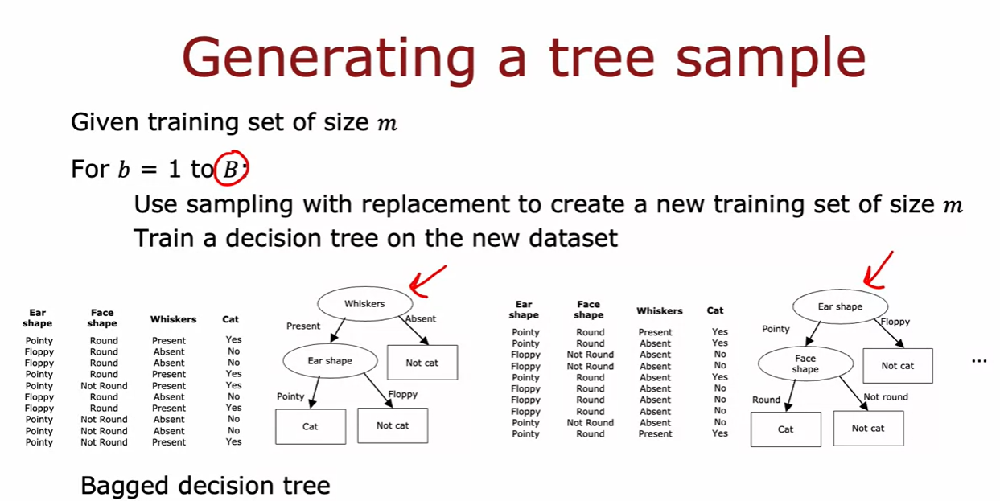

        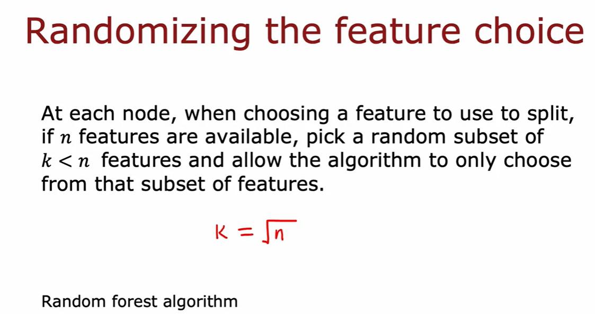

- XGBoost    

    - XGBoost is an optimized distributed gradient boosting library designed to be highly efficient, flexible and portable.

    - It implements machine learning algorithms under the Gradient Boosting framework.

    - XGBoost provides a parallel tree boosting that solves many data science problems in a fast and accurate way.

        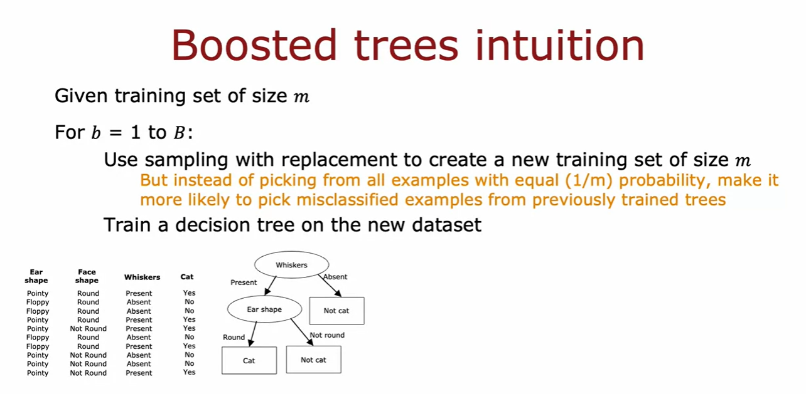