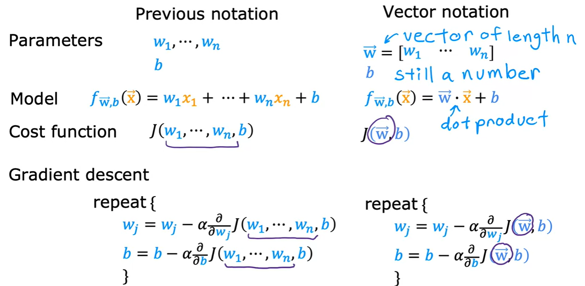
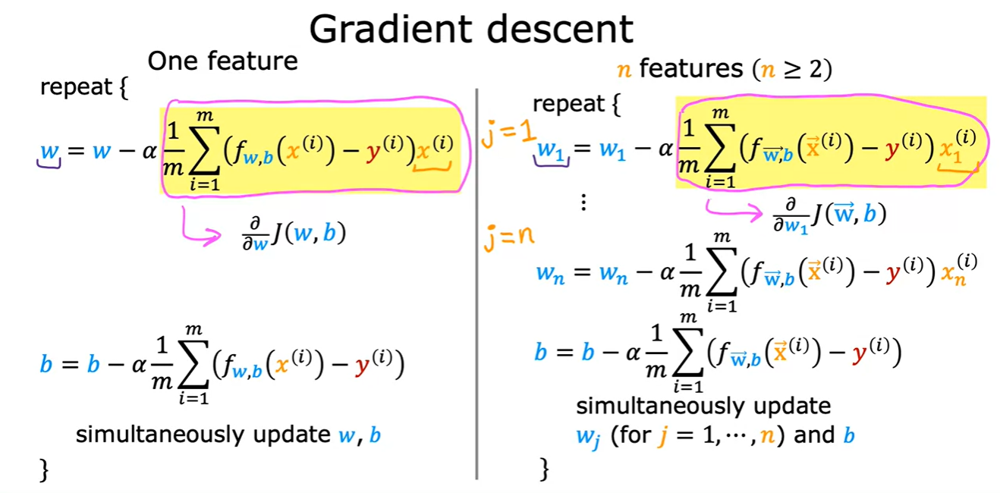
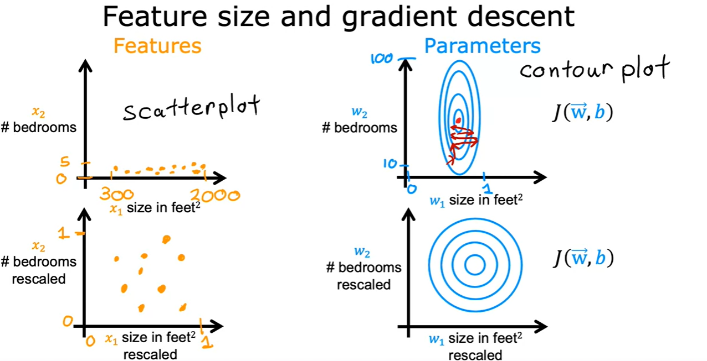

# Images for Reference

- Mutliple features (variables)

    

- Model Representation

    

- Vectorized Implementation

    

    

    

    

- Gradient Descent

    

    

- Feature Scaling

    