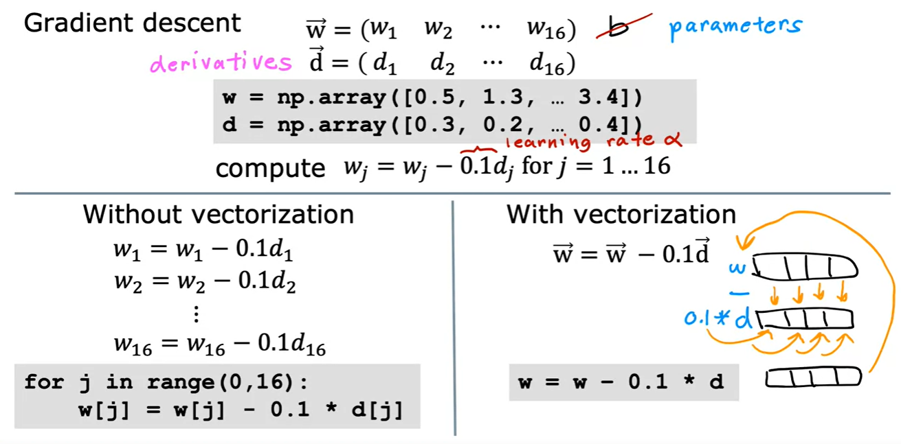

# Images for Reference

- Mutliple features (variables)

    

- Model Representation

    

- Vectorized Implementation

    

    

    

    

- Gradient Descent

    

    

- Feature Scaling

    

    - Dividing by max
       
        

    - Mean Normalization
    
        
        
    - Z-score Normalization
    
        

    

- Learning Rate

    - check the learning rate using the cost function vs number of iterations graph

- Feature Engineering

    - Using intuition to design new features by transforming or combining the original features

- Polynomial Regression

    - using the square of the original feature to fit a quadratic function

    