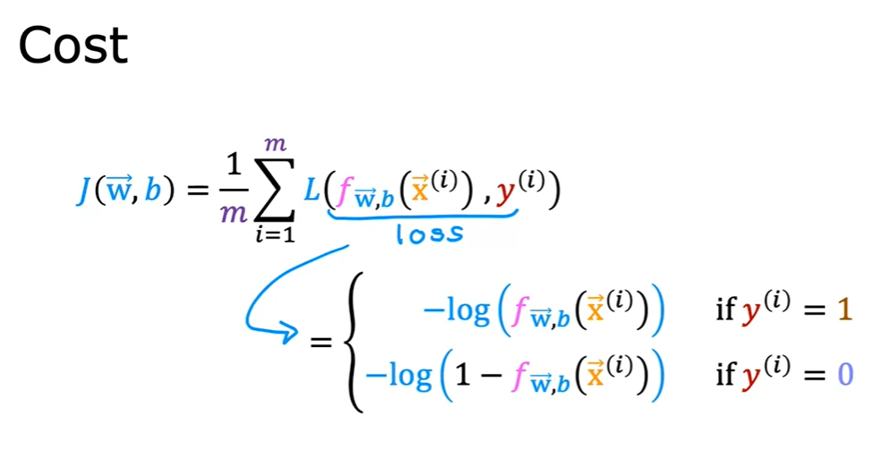
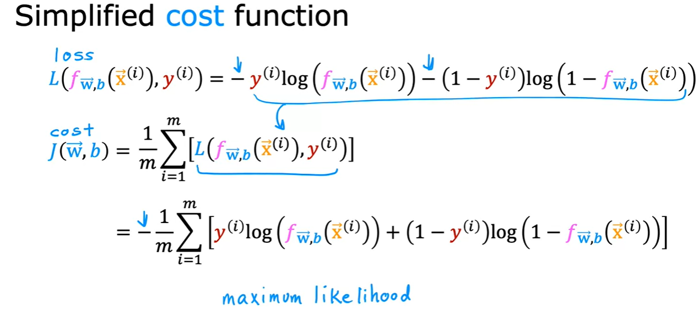
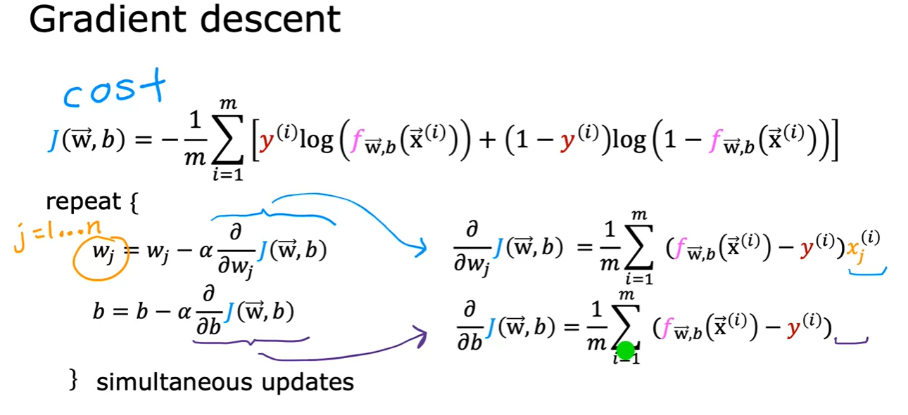
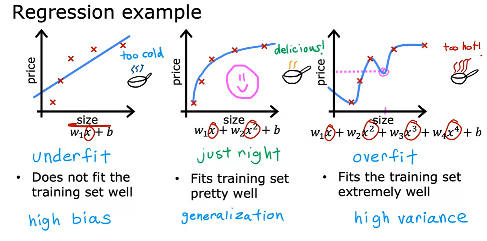
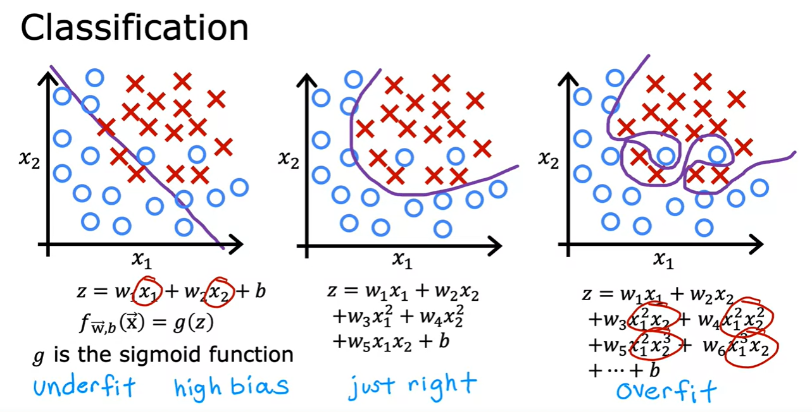

# Images for Reference

- Logistic Regression

    

    

    - Cost Function
        

        

    - Gradient Descent
        
        - Approach remains same as linear regression
        - Only difference is the hypothesis function

        

- Problem of Overfitting

    

    