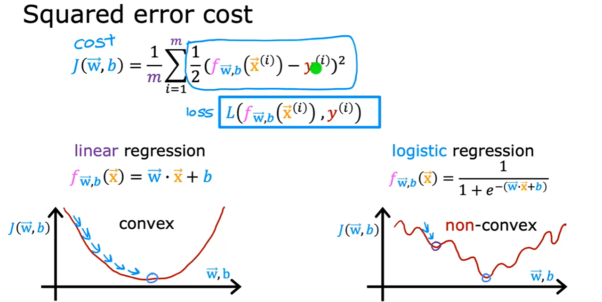

# Images for Reference

- Logistic Regression

    

    

    - Cost Function
        

        

    - Gradient Descent
        
        - Approach remains same as linear regression
        - Only difference is the hypothesis function

        

- Problem of Overfitting

    

    

- Addressing Overfitting

    -  Collect more training data

        

    - Select features to include/exclude

        

    - Regularization

        - Reduce the size of parameters w subscript j (j=1,2,3,...,n) by penalizing large values of the parameters

            

            - Choosing lambda

                

    - Implementing Gradient Descent

        