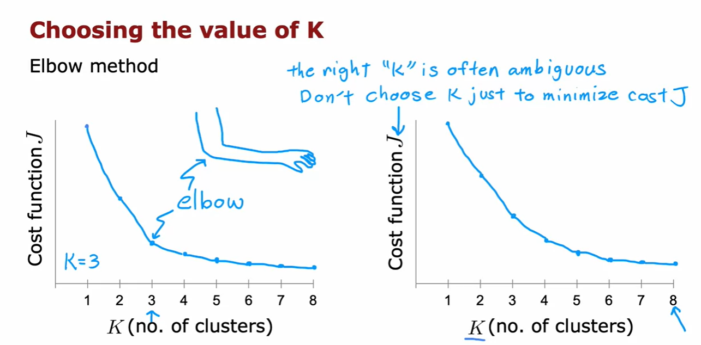
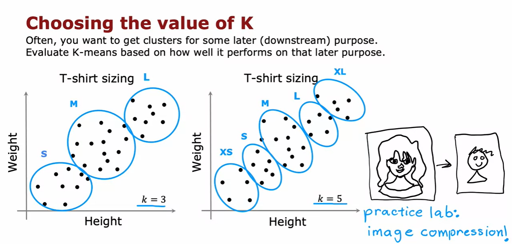
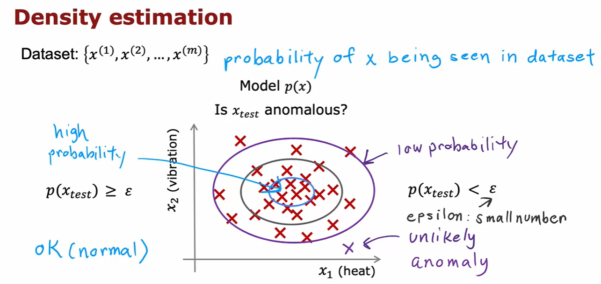
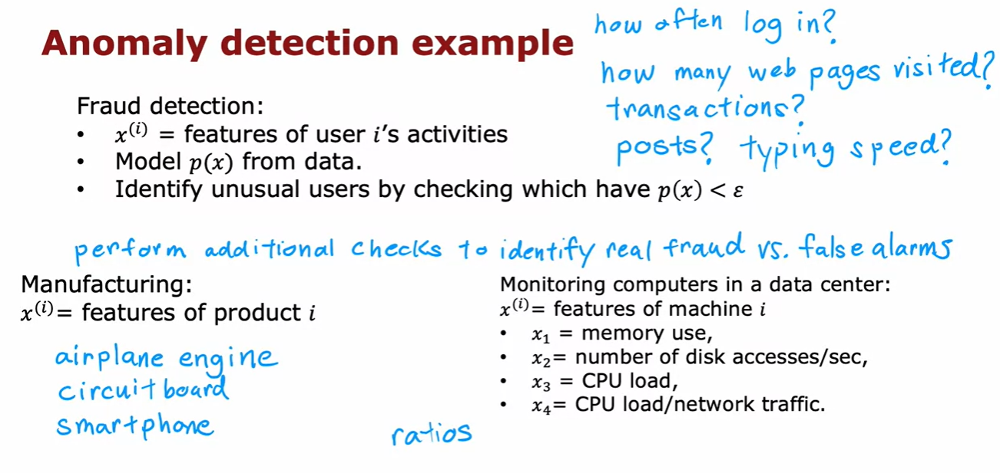
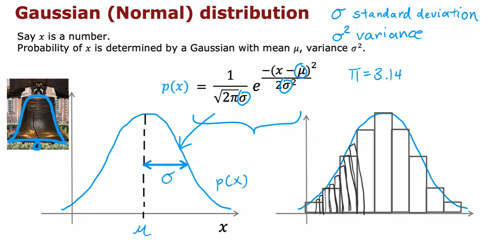
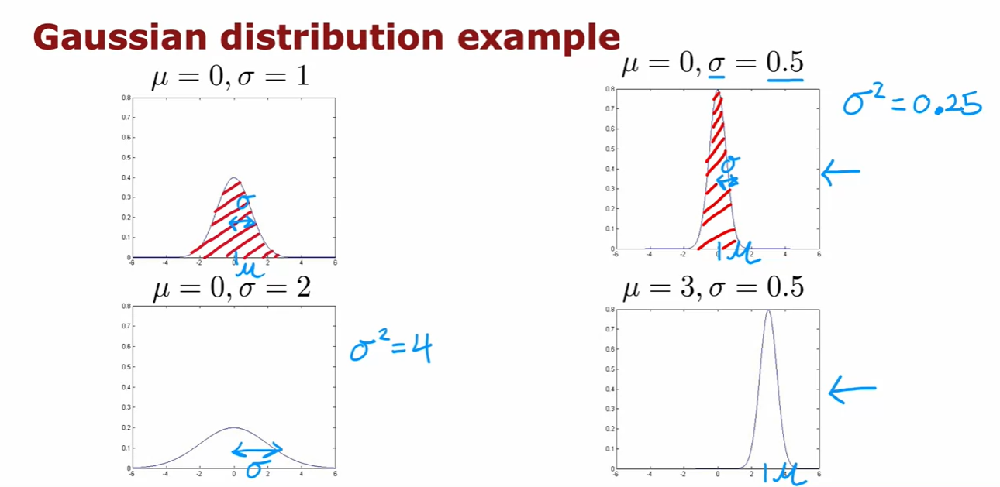

## Images for Reference

- Clustering

    - looks at a number of data points and groups them into clusters based on how similar they are to each other.

        

        

- K-means

    - repeatedly do two different things:

        - Assign each data point to the nearest cluster center.

        - Recompute the cluster centers to the mean of all points.

            

            

            
        
- K-means algorithm        

     

- Optimization objective

    

    

- Random Initialization    

    

    

    

- Choosing the number of clusters    

    - Elbow method

        

    - Choosing the value of K

        

- Anomaly detection

    - Anomaly detection is the identification of items, events or observations which do not conform to an expected pattern or other items in a dataset.

        

        

- Gaussian distribution

    - The Gaussian distribution is a continuous function that approximates the exact binomial distribution of events.

        

        
        
             