## Images for Reference

- Clustering

    - looks at a number of data points and groups them into clusters based on how similar they are to each other.

        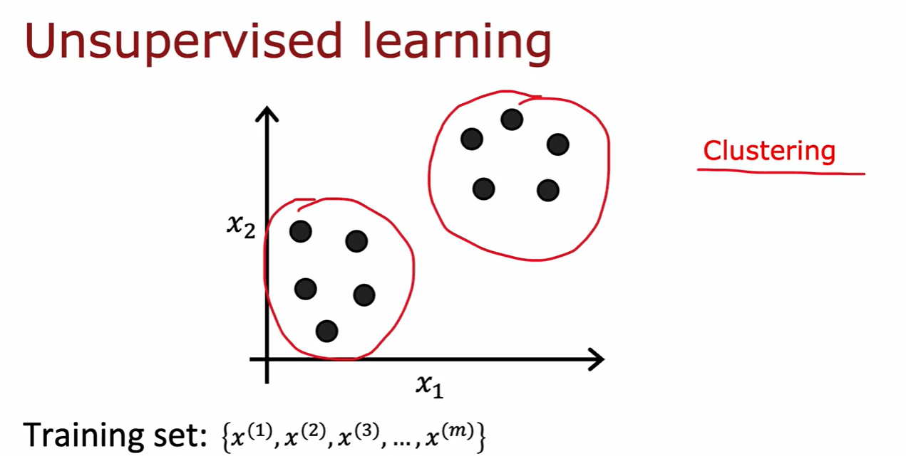

        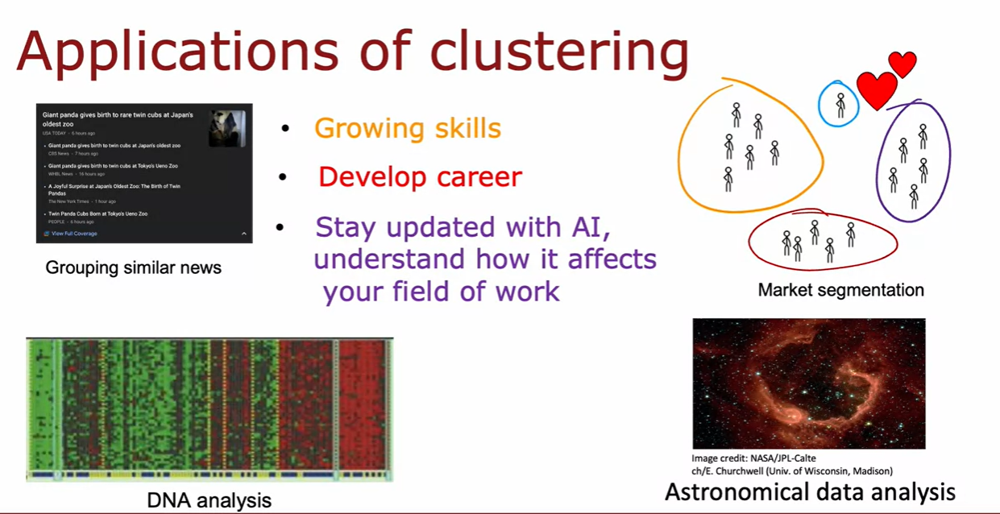

- K-means

    - repeatedly do two different things:

        - Assign each data point to the nearest cluster center.

        - Recompute the cluster centers to the mean of all points.

            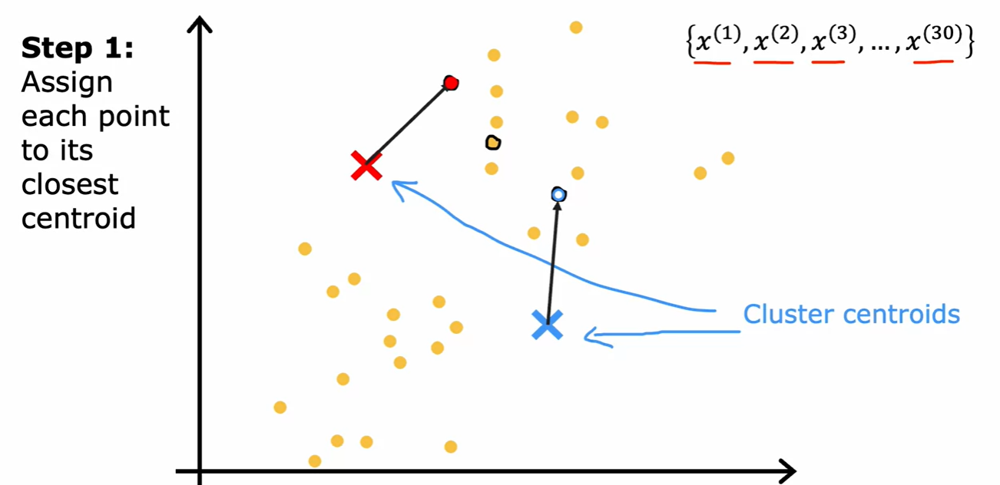

            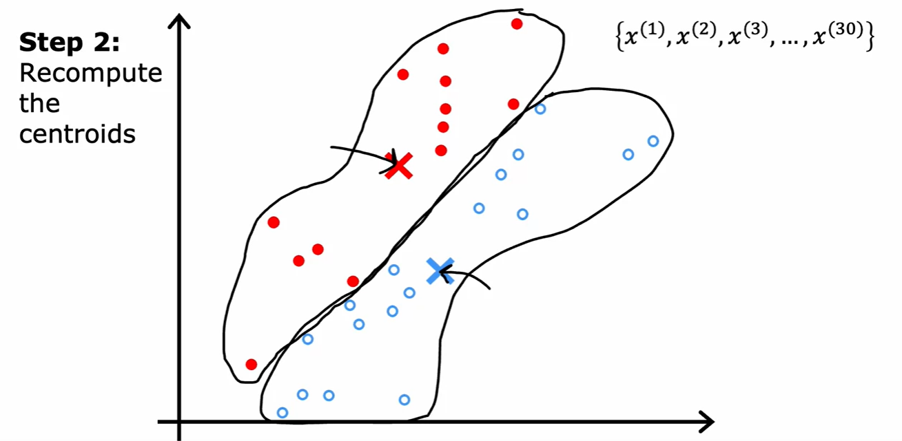

            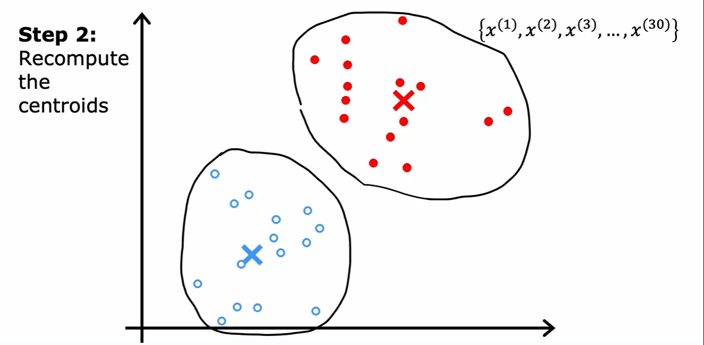
        
- K-means algorithm        

    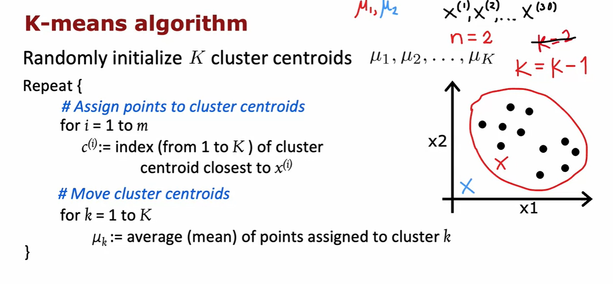 

- Optimization objective

    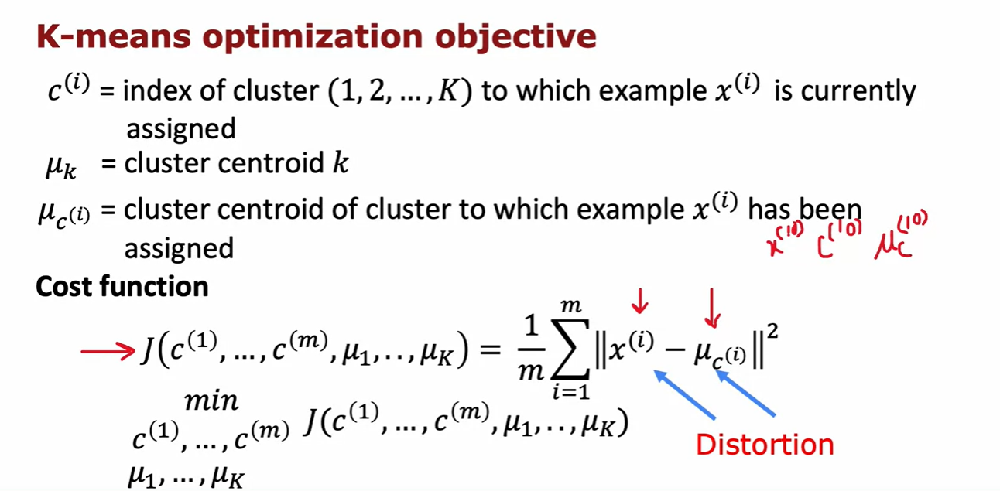

    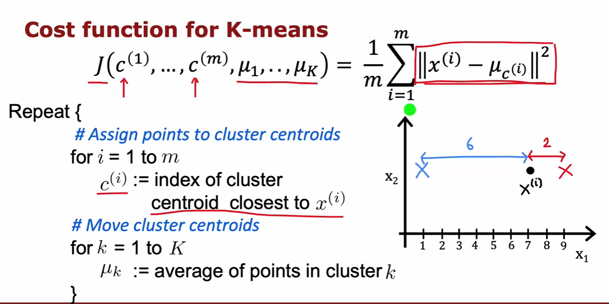

- Random Initialization    

    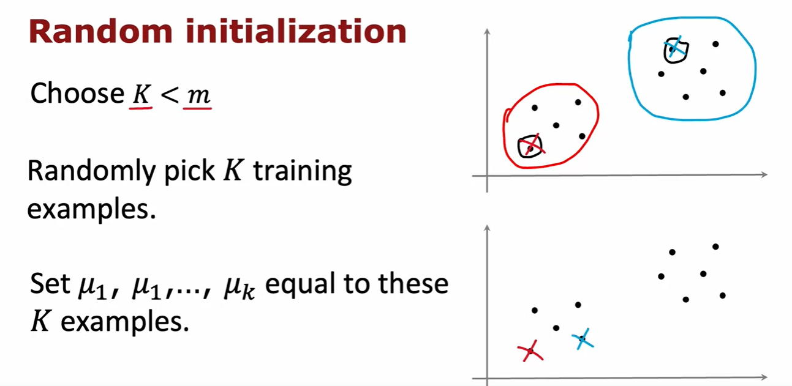

    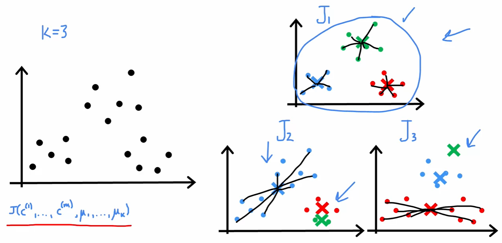

    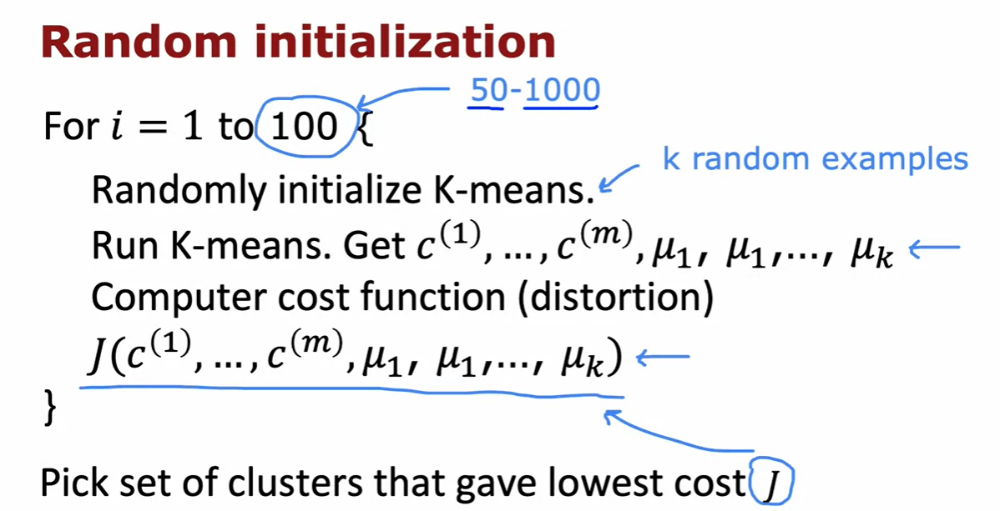