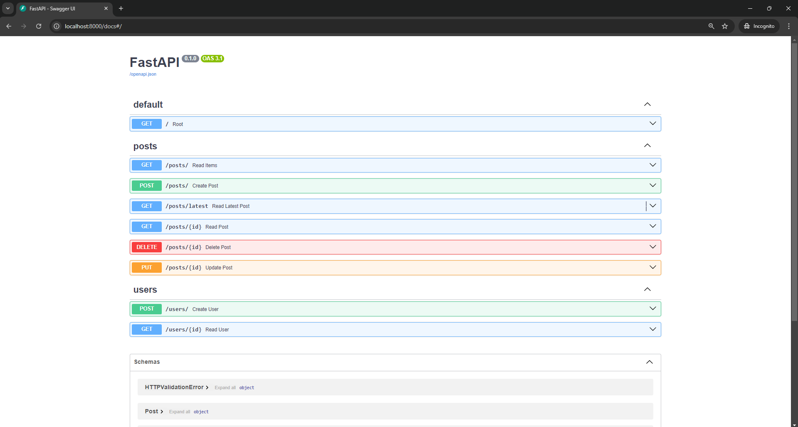

### Python API Development - Comprehensive Course for Beginners

- Reference: [Video](https://youtu.be/0sOvCWFmrtA?si=-05wLEo8dSuYzQfz)

- To run on Windows:

    - Install:
    
        - `python -m venv test_venv` # Create a virtual environment if not already created
        
        - `test_venv\Scripts\activate` # Activate the virtual environment
        
        - `pip install "fastapi[standard]"` # Refer to [FastAPI](https://fastapi.tiangolo.com/tutorial/#run-the-code:~:text=checks%2C%20autocompletion%2C%20etc.-,Install%20FastAPI,-%C2%B6) for more details

    - Run:

        - `(test_venv) D:\2024>fastapi dev "d:\2024\Python API Development - Comprehensive Course for Beginners\fastapi_main.py"`

        - `(test_venv) D:\2024>fastapi dev "d:\2024\Python API Development - Comprehensive Course for Beginners\fastapi_main.py" --reload` # To reload the server on changes, mostly for development

    - Test:
    
        - `http://localhost:8000/docs` # Swagger UI
        - `http://localhost:8000/redoc` # ReDoc UI

    - To run using uvicorn:

        - `pip install uvicorn`

        - `uvicorn fastapi_main:app --reload` # fastapi_main.py is the file name and app is the FastAPI instance

        - `uvicorn app.main:app --reload` # app is the folder name and main is the file name

- To connect postgre db:
    
    - Install:

        - `pip install psycopg2` # For PostgreSQL

- To connect and use ORM:

    - Install:

        - `pip install sqlalchemy`

    - Run:

        - `uvicorn app.main:app --reload`

- Router Tags:

    - `tags=["items"]` # To group the endpoints in Swagger UI ie http://localhost:8000/docs

    - 

- On Linux

    - `uvicorn app.main:app --host 0.0.0.0 --port 8765`

    - `gunicorn -w 4 -k uvicorn.workers.UvicornWorker app.main:app --bind 0.0.0.0:8765`