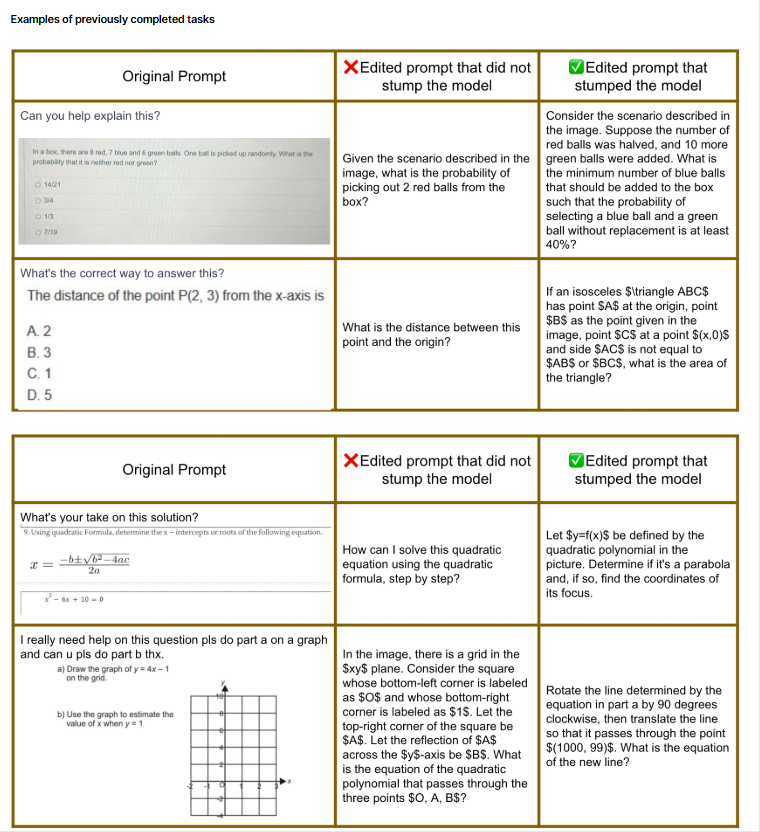

The goal of this project 

This project aims to create complex image-based math-related prompts that will make the model fail. You have three opportunities to design a prompt that leads to an incorrect or incomplete response from the model, but let's aim to stump the model on the first try.

https://docs.google.com/document/d/1bLcLp1x_JYtVjqbZyVy5oWsWt6R-a8cHVdQ7X_HwhN4/edit?pli=1&tab=t.0#heading=h.8ddouuxic1x6

https://docs.google.com/document/d/1vkqiZP9ZPp1aOGdyxv6XDMBBs3s0Hs0YzfrGXtq9NPA/edit?tab=t.0#heading=h.eyyu39l4z52g

https://docs.google.com/document/d/1vkqiZP9ZPp1aOGdyxv6XDMBBs3s0Hs0YzfrGXtq9NPA/edit?tab=t.snksg4dmoicq

https://docs.google.com/document/d/1vkqiZP9ZPp1aOGdyxv6XDMBBs3s0Hs0YzfrGXtq9NPA/edit?tab=t.of1q5owpzi74#heading=h.45ey9m58dw7l

https://docs.google.com/spreadsheets/d/e/2PACX-1vQHrKSDMTRK0NSyqQufTGSPzbKtuHp0jcLgJ_fQG1mlXNfRtsDlY_hnTpnduF2jePJvwnW8kvxmkrUC/pubhtml

STEP 1.1: Determine if the task can be completed based on the image.

Reasons for rejection: 

Image not loading: The image does not appear in the tool
Image not relevant: Image is irrelevant to high school math (mark the task as invalid if the image is beyond high school difficulty level)
Images contain proof-style questions asking the model to prove a specific statement
The image does not contain enough information to ask a meaningful question
Images contain non-English language
The image does not contain a question but only an answer or procedure. 

Reason 1: The image not loading

Why is this considered invalid?

There is no way to ask a question about a non-existing image.

Things to keep in mind:

Sometimes the image exists, but it is not downloading FOR US.

Try to open the image in a new tab
Reload
Make sure you have a good internet connection

❌ Example of Image not loading 

Reason 2: The image not relevant

Why is this considered an error?

Non-relevant images will not allow us to create a proper prompt.

There are 3 reasons why a task could be not relevant:

The image is not related to math
The image shows math that is either below or above high school math or is from another subject.
The image contains math, but it is from another field of study.

1. The image is not related to math

Example: 

2. The image shows math that is either below or above high school math.

The math shown in the image should be high school level.
 If you are unsure about the math level shown in the image, you can search online for US high school math topics.
Example:

3. The image contains math but from another field of study.

The images can contain high school math; however, formulas or elements from other fields of study are required to create a prompt related to the image. 

Example:

Reason 3: Proof style questions

Why is this considered invalid?

The image contains proof-style questions asking the model to prove a specific statement. 

This does not belong to high school math.

Reason 4: Not enough information

Why is this considered invalid?
The image does not contain enough information to ask a meaningful question

This doesn't mean that the image needs to have text.

❌ Example of Invalid

✅ Example of Valid

Reason 5: Image contains non-English language

Why is this considered invalid?

The image contains non-English language.
The model is not able to identify elements in other languages.
Even though math can be understood, if it contains any element in another language it should be marked as invalid.

Reason 6: The image does not contain a question but only an answer or procedure

Why is this considered invalid?

The image either contains both the problem and its solution procedure OR only the solution

There is no need to ask a prompt about something already answered.


STEP 2: Identify whether the prompt is good as is or needs edits to ensure it stumps the model.

First, these are the GIVEN questions/ prompts:

2. Edit the prompt if the provided prompt DOES NOT COMPLY with the prompt writing criteria. 

If the prompt needs edits:

Select “Yes, the prompt needs edits”
Make sure you scroll up to the prompt and click on 	
3. Rewrite the improved prompt and click on finish editing. 

Make sure the prompt makes the model respond FAIL. If it doesn’t, you must repeat this process up to three times!

Grading Prompts: 

What makes a prompt "good as is"? 

✅ It follows the prompt writing guidelines.

✅ The answer to the prompt requires the image to be solved.

✅ The prompt is not exactly the same as the one in the image.

✅ Great spelling and grammar.

Complete sentences
Longer than 4 words
Capitalized
Commas and periods are correct.
You can use Grammarly to check grammar and spelling.
✅ Related to the image.

✅ It does not request the model to do something beyond its capabilities.

✅The prompt is not generic

If the prompt does not complete ALL of the above, click "Yes, the prompt requires edits" and rewrite for perfection.

Bad examples:

❌ All of the following examples were marked as "No, the prompt is good as is."

Use the following guidelines to write a proper prompt:

Specific Writing Criteria: 🔍
The prompt should be about high-school math.
The prompt should not contain typos. (Use the Grammarly extension to help.)
Ensure that the question is direct, unambiguous, and not contrived.
Math equations should be correctly formatted. Use LaTeX with the correct delimiters (remember to use dollar signs as the delimiters, not backslashes as the delimiters).
Correct: $...$ or $$...$$
Incorrect: \(...\) or \[...\] or \\(...\\) or \\[...\\]
 Frappuccino LaTeX Style Guide
Make sure you know what the correct answer should be.
Please rewrite the prompt using your own language and creativity, and ask appropriate math questions based on the image whenever possible instead of just rewriting the naive prompt.
Questions should need the image to be answered. 
The question should be related to the visual content of the image. 
The image should be indispensable to respond to the prompt. 
A prompt that can be resolved without the image is NOT acceptable.
If you want your final answer to be rounded, mention it in the image; if not, please mention it explicitly in your prompt. For instance, if the accurate answer for a question is $\pi$ but you want to round it to 3.14, make sure that it is specified in the image and/or in the prompt.

General Writing Criteria 🔍

Accuracy: The text in the prompt should be accurate and understandable to the user.
Relevance: The question should be related to the visual content of the image. The image should be indispensable to respond to the prompt. A prompt that can be resolved without the image is not acceptable.
Grammar: The text in question is grammatically correct (spelling, punctuation).
Sensibility: The text in question is a sensible user request within the context of the image given and the guidelines.
Harmfulness: Avoid prompts with any of these sensitive topics:
Identification: Ask questions identifying individuals by name, driver’s license, passport number, account, credit card, or other unique descriptive identifier (“44th President of the United States”) of persons in the photos.  
Sensitive Inferences: Ask questions that make inferences about sensitive categories of information, such as the race, ethnicity, political affiliation, religion, union membership, and sexual preferences of the people in the photos. 
Health Inferences: Ask questions to make inferences about people's health in the photos.

Remember, one of the main goals of this project is to create complex, image-based math prompts that challenge the model to fail. Additionally, we aim for you to succeed on the first attempt so that you have enough time to complete the task. 

To help you achieve this, here is some relevant information:

Vary the Problem Structure: Alter the structure of the problem significantly.

Example: If a person pulls out a marble and then returns it afterward, what is the probability that the person will pull out a red marble, followed by a green marble, and then a blue marble? Refer to the image.

Introduce New Elements, Constraints, or Perspectives: Add new factors that change the nature of the problem, such as additional constraints (e.g., the clock is broken and skips specific minutes) or new elements (e.g., including seconds or time zones). 

Example: Find the area bounded by this inequality, the $x$- axis, and the function $y = \sin(x)$ where $x \in [-\pi, 0]$.

Expanding the Scope of the Problem: Expanding the time frame, the size of the problem, or the number of variables to track can increase the complexity. 

Example: Compute the limit in question 2(a) shown in the image, both with and without using L'Hospital's Rule. Also, check the asymptotic behavior. 

Alter the Goal or Outcome of the Problem: Instead of asking for a count or a sum, ask the solver to minimize or maximize a specific value or to find a pattern or sequence.

Example: Using the given function $P(x)$ in the image and its condition, determine whether $P(x)$ is decreasing, increasing, or both, and determine where the graph of $P(x)$ is concave upward and where it is concave downward.

Combine Multiple Simple Problems: Create compound problems that require solving simpler problems that interact with one another.

Example: What is the object's volume on the right of the image? Hint: Add the volume of the pyramid and the cuboid together.
WHAT NOT TO DO

Minimal Adjustments in Numbers or Values: Avoid simply changing numerical values, such as the target sum or the starting time, while keeping the problem's structure the same.

Repetitive Problem Mechanics: Do not retain the same problem-solving mechanics, such as arithmetic operations or sequence tracking, without introducing a new concept or twist.

Similar Context or Setting: Avoid using a setting that is too closely related or that could be seen as a direct variant of the original (e.g., changing from a digital clock to an analog clock).

Introduce Specific Parameters and Constraints

Purpose: Add complexity and specificity to the prompt.

Actions: Specify parameters and constraints for the model to follow.

Think of a way to “trick” or “stump” the model while being logical. 
One way to do this is to include irrelevant/distracting information or an object/setting that contains an implied property. This makes it more likely for the model to make an unjustified assumption, leading to an incorrect answer.
Remember, the prompt still needs to be unambiguous and uncontrived!
Another method is to use objects or settings with implied properties or characteristics that require an in-depth understanding of those objects/settings to solve the problem.

Examples of previously completed tasks

STEP 3.1: Determine if the model failed based on the response.

For a model to fail, the response must have an insufficient grade in at least one of the dimensions below:

Accuracy
Instruction Following
Relevance
Comprehensiveness
Grammar and Presentation
Writing Style and Tone

Accuracy

Insufficient - one or more incorrect claims OR 2 or more pieces of supporting evidence are false, OR the information can be found online that contradicts the claims being made in the response OR contains claims that are not fully proven or are controversial.

Good - ALL core claims are correct and accurate, AND all supporting claims are accurate and correct, AND no claims or evidence are incorrect or false and are verifiable, AND reputable sources are cited where appropriate to back up claims

Instruction Following

Insufficient  - The response does not address all the asks made in the prompt OR does not fully satisfy all the parameters/constraints within the prompt.

Good - The response addresses all explicit asks of the prompt, AND the response satisfies all the parameters or constraints made in the prompt.

Relevance

Insufficient - The key points provided are unrelated to the central claim OR essential details are omitted, OR the examples brought up are too general, OR the information provided does not contribute to the main claim.

Good - The supporting information logically makes sense to be included, AND the output contains useful context AND the claims are supported with precise and useful examples, AND every single part of the response adds value to the claims or context of the response.

Comprehensiveness

Insufficient - There is no supporting information OR the response omits important or necessary background to understand the response OR the response contains poorly connected ideas or irrelevant ideas, OR the response significantly lacks in detail.

Good - The supporting information includes ample relevant insights, evidence, and details AND the response provides the necessary useful background AND the step-by-step reasoning addresses most follow-up questions AND all ideas support the response, AND the response provides detailed information that covers all aspects of a specific question.

Grammar and Presentation

Insufficient -The way the response is presented makes reading it difficult (no separation between ideas, lists not presented in bullet points, or markdown is broken) OR multiple spelling, punctuation, or grammatical errors.

Good - The presentation directly contributes to the readability of the response AND LaTeX and markdown are used appropriately to enhance understandability AND the response structure matches the context of the question, AND there are no spelling, grammar, or punctuation issues, AND the response contains units.

Writing Style and Tone

Insufficient - The response is robotic or inconsistent with tone, OR it mostly includes opinions, OR the response does not directly answer the question, OR does not ask for follow-up questions.

Good - Response sound natural and human-like AND responses are focused on information rather than opinion AND responses sound smart and straightforward, AND responses ask follow-up questions that serve a specific purpose.

- some high school math work
